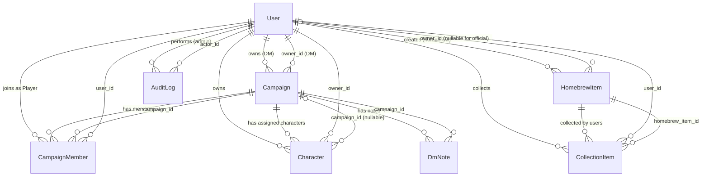
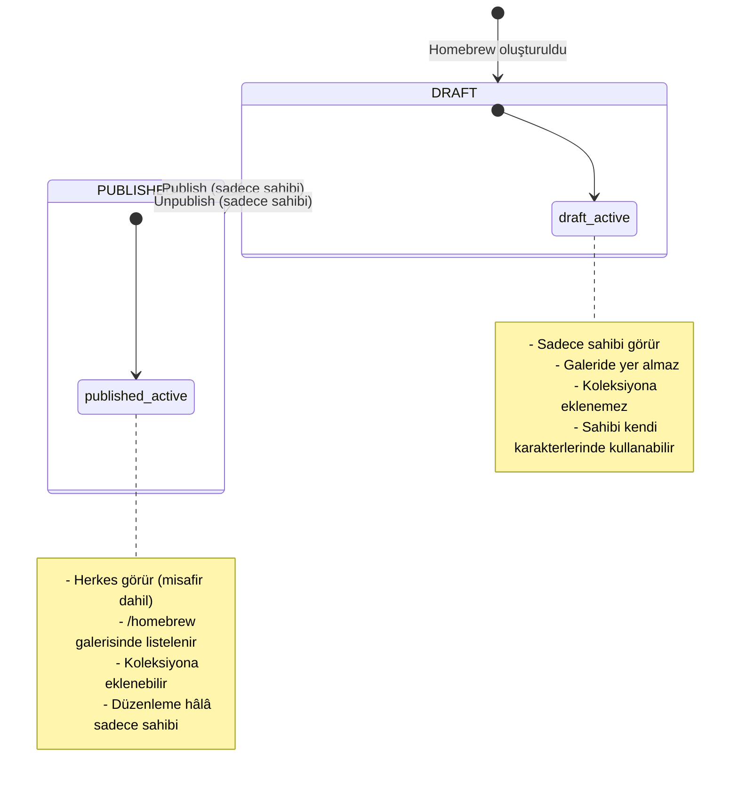

# DnD Companion Platform — Domain Model

> **Doküman amacı:** Sistemdeki tüm entity'leri, aralarındaki ilişkileri, iş kurallarını, state machine'leri ve enum/sabit tanımlarını tek bir yerde toplar. Kodlama agent'ı bu dokümanı okuyarak veri yapılarını, sahiplik kurallarını ve davranış kısıtlarını eksiksiz anlar.

---

## 1. Entity Kataloğu

| Entity | Açıklama |
|---|---|
| **User** | Platforma kayıtlı kullanıcı. Sistem rolü (ADMIN/USER) taşır; kampanyalarla ilişkisi üzerinden bağlamsal DM veya Player konumuna geçer. |
| **Campaign** | Bir DM'in oluşturduğu oyun grubu. Davet linki ile oyunculara açılır, özel (private) görünürlüğe sahiptir. |
| **CampaignMember** | Bir kullanıcının bir kampanyaya Player olarak katılımını temsil eden join kaydı. |
| **Character** | Bir oyuncunun D&D 5e kurallarına göre oluşturduğu karakter sheet'i. Opsiyonel olarak bir kampanyaya atanabilir. |
| **HomebrewItem** | Hem resmi D&D 5e kural verisi (PHB, XGtE, TCoE vb. kaynaklardan import edilen) hem de kullanıcıların oluşturduğu homebrew içerikleri barındıran tek tablo. `source` alanı ile ayrışır. |
| **CollectionItem** | Bir kullanıcının beğendiği HomebrewItem'ı kendi koleksiyonuna eklediğini temsil eden join kaydı. |
| **DmNote** | Bir kampanyanın DM'inin DM Screen'de tuttuğu serbest metin notu. |
| **AuditLog** | Admin eylemlerinin append-only kaydı. |

---

## 2. Entity İlişki Diyagramı



---

## 3. User

Platforma kayıtlı her kişiyi temsil eder. Tek bir global `users` tablosu vardır — tenant/organizasyon kavramı yoktur.

### Alanlar

| Alan | Tip | Kısıt | Açıklama |
|---|---|---|---|
| `id` | UUID | PK | |
| `email` | string | unique, not null | Giriş kimliği |
| `username` | string | unique, not null | Görünen ad, profil URL'si için kullanılır |
| `password_hash` | string | not null | Argon2id ile hash'lenir. Hiçbir zaman API yanıtında veya logda yer almaz. |
| `avatar_url` | string | nullable | Object storage'daki avatar görseli URL'si |
| `role` | enum: `ADMIN` \| `USER` | not null, default `USER` | Sistem rolü |
| `is_active` | boolean | not null, default `true` | `false` = deaktive edilmiş, giriş yapamaz |
| `email_verified_at` | timestamp | nullable | `NULL` = email doğrulanmamış → misafir seviyesi erişim |
| `created_at` | timestamp | not null | |
| `updated_at` | timestamp | not null | |

### İş Kuralları

- Yeni kayıt olan her kullanıcı `role = USER`, `is_active = true`, `email_verified_at = NULL` ile oluşturulur.
- `email_verified_at = NULL` olan kullanıcılar misafir (anonim) seviyesinde erişime sahiptir: yalnızca resmi 5e referans verisi ve published homebrew galerisini görüntüleyebilir. Karakter oluşturma, kampanyaya katılma, homebrew oluşturma, koleksiyona ekleme gibi tüm yazma eylemleri `email_verified_at != NULL` gerektirir.
- `is_active = false` olan kullanıcı giriş yapamaz (login endpoint'i kontrol eder). İçerikleri veritabanında kalır ama diğer normal kullanıcılardan gizlenir. ADMIN, Admin Panel'den bu içerikleri görmeye devam eder. Reaktive edildiğinde (`is_active = true`) içerikler otomatik olarak tekrar görünür hale gelir.
- İlk admin hesabı deployment sırasında seed script / env değişkeni ile oluşturulur. Sonrasında sadece mevcut bir ADMIN, başka bir kullanıcının rolünü değiştirebilir. Sistemde en az bir ADMIN kalması zorunludur — son admin rolünü düşüremez.
- `email` alanı PII/hassas kabul edilir: sadece hesap sahibine ve ADMIN'e API yanıtında döner. Diğer kullanıcılara `username` + `avatar_url` görünür.
- `password_hash` hiçbir API yanıtında dönmez.
- Kullanıcı kendi hesabını self-service deaktive edebilir (`is_active = false`). Kalıcı silme (hard delete) MVP'de yoktur.

---

## 4. Campaign

Bir DM'in oluşturduğu oyun grubu. Kampanyalar **tamamen private**'tır — sadece DM ve üyeler (campaign_members) görür ve erişir.

### Alanlar

| Alan | Tip | Kısıt | Açıklama |
|---|---|---|---|
| `id` | UUID | PK | |
| `name` | string | not null | Kampanya adı |
| `description` | text | nullable | Kampanya açıklaması |
| `banner_url` | string | nullable | Kampanya banner görseli URL'si |
| `setting` | string | nullable | Kampanya dünyası/teması (örn. "Forgotten Realms", "Homebrew World") |
| `owner_id` | UUID | FK → users, not null | Kampanyayı oluşturan kullanıcı = DM |
| `invite_token` | string | unique, nullable | `NULL` = davet kapalı |
| `created_at` | timestamp | not null | |
| `updated_at` | timestamp | not null | |

### İş Kuralları

- Bir kampanyayı oluşturan kişi otomatik olarak o kampanyanın DM'idir (`owner_id`). DM, `campaign_members` tablosuna ayrıca eklenmez — örtük üyedir.
- Kampanya **sadece DM ve campaign_members tablosunda kayıtlı Player'lar** tarafından görüntülenebilir. Davetli olmayan kullanıcılar kampanyayı listede göremez, doğrudan URL ile de erişemez (403/404).
- Sadece DM (`owner_id == user.id`) kampanyayı güncelleyebilir ve silebilir. Player'lar kampanyayı güncelleyemez.
- Davet linki token tabanlı, tekrar kullanılabilir ve yenilenebilirdir. DM yeni token ürettiğinde eski link geçersiz olur. DM token'ı `NULL` yaparak daveti devre dışı bırakabilir.
- Kampanya silindiğinde: `campaign_members` satırları silinir (cascade), atanmış karakterlerin `campaign_id` alanı `NULL`'a düşer (karakterler silinmez), `dm_notes` satırları silinir (cascade).
- ADMIN, sahiplik kontrolünü bypass ederek tüm kampanyaları görüntüleyebilir, düzenleyebilir ve silebilir.

---

## 5. CampaignMember

Bir kullanıcının bir kampanyaya Player olarak katılımını temsil eden join tablosu.

### Alanlar

| Alan | Tip | Kısıt | Açıklama |
|---|---|---|---|
| `campaign_id` | UUID | FK → campaigns, PK (composite) | |
| `user_id` | UUID | FK → users, PK (composite) | |
| `joined_at` | timestamp | not null | Katılım tarihi |

### İş Kuralları

- DM (`Campaign.owner_id`) bu tabloya eklenmez — DM zaten örtük üyedir.
- Davet linki ile katılım: giriş yapmış ve email doğrulanmış kullanıcı, geçerli bir `invite_token` ile kampanyaya katılabilir. Zaten üye veya DM olan kullanıcı tekrar eklenemez.
- Bir kullanıcı kampanyadan ayrılabilir (kendi kaydını siler). Ayrılan kullanıcının kampanyaya atanmış karakterlerinin `campaign_id`'si `NULL`'a düşer.
- DM, bir Player'ı kampanyadan çıkarabilir (Player'ın `campaign_members` kaydını siler). Çıkarılan Player'ın karakterleri de `campaign_id = NULL` olur.

---

## 6. Character

Bir oyuncunun D&D 5e kurallarına göre oluşturduğu karakter sheet'i. Karakter "taslak/tamamlandı" gibi bir duruma sahip değildir — her zaman düzenlenebilir bir sheet'tir.

### Alanlar

| Alan | Tip | Kısıt | Açıklama |
|---|---|---|---|
| `id` | UUID | PK | |
| `owner_id` | UUID | FK → users, not null | Karakterin sahibi (oyuncu) |
| `campaign_id` | UUID | FK → campaigns, nullable | Atandığı kampanya. `NULL` = bağımsız karakter |
| `name` | string | not null | Karakter adı |
| `race` | string | nullable | Tür/species (örn. "Elf", "Dwarf", "Tiefling") |
| `class` | string | nullable | Ana sınıf (örn. "Fighter", "Wizard") |
| `subclass` | string | nullable | Alt sınıf (örn. "Battle Master", "School of Evocation") |
| `level` | integer | not null, default 1 | Karakter seviyesi (1-20) |
| `background` | string | nullable | Arka plan (örn. "Soldier", "Noble") |
| `alignment` | string | nullable | Hizalama (örn. "Chaotic Good") |
| `experience_points` | integer | not null, default 0 | Deneyim puanı |
| `ability_scores` | JSONB | not null | `{ "STR": 10, "DEX": 14, "CON": 12, "INT": 16, "WIS": 13, "CHA": 8 }` |
| `hit_points_max` | integer | nullable | Maksimum can puanı |
| `hit_points_current` | integer | nullable | Mevcut can puanı (**canlı alan** — DM Screen'de WebSocket ile izlenir) |
| `temporary_hit_points` | integer | not null, default 0 | Geçici can puanı (**canlı alan**) |
| `armor_class` | integer | nullable | Zırh sınıfı |
| `speed` | integer | nullable | Hareket hızı (feet) |
| `proficiency_bonus` | integer | nullable | Yeterlilik bonusu |
| `saving_throws` | JSONB | nullable | `{ "STR": true, "DEX": false, ... }` (proficiency flag'leri) |
| `skills` | JSONB | nullable | `{ "Acrobatics": { "proficient": true, "expertise": false }, ... }` |
| `features_and_traits` | JSONB | nullable | `[{ "name": "Second Wind", "description": "...", "source": "Fighter" }]` |
| `equipment` | JSONB | nullable | `[{ "name": "Longsword", "quantity": 1, "equipped": true, "notes": "" }]` |
| `spell_slots` | JSONB | nullable | `{ "1": { "max": 4, "used": 1 }, "2": { "max": 3, "used": 0 }, ... }` |
| `known_spells` | JSONB | nullable | `[{ "name": "Fireball", "level": 3, "prepared": true }]` |
| `death_saves` | JSONB | not null, default `{"successes":0,"failures":0}` | Ölüm kurtarışları (**canlı alan**) |
| `conditions` | JSONB | not null, default `[]` | Aktif durum etiketleri (**canlı alan**), örn. `["Poisoned", "Prone"]` |
| `notes` | text | nullable | Oyuncunun serbest metin notları |
| `portrait_url` | string | nullable | Karakter portresi URL'si |
| `visibility` | enum: `PUBLIC` \| `PRIVATE` | not null, default `PRIVATE` | Görünürlük ayarı |
| `created_at` | timestamp | not null | |
| `updated_at` | timestamp | not null | |

### Canlı Alanlar (DM Screen — WebSocket)

Aşağıdaki alanlar DM Screen'de gerçek zamanlı izlenir. Bu alanlardan herhangi biri güncellendiğinde, karakter bir kampanyaya atanmışsa ilgili `campaign:<id>` WebSocket room'una event yayınlanır:

- `hit_points_current`
- `temporary_hit_points`
- `death_saves`
- `conditions`

Diğer tüm alanlar standart request/refresh ile senkronize olur.

### İş Kuralları

- Karakterler "taslak/tamamlandı" durumuna sahip değildir — her zaman düzenlenebilir.
- Character Builder, sheet'in guided tab görünümüdür (aynı veri, farklı UI): Tab 1: Race & Class, Tab 2: Ability Scores, Tab 3: Background & Details, Tab 4: Equipment, Tab 5: Spells, Tab 6: Review. Auto-save on blur/change (debounced PATCH).
- Bir karakter aynı anda en fazla bir kampanyaya atanabilir (`campaign_id` nullable FK, 1:1 opsiyonel). Başka kampanyaya atanmak için önce mevcut atama kaldırılmalıdır.
- **Görünürlük kuralı (OR):**
  1. `visibility = PUBLIC` → herkes (misafir dahil) görüntüleyebilir.
  2. Karakter bir kampanyaya atanmışsa → kampanyanın DM'i ve tüm üyeleri `visibility` değerinden bağımsız olarak görüntüleyebilir.
  3. Bunların dışında → sadece sahibi görüntüleyebilir.
- **Yazma kuralı:** (a) `owner_id == user.id` (sahibi), VEYA (b) karakter bir kampanyaya atanmışsa ve `campaign.owner_id == user.id` (o kampanyanın DM'i). DM, kampanyasındaki oyuncu karakterlerini düzenleyebilir.
- ADMIN, tüm karakterleri görüntüleyebilir, düzenleyebilir ve silebilir.
- Kampanya silindiğinde veya kullanıcı kampanyadan ayrıldığında/çıkarıldığında `campaign_id` → `NULL` olur, karakter silinmez.

---

## 7. HomebrewItem

Hem resmi D&D 5e kaynak kitaplarından import edilen kural verisi hem de kullanıcıların oluşturduğu homebrew içerikleri barındıran **tek tablo**. `source` alanı ile resmi ve homebrew veriler ayrışır; `type` alanı ile içerik alt tipi belirlenir.

### Alanlar

| Alan | Tip | Kısıt | Açıklama |
|---|---|---|---|
| `id` | UUID | PK | |
| `name` | string | not null | İçerik adı |
| `type` | enum: `BACKGROUND` \| `FEAT` \| `MAGIC_ITEM` \| `MONSTER` \| `SPELL` \| `SUBCLASS` | not null | Alt tip |
| `source` | enum (kitap kodu) | not null | İçeriğin kaynağı (bkz. Source Enum) |
| `owner_id` | UUID | FK → users, nullable | Resmi içeriklerde `NULL` (seed data), homebrew'lerde oluşturan kullanıcı |
| `status` | enum: `DRAFT` \| `PUBLISHED` | not null, default `DRAFT` | Yayın durumu. Resmi içerikler `PUBLISHED` olarak seed edilir. |
| `published_at` | timestamp | nullable | İlk yayınlanma tarihi |
| `image_url` | string | nullable | İçerik görseli URL'si |
| `description` | text | nullable | Genel açıklama / özet metin |
| `data` | JSONB | not null | Tipe göre değişen yapısal veri (bkz. JSONB Şemaları) |
| `created_at` | timestamp | not null | |
| `updated_at` | timestamp | not null | |

### Source Enum (Kitap Kodları)

Resmi D&D 5e kaynak kitaplarının kısa kodları:

| Kod | Kitap |
|---|---|
| `PHB` | Player's Handbook |
| `DMG` | Dungeon Master's Guide |
| `MM` | Monster Manual |
| `XGTE` | Xanathar's Guide to Everything |
| `TCOE` | Tasha's Cauldron of Everything |
| `FTOD` | Fizban's Treasury of Dragons |
| `VRGR` | Van Richten's Guide to Ravenloft |
| `MPMM` | Mordenkainen Presents: Monsters of the Multiverse |
| `SCAG` | Sword Coast Adventurer's Guide |
| `ERLW` | Eberron: Rising from the Last War |
| `EGW` | Explorer's Guide to Wildemount |
| `GGR` | Guildmaster's Guide to Ravnica |
| `SAiS` | Spelljammer: Adventures in Space |
| `SatO` | Strixhaven: A Curriculum of Chaos |
| `AAG` | Astral Adventurer's Guide |
| `BGG` | Bigby Presents: Glory of the Giants |
| `PAitM` | Planescape: Adventures in the Multiverse |
| `BMT` | The Book of Many Things |
| `PHB2024` | Player's Handbook (2024) |
| `DMG2024` | Dungeon Master's Guide (2024) |
| `MM2024` | Monster Manual (2024) |
| `HOMEBREW` | Kullanıcı tarafından oluşturulmuş içerik |

Yeni kitap eklendiğinde bu enum genişletilir (seed script güncellemesi + Prisma migration).

### JSONB `data` Şemaları (Tipe Göre)

Her `type` için `data` alanının beklenen yapısı:

#### Spell

```json
{
  "level": 3,
  "school": "Evocation",
  "casting_time": "1 action",
  "range": "150 feet",
  "components": { "V": true, "S": true, "M": "a tiny ball of bat guano and sulfur" },
  "duration": "Instantaneous",
  "concentration": false,
  "ritual": false,
  "classes": ["Sorcerer", "Wizard"],
  "description": "A bright streak flashes from your pointing finger...",
  "at_higher_levels": "When you cast this spell using a spell slot of 4th level or higher..."
}
```

#### Monster

```json
{
  "size": "Large",
  "creature_type": "Dragon",
  "alignment": "Chaotic Evil",
  "armor_class": 18,
  "hit_points": "195 (17d12 + 85)",
  "speed": { "walk": "40 ft.", "fly": "80 ft.", "swim": "40 ft." },
  "ability_scores": { "STR": 23, "DEX": 10, "CON": 21, "INT": 14, "WIS": 11, "CHA": 19 },
  "saving_throws": { "DEX": 5, "CON": 10, "WIS": 5, "CHA": 9 },
  "skills": { "Perception": 10, "Stealth": 5 },
  "damage_immunities": ["fire"],
  "condition_immunities": [],
  "senses": "blindsight 30 ft., darkvision 120 ft., passive Perception 20",
  "languages": "Common, Draconic",
  "challenge_rating": "15",
  "traits": [{ "name": "Legendary Resistance (3/Day)", "description": "..." }],
  "actions": [{ "name": "Multiattack", "description": "..." }],
  "legendary_actions": [{ "name": "Detect", "description": "..." }],
  "lair_actions": [],
  "regional_effects": []
}
```

#### Feat

```json
{
  "prerequisite": "Strength 13 or higher",
  "benefit": "You've developed the skills necessary to hold your own...",
  "category": "General"
}
```

#### Background

```json
{
  "skill_proficiencies": ["Athletics", "Survival"],
  "tool_proficiencies": ["Vehicles (land)"],
  "languages": [],
  "equipment": "An insignia of rank, a trophy...",
  "feature_name": "Military Rank",
  "feature_description": "You have a military rank from your career as a soldier...",
  "suggested_characteristics": {
    "personality_traits": ["I'm always polite and respectful.", "..."],
    "ideals": ["Greater Good. Our lot is to lay down our lives...", "..."],
    "bonds": ["I would still lay down my life for the people I served with.", "..."],
    "flaws": ["The monstrous enemy we faced in battle still leaves me quivering with fear.", "..."]
  }
}
```

#### Magic Item

```json
{
  "rarity": "Rare",
  "type": "Weapon (longsword)",
  "attunement": true,
  "attunement_requirement": "by a creature that is attuned to the weapon",
  "properties": "You gain a +1 bonus to attack and damage rolls made with this magic weapon...",
  "charges": null,
  "recharge": null
}
```

#### Subclass

```json
{
  "parent_class": "Fighter",
  "flavor_text": "Those who emulate the archetypal Battle Master employ martial techniques...",
  "features": [
    {
      "level": 3,
      "name": "Combat Superiority",
      "description": "When you choose this archetype at 3rd level, you learn maneuvers..."
    },
    {
      "level": 7,
      "name": "Know Your Enemy",
      "description": "Starting at 7th level, if you spend at least 1 minute observing..."
    }
  ]
}
```

### İş Kuralları

- Resmi 5e içerikleri seed script ile yüklenir: `source` = kitap kodu (PHB, XGTE vb.), `owner_id = NULL`, `status = PUBLISHED`.
- Kullanıcı oluşturduğu homebrew: `source = HOMEBREW`, `owner_id` = oluşturan kullanıcı, `status = DRAFT` (varsayılan).
- Sadece `HOMEBREW` source'lu ve `owner_id != NULL` olan içerikler kullanıcı tarafından düzenlenebilir/silinebilir. Resmi içerikler kullanıcılar tarafından değiştirilemez.
- Homebrew içerikler DRAFT ↔ PUBLISHED state machine'ine tabidir (bkz. Bölüm 11).
- Resmi içerikler her zaman `PUBLISHED`'tır ve galeri/arama'da varsayılan olarak görünür.
- Arama ve filtreleme tek sorguda resmi + homebrew içerikleri kapsar. `source` filtresi ile kitap bazlı daraltma yapılabilir.
- Sadece `owner_id == user.id` olan kullanıcı homebrew içeriği güncelleyebilir/silebilir.
- ADMIN, tüm içerikleri (resmi dahil) düzenleyebilir ve silebilir.

---

## 8. CollectionItem

Bir kullanıcının beğendiği HomebrewItem'ı kendi koleksiyonuna eklediğini temsil eden join tablosu.

### Alanlar

| Alan | Tip | Kısıt | Açıklama |
|---|---|---|---|
| `user_id` | UUID | FK → users, PK (composite) | Koleksiyon sahibi |
| `homebrew_item_id` | UUID | FK → homebrew_items, PK (composite) | Koleksiyona eklenen öğe |
| `added_at` | timestamp | not null | Eklenme tarihi |

### İş Kuralları

- Kullanıcı yalnızca `status = PUBLISHED` olan içerikleri koleksiyonuna ekleyebilir.
- Bir içerik sahibi tarafından unpublish edildiğinde (`PUBLISHED → DRAFT`): `collection_items` kaydı **silinmez**, referans korunur. UI'da "Yazar tarafından yayından kaldırıldı" rozeti gösterilir. İçerik hâlâ koleksiyon sayfasından görüntülenebilir.
- Koleksiyondan çıkarma: kullanıcı kendi `collection_items` kaydını silebilir.
- Resmi 5e içerikleri de koleksiyona eklenebilir (favori spell listesi gibi kullanım).

---

## 9. DmNote

DM Screen'de DM'in kampanya sırasında hızlı erişeceği serbest metin notları.

### Alanlar

| Alan | Tip | Kısıt | Açıklama |
|---|---|---|---|
| `id` | UUID | PK | |
| `campaign_id` | UUID | FK → campaigns, not null | İlgili kampanya |
| `title` | string | not null | Not başlığı |
| `content` | text | nullable | Markdown destekli serbest metin |
| `sort_order` | integer | not null, default 0 | DM'in belirlediği sıralama |
| `created_at` | timestamp | not null | |
| `updated_at` | timestamp | not null | |

### İş Kuralları

- DM notları sadece kampanyanın DM'i (`Campaign.owner_id == user.id`) tarafından oluşturulabilir, düzenlenebilir, silinebilir ve görüntülenebilir. Player'lar DM notlarını göremez.
- ADMIN, tüm DM notlarını görüntüleyebilir, düzenleyebilir ve silebilir.
- Kampanya silindiğinde tüm DM notları cascade ile silinir.

---

## 10. AuditLog

Admin eylemlerinin append-only kaydı. Uygulama katmanında UPDATE/DELETE yasaktır — sadece INSERT yapılır.

### Alanlar

| Alan | Tip | Kısıt | Açıklama |
|---|---|---|---|
| `id` | UUID | PK | |
| `actor_id` | UUID | FK → users, not null | İşlemi yapan ADMIN |
| `action` | enum | not null | Eylem türü (bkz. AuditAction enum) |
| `target_type` | enum | not null | Etkilenen kaynak türü (bkz. AuditTargetType enum) |
| `target_id` | UUID | not null | Etkilenen kaydın ID'si |
| `metadata` | JSONB | nullable | Değişiklik detayları |
| `created_at` | timestamp | not null | |

### Loglanan Eylemler

| Eylem | Koşul | Metadata Örneği |
|---|---|---|
| `ROLE_CHANGED` | Admin bir kullanıcının rolünü değiştirdiğinde | `{ "old_role": "USER", "new_role": "ADMIN" }` |
| `USER_DEACTIVATED` | Admin bir kullanıcıyı deaktive ettiğinde | `{ "username": "player42" }` |
| `USER_REACTIVATED` | Admin bir kullanıcıyı reaktive ettiğinde | `{ "username": "player42" }` |
| `CONTENT_EDITED` | Admin, sahibi olmadığı bir içeriği düzenlediğinde | `{ "changes": ["name", "description"] }` |
| `CONTENT_DELETED` | Admin, sahibi olmadığı bir içeriği sildiğinde | `{ "content_name": "Ancient Dragon" }` |

### İş Kuralları

- Sadece ADMIN eylemleri loglanır. Normal kullanıcıların kendi içerikleri üzerindeki işlemleri loglanmaz.
- Append-only: uygulama katmanında `audit_logs` tablosuna UPDATE ve DELETE yapılmaz.
- Süresiz saklanır — otomatik silme/arşivleme politikası MVP'de yoktur.
- Admin Panel'de audit log görüntüleme ekranı MVP'de yoktur (post-MVP). Veri DB'de tutulur, gerektiğinde doğrudan sorgu ile incelenir.

---

## 11. State Machine: Homebrew Yaşam Döngüsü

Sadece `source = HOMEBREW` olan içerikler bu state machine'e tabidir. Resmi içerikler her zaman `PUBLISHED`'tır.



### Geçiş Kuralları

| Geçiş | Koşul | Yan Etki |
|---|---|---|
| DRAFT → PUBLISHED | `owner_id == user.id` ve `email_verified_at != NULL` | `published_at` set edilir (ilk kez), galeri sorgularında görünür hale gelir |
| PUBLISHED → DRAFT | `owner_id == user.id` | Galeriden kaldırılır, yeni koleksiyon eklemeleri durur. Mevcut `collection_items` referansları **korunur** (silinmez). |

### ADMIN Override

ADMIN, herhangi bir homebrew içeriğin `status`'ını değiştirebilir (publish/unpublish). Bu eylem `audit_logs`'a `CONTENT_EDITED` olarak loglanır.

---

## 12. İş Kuralları Özeti

### Erişim Kuralları Matrisi (USER Rolü)

| Kaynak | Oluşturma | Görüntüleme (Read) | Güncelleme | Silme |
|---|---|---|---|---|
| **Campaign** | Email doğrulanmış her kullanıcı | Sadece DM + campaign_members | Sadece DM (`owner_id`) | Sadece DM |
| **Character** | Email doğrulanmış her kullanıcı | (1) `visibility=PUBLIC` → herkes, (2) kampanyaya atanmış → kampanya üyeleri, (3) diğer → sadece sahibi | Sahibi (`owner_id`) VEYA kampanya DM'i | Sahibi (`owner_id`) VEYA kampanya DM'i |
| **Homebrew** (create) | Email doğrulanmış her kullanıcı | DRAFT: sadece sahibi. PUBLISHED: herkes (misafir dahil) | Sadece sahibi (`owner_id`). Resmi içerikler kullanıcı tarafından düzenlenemez. | Sadece sahibi. Resmi içerikler kullanıcı tarafından silinemez. |
| **Collection** | Email doğrulanmış her kullanıcı | Sadece kendi koleksiyonu | — | Kendi koleksiyonundan çıkarabilir |
| **DmNote** | Sadece kampanya DM'i | Sadece kampanya DM'i | Sadece kampanya DM'i | Sadece kampanya DM'i |
| **User (profil)** | — | `username` + `avatar_url` herkese, `email` sadece kendi + ADMIN | Sadece kendi hesabı | Self-service deaktivasyon |

### ADMIN Override

ADMIN rolündeki kullanıcılar yukarıdaki tüm sahiplik kontrollerini bypass eder. ADMIN tüm Campaign, Character, HomebrewItem, DmNote ve User kayıtlarını görüntüleyebilir, güncelleyebilir ve silebilir.

### Email Doğrulama Kısıtı

`email_verified_at = NULL` olan kullanıcılar misafir seviyesinde erişime sahiptir:

| Eylem | İzin |
|---|---|
| Resmi 5e referans verisi görüntüleme | ✅ |
| Published homebrew galeri görüntüleme | ✅ |
| Karakter oluşturma/düzenleme | ❌ |
| Kampanya oluşturma/katılma | ❌ |
| Homebrew oluşturma/yayınlama | ❌ |
| Koleksiyona ekleme | ❌ |
| Profil düzenleme (username, avatar) | ❌ |

### Deaktive Kullanıcı Davranışı

`is_active = false` olan kullanıcı:
- Giriş yapamaz.
- İçerikleri DB'de kalır ama diğer normal kullanıcılardan gizlenir (sahibinin `is_active = false` olması ek bir gizleme koşuludur).
- ADMIN, deaktive kullanıcıların içeriklerini Admin Panel'den görür.
- Reaktive edildiğinde içerikler otomatik olarak tekrar görünür hale gelir.

---

## 13. Enum'lar ve Sabitler

Tüm enum'lar `packages/shared` altında merkezi olarak tanımlanır, frontend ve backend ortak kullanır.

### Role

```typescript
enum Role {
  ADMIN = 'ADMIN',
  USER = 'USER'
}
```

### HomebrewStatus

```typescript
enum HomebrewStatus {
  DRAFT = 'DRAFT',
  PUBLISHED = 'PUBLISHED'
}
```

### CharacterVisibility

```typescript
enum CharacterVisibility {
  PUBLIC = 'PUBLIC',
  PRIVATE = 'PRIVATE'
}
```

### HomebrewType

```typescript
enum HomebrewType {
  BACKGROUND = 'BACKGROUND',
  FEAT = 'FEAT',
  MAGIC_ITEM = 'MAGIC_ITEM',
  MONSTER = 'MONSTER',
  SPELL = 'SPELL',
  SUBCLASS = 'SUBCLASS'
}
```

### Source

```typescript
enum Source {
  PHB = 'PHB',
  DMG = 'DMG',
  MM = 'MM',
  XGTE = 'XGTE',
  TCOE = 'TCOE',
  FTOD = 'FTOD',
  VRGR = 'VRGR',
  MPMM = 'MPMM',
  SCAG = 'SCAG',
  ERLW = 'ERLW',
  EGW = 'EGW',
  GGR = 'GGR',
  SAiS = 'SAiS',
  SatO = 'SatO',
  AAG = 'AAG',
  BGG = 'BGG',
  PAitM = 'PAitM',
  BMT = 'BMT',
  PHB2024 = 'PHB2024',
  DMG2024 = 'DMG2024',
  MM2024 = 'MM2024',
  HOMEBREW = 'HOMEBREW'
}
```

### AuditAction

```typescript
enum AuditAction {
  ROLE_CHANGED = 'ROLE_CHANGED',
  USER_DEACTIVATED = 'USER_DEACTIVATED',
  USER_REACTIVATED = 'USER_REACTIVATED',
  CONTENT_EDITED = 'CONTENT_EDITED',
  CONTENT_DELETED = 'CONTENT_DELETED'
}
```

### AuditTargetType

```typescript
enum AuditTargetType {
  USER = 'USER',
  CAMPAIGN = 'CAMPAIGN',
  CHARACTER = 'CHARACTER',
  HOMEBREW = 'HOMEBREW'
}
```

### D&D 5e Conditions (Durum Etiketleri)

Character `conditions` JSONB alanında kullanılan standart D&D 5e durum etiketleri:

```typescript
const CONDITIONS = [
  'Blinded', 'Charmed', 'Deafened', 'Exhaustion',
  'Frightened', 'Grappled', 'Incapacitated', 'Invisible',
  'Paralyzed', 'Petrified', 'Poisoned', 'Prone',
  'Restrained', 'Stunned', 'Unconscious'
] as const;
```

### D&D 5e Ability Scores

```typescript
const ABILITY_SCORES = ['STR', 'DEX', 'CON', 'INT', 'WIS', 'CHA'] as const;
```

### D&D 5e Skills

```typescript
const SKILLS = [
  'Acrobatics', 'Animal Handling', 'Arcana', 'Athletics',
  'Deception', 'History', 'Insight', 'Intimidation',
  'Investigation', 'Medicine', 'Nature', 'Perception',
  'Performance', 'Persuasion', 'Religion', 'Sleight of Hand',
  'Stealth', 'Survival'
] as const;
```
