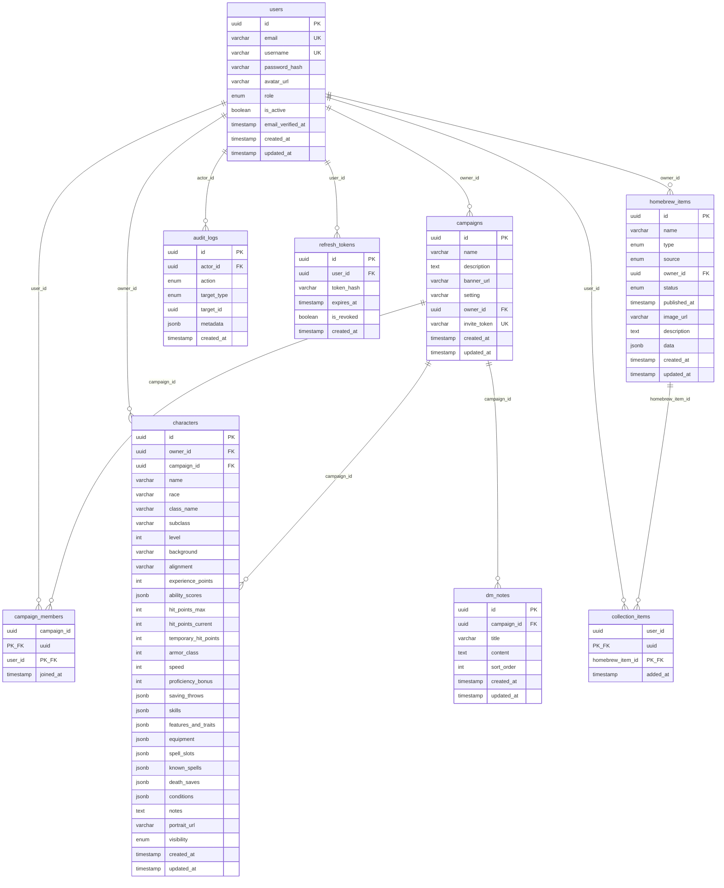

# DnD Companion Platform — Database Schema

> **Doküman amacı:** Tüm veritabanı tablolarını, alanlarını, index'lerini, FK ilişkilerini, cascade kurallarını, seed data stratejisini ve migration prosedürlerini tanımlar. Kodlama agent'ı bu dokümanı okuyarak Prisma şemasını, migration'ları ve seed script'ini eksiksiz üretir.

---

## 1. Genel İlkeler

**Veritabanı:** PostgreSQL (managed, minimum 7 gün PITR destekli).

**ORM:** Prisma. Tüm veritabanı erişimi Prisma Client üzerinden yapılır. Raw SQL ve string concatenation yasaktır.

**Primary Key:** Tüm tablolarda `id` alanı UUID tipindedir. Prisma'da `@default(uuid())` ile otomatik üretilir. İstisna: composite PK kullanan join tablolar (`campaign_members`, `collection_items`).

**Timestamp'ler:** Tüm tablolarda `created_at` (`@default(now())`) bulunur. Güncellenebilir tablolarda ek olarak `updated_at` (`@updatedAt`) bulunur. Tüm timestamp'ler UTC olarak saklanır.

**Naming Convention:**
- PostgreSQL tablo ve kolon adları: `snake_case` (örn. `campaign_members`, `owner_id`)
- Prisma model adları: `PascalCase` (örn. `CampaignMember`)
- Prisma `@@map("snake_case_table")` ve `@map("snake_case_column")` ile PostgreSQL adlandırmasına eşlenir

**JSONB Kullanımı:** Tipe göre değişen veya iç içe yapısal veri JSONB alanlarında tutulur (karakter ability scores, homebrew item data, audit metadata vb.). JSONB şema validasyonu PostgreSQL seviyesinde yapılmaz — uygulama katmanında Zod/class-validator ile enforce edilir.

**Enum'lar:** Prisma `enum` olarak tanımlanır, PostgreSQL'de native enum type'a dönüşür.

---

## 2. ERD (Fiziksel Şema)



---

## 3. Tablo Tanımları

### 3.1 `users`

| Kolon | Tip | Kısıt | Default | Açıklama |
|---|---|---|---|---|
| `id` | UUID | PK | `gen_random_uuid()` | |
| `email` | VARCHAR(255) | NOT NULL, UNIQUE | — | Giriş kimliği, PII |
| `username` | VARCHAR(50) | NOT NULL, UNIQUE | — | Görünen ad, profil URL |
| `password_hash` | VARCHAR(255) | NOT NULL | — | Argon2id hash. API yanıtında dönmez. |
| `avatar_url` | VARCHAR(500) | NULLABLE | `NULL` | Object storage URL |
| `role` | ENUM(`ADMIN`, `USER`) | NOT NULL | `USER` | Sistem rolü |
| `is_active` | BOOLEAN | NOT NULL | `true` | `false` → giriş engeli |
| `email_verified_at` | TIMESTAMP | NULLABLE | `NULL` | `NULL` → misafir erişim seviyesi |
| `created_at` | TIMESTAMP | NOT NULL | `now()` | |
| `updated_at` | TIMESTAMP | NOT NULL | auto | |

**Index'ler:**
- `users_email_key` — UNIQUE index on `email` (implicit from constraint)
- `users_username_key` — UNIQUE index on `username` (implicit from constraint)
- `users_role_is_active_idx` — Composite: `(role, is_active)` — Admin Panel kullanıcı listesi filtresi

---

### 3.2 `campaigns`

| Kolon | Tip | Kısıt | Default | Açıklama |
|---|---|---|---|---|
| `id` | UUID | PK | `gen_random_uuid()` | |
| `name` | VARCHAR(200) | NOT NULL | — | Kampanya adı |
| `description` | TEXT | NULLABLE | `NULL` | |
| `banner_url` | VARCHAR(500) | NULLABLE | `NULL` | |
| `setting` | VARCHAR(200) | NULLABLE | `NULL` | Kampanya dünyası/teması |
| `owner_id` | UUID | FK → `users.id`, NOT NULL | — | DM |
| `invite_token` | VARCHAR(64) | UNIQUE, NULLABLE | `NULL` | `NULL` = davet kapalı |
| `created_at` | TIMESTAMP | NOT NULL | `now()` | |
| `updated_at` | TIMESTAMP | NOT NULL | auto | |

**Foreign Key'ler:**
- `campaigns_owner_id_fkey` → `users.id` ON DELETE RESTRICT (DM silinmeden kampanya silinmez; kullanıcı silme zaten soft-delete)

**Index'ler:**
- `campaigns_owner_id_idx` — `(owner_id)` — kullanıcının kendi kampanyalarını listeleme
- `campaigns_invite_token_key` — UNIQUE index on `invite_token` (implicit, WHERE invite_token IS NOT NULL)

---

### 3.3 `campaign_members`

| Kolon | Tip | Kısıt | Default | Açıklama |
|---|---|---|---|---|
| `campaign_id` | UUID | PK (composite), FK → `campaigns.id` | — | |
| `user_id` | UUID | PK (composite), FK → `users.id` | — | |
| `joined_at` | TIMESTAMP | NOT NULL | `now()` | |

**Primary Key:** Composite `(campaign_id, user_id)`

**Foreign Key'ler:**
- `campaign_members_campaign_id_fkey` → `campaigns.id` ON DELETE CASCADE
- `campaign_members_user_id_fkey` → `users.id` ON DELETE CASCADE

**Index'ler:**
- `campaign_members_user_id_idx` — `(user_id)` — kullanıcının üye olduğu kampanyaları listeleme (PK zaten campaign_id'den başlar)

---

### 3.4 `characters`

| Kolon | Tip | Kısıt | Default | Açıklama |
|---|---|---|---|---|
| `id` | UUID | PK | `gen_random_uuid()` | |
| `owner_id` | UUID | FK → `users.id`, NOT NULL | — | Karakterin sahibi |
| `campaign_id` | UUID | FK → `campaigns.id`, NULLABLE | `NULL` | `NULL` = bağımsız |
| `name` | VARCHAR(200) | NOT NULL | — | |
| `race` | VARCHAR(100) | NULLABLE | `NULL` | |
| `class_name` | VARCHAR(100) | NULLABLE | `NULL` | `class` reserved keyword olduğu için `class_name` |
| `subclass` | VARCHAR(100) | NULLABLE | `NULL` | |
| `level` | INTEGER | NOT NULL | `1` | 1-20 arası |
| `background` | VARCHAR(100) | NULLABLE | `NULL` | |
| `alignment` | VARCHAR(50) | NULLABLE | `NULL` | |
| `experience_points` | INTEGER | NOT NULL | `0` | |
| `ability_scores` | JSONB | NOT NULL | `{"STR":10,"DEX":10,"CON":10,"INT":10,"WIS":10,"CHA":10}` | |
| `hit_points_max` | INTEGER | NULLABLE | `NULL` | |
| `hit_points_current` | INTEGER | NULLABLE | `NULL` | Canlı alan |
| `temporary_hit_points` | INTEGER | NOT NULL | `0` | Canlı alan |
| `armor_class` | INTEGER | NULLABLE | `NULL` | |
| `speed` | INTEGER | NULLABLE | `NULL` | |
| `proficiency_bonus` | INTEGER | NULLABLE | `NULL` | |
| `saving_throws` | JSONB | NULLABLE | `NULL` | |
| `skills` | JSONB | NULLABLE | `NULL` | |
| `features_and_traits` | JSONB | NULLABLE | `NULL` | |
| `equipment` | JSONB | NULLABLE | `NULL` | |
| `spell_slots` | JSONB | NULLABLE | `NULL` | |
| `known_spells` | JSONB | NULLABLE | `NULL` | |
| `death_saves` | JSONB | NOT NULL | `{"successes":0,"failures":0}` | Canlı alan |
| `conditions` | JSONB | NOT NULL | `[]` | Canlı alan |
| `notes` | TEXT | NULLABLE | `NULL` | |
| `portrait_url` | VARCHAR(500) | NULLABLE | `NULL` | |
| `visibility` | ENUM(`PUBLIC`, `PRIVATE`) | NOT NULL | `PRIVATE` | |
| `created_at` | TIMESTAMP | NOT NULL | `now()` | |
| `updated_at` | TIMESTAMP | NOT NULL | auto | |

**Foreign Key'ler:**
- `characters_owner_id_fkey` → `users.id` ON DELETE CASCADE (kullanıcı hard-delete durumunda — MVP'de olmaz ama FK güvenliği)
- `characters_campaign_id_fkey` → `campaigns.id` ON DELETE SET NULL (kampanya silinince karakter bağımsız olur)

**Index'ler:**
- `characters_owner_id_idx` — `(owner_id)` — "My Characters" listesi
- `characters_campaign_id_idx` — `(campaign_id)` — kampanyaya atanmış karakterler (DM Screen)
- `characters_visibility_idx` — `(visibility)` WHERE `visibility = 'PUBLIC'` — partial index, public karakter listeleme

---

### 3.5 `homebrew_items`

| Kolon | Tip | Kısıt | Default | Açıklama |
|---|---|---|---|---|
| `id` | UUID | PK | `gen_random_uuid()` | |
| `name` | VARCHAR(300) | NOT NULL | — | |
| `type` | ENUM(`BACKGROUND`, `FEAT`, `MAGIC_ITEM`, `MONSTER`, `SPELL`, `SUBCLASS`) | NOT NULL | — | Alt tip |
| `source` | ENUM(kitap kodları + `HOMEBREW`) | NOT NULL | — | İçerik kaynağı |
| `owner_id` | UUID | FK → `users.id`, NULLABLE | `NULL` | Resmi içerikler: `NULL` |
| `status` | ENUM(`DRAFT`, `PUBLISHED`) | NOT NULL | `DRAFT` | |
| `published_at` | TIMESTAMP | NULLABLE | `NULL` | |
| `image_url` | VARCHAR(500) | NULLABLE | `NULL` | |
| `description` | TEXT | NULLABLE | `NULL` | |
| `data` | JSONB | NOT NULL | `{}` | Tipe göre değişen yapısal veri |
| `created_at` | TIMESTAMP | NOT NULL | `now()` | |
| `updated_at` | TIMESTAMP | NOT NULL | auto | |

**Foreign Key'ler:**
- `homebrew_items_owner_id_fkey` → `users.id` ON DELETE SET NULL (kullanıcı silinse bile içerik korunur — orphaned content olarak ADMIN yönetir)

**Index'ler:**
- `homebrew_items_type_status_idx` — Composite: `(type, status)` — galeri: tip filtresi + sadece PUBLISHED
- `homebrew_items_source_idx` — `(source)` — kaynak kitap filtresi
- `homebrew_items_owner_id_idx` — `(owner_id)` — "My Creations" listesi
- `homebrew_items_name_idx` — `(name)` — ILIKE arama desteği (trigram index aşağıda)
- `homebrew_items_published_idx` — Partial: `(type, source, created_at)` WHERE `status = 'PUBLISHED'` — galeri sıralaması

**Trigram Index (ILIKE Arama):**

```sql
CREATE EXTENSION IF NOT EXISTS pg_trgm;
CREATE INDEX homebrew_items_name_trgm_idx ON homebrew_items USING gin (name gin_trgm_ops);
```

Bu index, `WHERE name ILIKE '%dragon%'` sorgularını hızlandırır. Prisma migration'da raw SQL olarak eklenir (`prisma migrate` custom SQL desteği ile).

---

### 3.6 `collection_items`

| Kolon | Tip | Kısıt | Default | Açıklama |
|---|---|---|---|---|
| `user_id` | UUID | PK (composite), FK → `users.id` | — | |
| `homebrew_item_id` | UUID | PK (composite), FK → `homebrew_items.id` | — | |
| `added_at` | TIMESTAMP | NOT NULL | `now()` | |

**Primary Key:** Composite `(user_id, homebrew_item_id)`

**Foreign Key'ler:**
- `collection_items_user_id_fkey` → `users.id` ON DELETE CASCADE
- `collection_items_homebrew_item_id_fkey` → `homebrew_items.id` ON DELETE CASCADE

**Index'ler:**
- `collection_items_homebrew_item_id_idx` — `(homebrew_item_id)` — bir içeriğin kaç kişi tarafından koleksiyona eklendiğini sorgulama

---

### 3.7 `dm_notes`

| Kolon | Tip | Kısıt | Default | Açıklama |
|---|---|---|---|---|
| `id` | UUID | PK | `gen_random_uuid()` | |
| `campaign_id` | UUID | FK → `campaigns.id`, NOT NULL | — | |
| `title` | VARCHAR(300) | NOT NULL | — | |
| `content` | TEXT | NULLABLE | `NULL` | Markdown destekli |
| `sort_order` | INTEGER | NOT NULL | `0` | DM'in belirlediği sıralama |
| `created_at` | TIMESTAMP | NOT NULL | `now()` | |
| `updated_at` | TIMESTAMP | NOT NULL | auto | |

**Foreign Key'ler:**
- `dm_notes_campaign_id_fkey` → `campaigns.id` ON DELETE CASCADE

**Index'ler:**
- `dm_notes_campaign_id_sort_idx` — Composite: `(campaign_id, sort_order)` — kampanya bazlı sıralı listeleme

---

### 3.8 `audit_logs`

| Kolon | Tip | Kısıt | Default | Açıklama |
|---|---|---|---|---|
| `id` | UUID | PK | `gen_random_uuid()` | |
| `actor_id` | UUID | FK → `users.id`, NOT NULL | — | İşlemi yapan ADMIN |
| `action` | ENUM(`ROLE_CHANGED`, `USER_DEACTIVATED`, `USER_REACTIVATED`, `CONTENT_EDITED`, `CONTENT_DELETED`) | NOT NULL | — | |
| `target_type` | ENUM(`USER`, `CAMPAIGN`, `CHARACTER`, `HOMEBREW`) | NOT NULL | — | |
| `target_id` | UUID | NOT NULL | — | Etkilenen kaydın ID'si (FK yok — hedef silinmiş olabilir) |
| `metadata` | JSONB | NULLABLE | `NULL` | |
| `created_at` | TIMESTAMP | NOT NULL | `now()` | |

**`updated_at` yoktur** — append-only tablo, UPDATE yasaktır.

**`target_id` üzerinde FK yoktur** — hedef kayıt silinmiş olabilir (admin hard-delete sonrası log korunmalıdır).

**Foreign Key'ler:**
- `audit_logs_actor_id_fkey` → `users.id` ON DELETE RESTRICT (admin kullanıcı silinemez, zaten soft-delete)

**Index'ler:**
- `audit_logs_actor_id_idx` — `(actor_id)` — admin bazlı log sorgulama
- `audit_logs_target_type_target_id_idx` — Composite: `(target_type, target_id)` — hedef bazlı log sorgulama
- `audit_logs_created_at_idx` — `(created_at DESC)` — kronolojik sıralama

**Uygulama Katmanı Kısıtı:** Bu tabloya UPDATE ve DELETE operasyonu yapılmaz. Bu kural Prisma Client wrapper'ında veya NestJS service katmanında zorlanır (DB seviyesinde trigger/rule opsiyonel — MVP'de uygulama katmanı yeterlidir).

---

### 3.9 `refresh_tokens`

JWT refresh token rotation desteği için teknik tablo. Domain entity değildir.

| Kolon | Tip | Kısıt | Default | Açıklama |
|---|---|---|---|---|
| `id` | UUID | PK | `gen_random_uuid()` | |
| `user_id` | UUID | FK → `users.id`, NOT NULL | — | Token sahibi |
| `token_hash` | VARCHAR(255) | NOT NULL | — | Refresh token'ın hash'i (raw token saklanmaz) |
| `expires_at` | TIMESTAMP | NOT NULL | — | 30 gün sonra |
| `is_revoked` | BOOLEAN | NOT NULL | `false` | `true` → geçersiz kılınmış |
| `created_at` | TIMESTAMP | NOT NULL | `now()` | |

**Foreign Key'ler:**
- `refresh_tokens_user_id_fkey` → `users.id` ON DELETE CASCADE (kullanıcı silinince tüm token'lar da silinir)

**Index'ler:**
- `refresh_tokens_user_id_idx` — `(user_id)` — kullanıcının tüm aktif token'larını bulma (reuse detection'da toplu iptal)
- `refresh_tokens_token_hash_idx` — `(token_hash)` — refresh isteğinde token lookup

**Temizlik:** Süresi dolmuş (`expires_at < now()`) veya iptal edilmiş (`is_revoked = true`) token'lar periyodik olarak temizlenir. Basit bir scheduled job (cron veya NestJS `@Cron`) günde bir kez eski kayıtları siler.

---

## 4. Cascade ve Referential Integrity Kuralları

| FK | ON DELETE | Gerekçe |
|---|---|---|
| `campaigns.owner_id` → `users.id` | RESTRICT | DM silinmeden kampanya kalmamalı. Kullanıcı silme zaten soft-delete (is_active=false). |
| `campaign_members.campaign_id` → `campaigns.id` | CASCADE | Kampanya silinince üyelik kayıtları silinir. |
| `campaign_members.user_id` → `users.id` | CASCADE | Kullanıcı hard-delete'te üyelikler temizlenir. |
| `characters.owner_id` → `users.id` | CASCADE | Kullanıcı hard-delete'te karakterler de silinir. |
| `characters.campaign_id` → `campaigns.id` | SET NULL | Kampanya silinince karakter bağımsız olur, silinmez. |
| `homebrew_items.owner_id` → `users.id` | SET NULL | Kullanıcı silinse bile içerik korunur (orphaned). |
| `collection_items.user_id` → `users.id` | CASCADE | |
| `collection_items.homebrew_item_id` → `homebrew_items.id` | CASCADE | İçerik silinince koleksiyon referansı da silinir. |
| `dm_notes.campaign_id` → `campaigns.id` | CASCADE | Kampanya silinince notlar da silinir. |
| `audit_logs.actor_id` → `users.id` | RESTRICT | Logları koruyan admin silinemez. |
| `refresh_tokens.user_id` → `users.id` | CASCADE | |

**Önemli:** MVP'de kullanıcı hard-delete yapılmaz (sadece soft-delete/deaktivasyon). CASCADE kuralları veri tutarlılığı için tanımlanır ama pratikte tetiklenmesi beklenmez.

---

## 5. JSONB Validasyon Stratejisi

PostgreSQL, JSONB alanları üzerinde native şema validasyonu desteklemez (CHECK constraint ile basit kontroller mümkün ama karmaşık nested yapılar için yetersiz).

Validasyon uygulama katmanında enforce edilir:

- **Backend (NestJS):** Her `type` için ayrı Zod şeması tanımlanır. `data` alanı service katmanında validate edilir; geçersiz yapı `400 Bad Request` döner.
- **Frontend (React):** React Hook Form + Zod ile aynı şemalar kullanılır (packages/shared'dan import).
- **Seed script:** Import edilen resmi 5e verisi de aynı Zod şemalarından geçirilir; uyumsuz kayıtlar loglanır ve atlanır.

Şema tanımları `packages/shared/schemas/homebrew/` altında tipe göre ayrı dosyalarda tutulur:
- `spell.schema.ts`
- `monster.schema.ts`
- `feat.schema.ts`
- `background.schema.ts`
- `magic-item.schema.ts`
- `subclass.schema.ts`

---

## 6. Seed Data Stratejisi

### 6.1 Resmi 5e Verisi

Tüm resmi D&D 5e kaynak kitaplarından hazırlanan JSON dosyaları `apps/api/prisma/seed-data/` altında tutulur:

```
prisma/seed-data/
  spells.json        # Tüm kitaplardan spell'ler
  monsters.json      # Tüm kitaplardan monster'lar
  feats.json         # Tüm kitaplardan feat'ler
  backgrounds.json   # Tüm kitaplardan background'lar
  magic-items.json   # Tüm kitaplardan magic item'lar
  subclasses.json    # Tüm kitaplardan subclass'lar
```

Her JSON dosyasının formatı:

```json
[
  {
    "name": "Fireball",
    "type": "SPELL",
    "source": "PHB",
    "description": "A bright streak flashes...",
    "data": {
      "level": 3,
      "school": "Evocation",
      "casting_time": "1 action",
      "..."
    }
  }
]
```

### 6.2 Seed Script

Prisma seed script (`prisma/seed.ts`):

```typescript
// Pseudo-code — referans pattern
async function main() {
  // 1. İlk admin hesabı
  const adminEmail = process.env.SEED_ADMIN_EMAIL;
  const adminPassword = process.env.SEED_ADMIN_PASSWORD;
  if (adminEmail && adminPassword) {
    await prisma.user.upsert({
      where: { email: adminEmail },
      update: {},
      create: {
        email: adminEmail,
        username: 'admin',
        password_hash: await argon2.hash(adminPassword),
        role: 'ADMIN',
        is_active: true,
        email_verified_at: new Date(),
      },
    });
  }

  // 2. Resmi 5e verileri (idempotent upsert)
  for (const file of ['spells', 'monsters', 'feats', 'backgrounds', 'magic-items', 'subclasses']) {
    const items = JSON.parse(fs.readFileSync(`prisma/seed-data/${file}.json`, 'utf-8'));
    for (const item of items) {
      // Zod validasyonu
      const parsed = homebrewDataSchema[item.type].safeParse(item.data);
      if (!parsed.success) {
        console.warn(`Skipping invalid ${item.type}: ${item.name}`, parsed.error);
        continue;
      }
      await prisma.homebrewItem.upsert({
        where: { name_type_source: { name: item.name, type: item.type, source: item.source } },
        update: { data: item.data, description: item.description },
        create: {
          name: item.name,
          type: item.type,
          source: item.source,
          owner_id: null,
          status: 'PUBLISHED',
          published_at: new Date(),
          description: item.description,
          data: item.data,
        },
      });
    }
  }
}
```

### 6.3 Idempotency

Seed script idempotent olmalıdır — tekrar çalıştırıldığında mevcut kayıtları günceller (upsert), çoğaltmaz. Upsert anahtarı: `(name, type, source)` composite unique constraint.

Bu, `homebrew_items` tablosuna ek bir unique constraint gerektirir:

```sql
CREATE UNIQUE INDEX homebrew_items_name_type_source_key
ON homebrew_items (name, type, source);
```

**Not:** Bu constraint, aynı adda homebrew oluşturmayı engellemez çünkü homebrew'lerin `source = HOMEBREW`'dur. Farklı kullanıcılar aynı adda homebrew oluşturabilir — bu durumda `owner_id`'nin de unique key'e dahil edilmesi gerekir. Çözüm: upsert sadece `source != HOMEBREW` olan kayıtlar için `(name, type, source)` üzerinden yapılır; homebrew kayıtları normal `create` ile eklenir. Prisma'da bu, `@@unique([name, type, source])` ile sağlanır ve seed script `where` koşulunda `source != HOMEBREW` kontrolü yapar.

### 6.4 Environment Variables (Seed)

| Değişken | Açıklama | Zorunlu |
|---|---|---|
| `SEED_ADMIN_EMAIL` | İlk admin hesabının email adresi | Evet (ilk deploy) |
| `SEED_ADMIN_PASSWORD` | İlk admin hesabının şifresi | Evet (ilk deploy) |

---

## 7. Migration Stratejisi

### 7.1 Geliştirme Ortamı

```bash
# Şema değişikliği sonrası migration oluşturma
npx prisma migrate dev --name <descriptive-name>

# Migration dosyası: prisma/migrations/<timestamp>_<name>/migration.sql
```

Migration dosyaları versiyon kontrolünde (Git) tutulur. Her migration dosyası review edilebilir SQL içerir.

### 7.2 Production / Staging

```bash
# Mevcut migration'ları uygulama (yeni migration oluşturmaz)
npx prisma migrate deploy
```

CI/CD pipeline'ında deploy adımından önce çalıştırılır.

### 7.3 Custom SQL Migration

Prisma migration'larında raw SQL gerektiğinde (trigram index, partial index vb.):

1. Boş migration oluştur: `npx prisma migrate dev --create-only --name <name>`
2. Oluşan `migration.sql` dosyasına custom SQL ekle.
3. `npx prisma migrate dev` ile uygula.

### 7.4 Rollback Prosedürü

Prisma native rollback desteklemez. Rollback senaryoları:

- **Başarısız migration:** `npx prisma migrate resolve --rolled-back <migration-name>` ile migration "rolled back" olarak işaretlenir, ardından düzeltilmiş migration oluşturulur.
- **Veri kaybı riski olan migration:** Migration öncesi managed PostgreSQL snapshot alınır (PITR). Sorun olursa snapshot'tan geri dönülür.
- **Kural:** Destructive migration'lar (DROP COLUMN, DROP TABLE) iki aşamalı yapılır: (1) kodu kolonu kullanmayı bırakacak şekilde güncelle + deploy, (2) sonraki sprint'te kolonu kaldıran migration'ı uygula.

---

## 8. Backup ve Kurtarma

### 8.1 Gereksinimler

- Managed PostgreSQL sağlayıcısında **günlük otomatik snapshot** zorunludur.
- Minimum **7 gün Point-in-Time Recovery (PITR)** desteği zorunludur.
- Backup'lar uygulama verisi ile aynı bölgede saklanır.

### 8.2 Kurtarma Prosedürü

1. Managed PostgreSQL konsolundan hedef zaman damgasına PITR restore başlat.
2. Yeni DB instance'ını staging ortamında doğrula.
3. Backend'in bağlantı string'ini yeni instance'a yönlendir.
4. `npx prisma migrate deploy` ile migration durumunu kontrol et.

### 8.3 Seed Data ve Backup İlişkisi

Resmi 5e seed verisi JSON dosyalarında tutulduğu için DB backup'ından bağımsız olarak yeniden yüklenebilir. Kullanıcı verisi (hesaplar, karakterler, kampanyalar, homebrew'ler) backup'a bağımlıdır — bu nedenle PITR zorunluluğu kritiktir.

---

## 9. Prisma Şema Referansı

Aşağıdaki Prisma şeması, yukarıdaki tüm tablo tanımlarının Prisma DSL karşılığıdır. Agent bu şemayı `prisma/schema.prisma` dosyasına yazarken referans alır.

```prisma
generator client {
  provider = "prisma-client-js"
}

datasource db {
  provider = "postgresql"
  url      = env("DATABASE_URL")
}

enum Role {
  ADMIN
  USER
}

enum HomebrewStatus {
  DRAFT
  PUBLISHED
}

enum CharacterVisibility {
  PUBLIC
  PRIVATE
}

enum HomebrewType {
  BACKGROUND
  FEAT
  MAGIC_ITEM
  MONSTER
  SPELL
  SUBCLASS
}

enum Source {
  PHB
  DMG
  MM
  XGTE
  TCOE
  FTOD
  VRGR
  MPMM
  SCAG
  ERLW
  EGW
  GGR
  SAiS
  SatO
  AAG
  BGG
  PAitM
  BMT
  PHB2024
  DMG2024
  MM2024
  HOMEBREW
}

enum AuditAction {
  ROLE_CHANGED
  USER_DEACTIVATED
  USER_REACTIVATED
  CONTENT_EDITED
  CONTENT_DELETED
}

enum AuditTargetType {
  USER
  CAMPAIGN
  CHARACTER
  HOMEBREW
}

model User {
  id               String    @id @default(uuid())
  email            String    @unique
  username         String    @unique
  passwordHash     String    @map("password_hash")
  avatarUrl        String?   @map("avatar_url")
  role             Role      @default(USER)
  isActive         Boolean   @default(true) @map("is_active")
  emailVerifiedAt  DateTime? @map("email_verified_at")
  createdAt        DateTime  @default(now()) @map("created_at")
  updatedAt        DateTime  @updatedAt @map("updated_at")

  campaigns        Campaign[]
  campaignMembers  CampaignMember[]
  characters       Character[]
  homebrewItems    HomebrewItem[]
  collectionItems  CollectionItem[]
  auditLogs        AuditLog[]
  refreshTokens    RefreshToken[]

  @@index([role, isActive])
  @@map("users")
}

model Campaign {
  id           String    @id @default(uuid())
  name         String
  description  String?
  bannerUrl    String?   @map("banner_url")
  setting      String?
  ownerId      String    @map("owner_id")
  inviteToken  String?   @unique @map("invite_token")
  createdAt    DateTime  @default(now()) @map("created_at")
  updatedAt    DateTime  @updatedAt @map("updated_at")

  owner        User      @relation(fields: [ownerId], references: [id], onDelete: Restrict)
  members      CampaignMember[]
  characters   Character[]
  dmNotes      DmNote[]

  @@index([ownerId])
  @@map("campaigns")
}

model CampaignMember {
  campaignId String   @map("campaign_id")
  userId     String   @map("user_id")
  joinedAt   DateTime @default(now()) @map("joined_at")

  campaign   Campaign @relation(fields: [campaignId], references: [id], onDelete: Cascade)
  user       User     @relation(fields: [userId], references: [id], onDelete: Cascade)

  @@id([campaignId, userId])
  @@index([userId])
  @@map("campaign_members")
}

model Character {
  id                 String              @id @default(uuid())
  ownerId            String              @map("owner_id")
  campaignId         String?             @map("campaign_id")
  name               String
  race               String?
  className          String?             @map("class_name")
  subclass           String?
  level              Int                 @default(1)
  background         String?
  alignment          String?
  experiencePoints   Int                 @default(0) @map("experience_points")
  abilityScores      Json                @default("{\"STR\":10,\"DEX\":10,\"CON\":10,\"INT\":10,\"WIS\":10,\"CHA\":10}") @map("ability_scores")
  hitPointsMax       Int?                @map("hit_points_max")
  hitPointsCurrent   Int?                @map("hit_points_current")
  temporaryHitPoints Int                 @default(0) @map("temporary_hit_points")
  armorClass         Int?                @map("armor_class")
  speed              Int?
  proficiencyBonus   Int?                @map("proficiency_bonus")
  savingThrows       Json?               @map("saving_throws")
  skills             Json?
  featuresAndTraits  Json?               @map("features_and_traits")
  equipment          Json?
  spellSlots         Json?               @map("spell_slots")
  knownSpells        Json?               @map("known_spells")
  deathSaves         Json                @default("{\"successes\":0,\"failures\":0}") @map("death_saves")
  conditions         Json                @default("[]")
  notes              String?
  portraitUrl        String?             @map("portrait_url")
  visibility         CharacterVisibility @default(PRIVATE)
  createdAt          DateTime            @default(now()) @map("created_at")
  updatedAt          DateTime            @updatedAt @map("updated_at")

  owner              User                @relation(fields: [ownerId], references: [id], onDelete: Cascade)
  campaign           Campaign?           @relation(fields: [campaignId], references: [id], onDelete: SetNull)

  @@index([ownerId])
  @@index([campaignId])
  @@map("characters")
}

model HomebrewItem {
  id           String         @id @default(uuid())
  name         String
  type         HomebrewType
  source       Source
  ownerId      String?        @map("owner_id")
  status       HomebrewStatus @default(DRAFT)
  publishedAt  DateTime?      @map("published_at")
  imageUrl     String?        @map("image_url")
  description  String?
  data         Json           @default("{}")
  createdAt    DateTime       @default(now()) @map("created_at")
  updatedAt    DateTime       @updatedAt @map("updated_at")

  owner        User?          @relation(fields: [ownerId], references: [id], onDelete: SetNull)
  collections  CollectionItem[]

  @@unique([name, type, source])
  @@index([type, status])
  @@index([source])
  @@index([ownerId])
  @@map("homebrew_items")
}

model CollectionItem {
  userId         String   @map("user_id")
  homebrewItemId String   @map("homebrew_item_id")
  addedAt        DateTime @default(now()) @map("added_at")

  user           User         @relation(fields: [userId], references: [id], onDelete: Cascade)
  homebrewItem   HomebrewItem @relation(fields: [homebrewItemId], references: [id], onDelete: Cascade)

  @@id([userId, homebrewItemId])
  @@index([homebrewItemId])
  @@map("collection_items")
}

model DmNote {
  id         String   @id @default(uuid())
  campaignId String   @map("campaign_id")
  title      String
  content    String?
  sortOrder  Int      @default(0) @map("sort_order")
  createdAt  DateTime @default(now()) @map("created_at")
  updatedAt  DateTime @updatedAt @map("updated_at")

  campaign   Campaign @relation(fields: [campaignId], references: [id], onDelete: Cascade)

  @@index([campaignId, sortOrder])
  @@map("dm_notes")
}

model AuditLog {
  id         String          @id @default(uuid())
  actorId    String          @map("actor_id")
  action     AuditAction
  targetType AuditTargetType @map("target_type")
  targetId   String          @map("target_id")
  metadata   Json?
  createdAt  DateTime        @default(now()) @map("created_at")

  actor      User            @relation(fields: [actorId], references: [id], onDelete: Restrict)

  @@index([actorId])
  @@index([targetType, targetId])
  @@index([createdAt(sort: Desc)])
  @@map("audit_logs")
}

model RefreshToken {
  id        String   @id @default(uuid())
  userId    String   @map("user_id")
  tokenHash String   @map("token_hash")
  expiresAt DateTime @map("expires_at")
  isRevoked Boolean  @default(false) @map("is_revoked")
  createdAt DateTime @default(now()) @map("created_at")

  user      User     @relation(fields: [userId], references: [id], onDelete: Cascade)

  @@index([userId])
  @@index([tokenHash])
  @@map("refresh_tokens")
}
```
