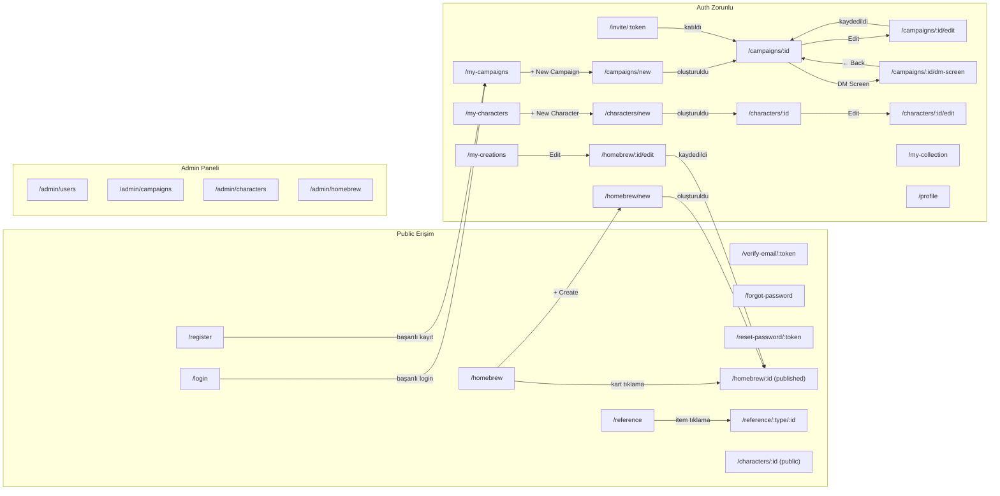

# 06 — Screen Catalog

Bu doküman, DnD Companion Platform'un tüm ekranlarını agent-ready detayda tanımlar. Her ekran için route, layout, bileşen listesi, state yönetimi, API çağrıları, yetki kuralları ve responsive davranış belirtilir. Bir kodlama agent'ı bu dokümanı okuduğunda, her ekranı sıfırdan uygulayabilecek kadar bilgiye sahip olur.

---

## İçindekiler

1. [Ekran Haritası](#1-ekran-haritası)
2. [Layout Sistemi](#2-layout-sistemi)
3. [Navigasyon Yapısı](#3-navigasyon-yapısı)
4. [Grup 1 — Auth Ekranları](#4-grup-1--auth-ekranları)
5. [Grup 2 — Campaign Ekranları](#5-grup-2--campaign-ekranları)
6. [Grup 3 — DM Screen](#6-grup-3--dm-screen)
7. [Grup 4 — Character Ekranları](#7-grup-4--character-ekranları)
8. [Grup 5 — Homebrew Ekranları](#8-grup-5--homebrew-ekranları)
9. [Grup 6 — Reference Ekranları](#9-grup-6--reference-ekranları)
10. [Grup 7 — Admin Ekranları](#10-grup-7--admin-ekranları)
11. [Grup 8 — Profil ve Hata Ekranları](#11-grup-8--profil-ve-hata-ekranları)
12. [Ekran Akış Diyagramı](#12-ekran-akış-diyagramı)
13. [Ortak Bileşenler](#13-ortak-bileşenler)

---

## 1. Ekran Haritası

| ID | Route | Layout | Seviye | Auth | Misafir |
|---|---|---|---|---|---|
| S-LOGIN | `/login` | Auth | Kritik | Hayır | Evet |
| S-REGISTER | `/register` | Auth | Kritik | Hayır | Evet |
| S-VERIFY-EMAIL | `/verify-email/:token` | Auth | İkincil | Hayır | Evet |
| S-PW-RESET-REQ | `/forgot-password` | Auth | İkincil | Hayır | Evet |
| S-PW-RESET-CONF | `/reset-password/:token` | Auth | İkincil | Hayır | Evet |
| S-SESSION-EXPIRED | modal/overlay | Modal | İkincil | — | — |
| S-CAMPAIGN-LIST | `/my-campaigns` | App | Kritik | Evet | Hayır |
| S-CAMPAIGN-CREATE | `/campaigns/new` | App | Kritik | Evet | Hayır |
| S-CAMPAIGN-DETAIL | `/campaigns/:id` | App | Kritik | Evet | Hayır |
| S-CAMPAIGN-EDIT | `/campaigns/:id/edit` | App | İkincil | Evet | Hayır |
| S-INVITE | `/invite/:token` | Minimal | Kritik | Evet | Hayır |
| S-DM-SCREEN | `/campaigns/:id/dm-screen` | App (full-width) | Kritik | Evet | Hayır |
| S-CHAR-LIST | `/my-characters` | App | Kritik | Evet | Hayır |
| S-CHAR-BUILDER | `/characters/new`, `/characters/:id/builder` | App (multi-tab) | Kritik | Evet | Hayır |
| S-CHAR-DETAIL | `/characters/:id` | App | Kritik | Evet + koşullu | Koşullu |
| S-CHAR-EDIT | `/characters/:id/edit` | App (multi-tab) | İkincil | Evet | Hayır |
| S-HOMEBREW-GALLERY | `/homebrew` | App | Kritik | Hayır | Evet |
| S-HOMEBREW-DETAIL | `/homebrew/:id` | App | Kritik | Hayır | Evet (published) |
| S-HOMEBREW-CREATE | `/homebrew/new` | App | Kritik | Evet | Hayır |
| S-HOMEBREW-EDIT | `/homebrew/:id/edit` | App | İkincil | Evet | Hayır |
| S-MY-CREATIONS | `/my-creations` | App | Kritik | Evet | Hayır |
| S-MY-COLLECTION | `/my-collection` | App | Kritik | Evet | Hayır |
| S-REF-LIST | `/reference`, `/reference/:type` | App | Kritik | Hayır | Evet |
| S-REF-DETAIL | `/reference/:type/:id` | App | İkincil | Hayır | Evet |
| S-PROFILE | `/profile` | App | İkincil | Evet | Hayır |
| S-ADMIN-USERS | `/admin/users` | Admin | Kritik | Evet (ADMIN) | Hayır |
| S-ADMIN-CAMPAIGNS | `/admin/campaigns` | Admin | İkincil | Evet (ADMIN) | Hayır |
| S-ADMIN-CHARACTERS | `/admin/characters` | Admin | İkincil | Evet (ADMIN) | Hayır |
| S-ADMIN-HOMEBREW | `/admin/homebrew` | Admin | İkincil | Evet (ADMIN) | Hayır |
| S-404 | `*` (catch-all) | Minimal | İkincil | Hayır | Evet |
| S-500 | error boundary | Minimal | İkincil | Hayır | Evet |

**Toplam: 31 ekran** — 17 kritik (tam şablon), 14 ikincil (kısa şablon).

**Seviye açıklaması:**
- **Kritik:** Wireframe seviyesi detay — bileşen hiyerarşisi, state slice'ları, API çağrıları, yetki kuralları, responsive davranış, empty/loading/error state'leri.
- **İkincil:** Temel layout, ana bileşenler, yetki notu, kritik bir ekranla paylaşılan pattern'e referans.

---

## 2. Layout Sistemi

Platform dört layout şablonu kullanır. Her ekran bu şablonlardan birini kullanır; layout seçimi ekran haritasında belirtilmiştir.

### 2.1 Auth Layout

Kimlik doğrulama sayfaları için minimal layout. Navigasyon çubuğu ve sidebar yoktur.

```
┌─────────────────────────────────────────┐
│              Logo (merkez)              │
├─────────────────────────────────────────┤
│                                         │
│         ┌───────────────────┐           │
│         │   Form Kartı      │           │
│         │   (max-w-md)      │           │
│         │                   │           │
│         └───────────────────┘           │
│                                         │
│         Alt link (login ↔ register)     │
└─────────────────────────────────────────┘
```

- Arka plan: nötr renk veya subtle gradient.
- Form kartı: `max-w-md`, dikeyde ortalanmış, `shadow-lg`, `rounded-xl`.
- Logo: üstte merkez hizalı, tıklanınca `/` route'una yönlendirir.
- Alt link: Login sayfasında "Don't have an account? Register", Register sayfasında "Already have an account? Log in".

### 2.2 App Layout (Sidebar)

Giriş yapmış kullanıcıların ana layout'u. Üst navigasyon çubuğu + sol sidebar + içerik alanı.

```
┌──────────────────────────────────────────────────┐
│  Logo │ ─── Top Bar ───────────── │ Avatar Menu  │
├───────┼──────────────────────────────────────────┤
│       │                                          │
│  Nav  │           Content Area                   │
│  Bar  │           (main)                         │
│       │                                          │
│       │                                          │
│       │                                          │
└───────┴──────────────────────────────────────────┘
```

- **Top Bar:** Logo (sol), sayfa başlığı (merkez veya sol-logo yanı), kullanıcı avatar + dropdown menü (sağ). Dropdown: "Profile", "Log out"; `role === ADMIN` ise ek "Admin Panel" linki.
- **Sidebar (sol, `w-64`):** Ana navigasyon linkleri (aşağıda §3'te tanımlı). Masaüstünde her zaman görünür. Mobilde (`< md`) hamburger menü ile açılır (off-canvas, sol taraftan kayarak gelir), dışına tıklayınca kapanır.
- **Content Area:** `flex-1`, `overflow-y-auto`. Sayfa içeriği burada render edilir. Padding: `p-6` (masaüstü), `p-4` (mobil).

### 2.3 App Layout — Full-Width Varyantı

DM Screen gibi ekran alanını maksimize etmesi gereken sayfalar için. Sidebar gizlenir, içerik tam genişlik kullanır.

```
┌──────────────────────────────────────────────────┐
│  ← Back │ Campaign Adı │ ──────── │ Avatar Menu  │
├──────────────────────────────────────────────────┤
│                                                  │
│              Full-Width Content                  │
│              (sidebar yok)                       │
│                                                  │
└──────────────────────────────────────────────────┘
```

- Top bar'da sidebar toggle yerine "← Back to Campaign" butonu.
- İçerik alanı tam genişlik (`max-w-full`).

### 2.4 Admin Layout

App Layout'un admin varyantı. Sidebar, admin navigasyon linklerini gösterir.

```
┌──────────────────────────────────────────────────┐
│  Logo │ "Admin Panel" ─────────── │ Avatar Menu  │
├───────┼──────────────────────────────────────────┤
│       │                                          │
│ Admin │           Content Area                   │
│  Nav  │                                          │
│       │                                          │
└───────┴──────────────────────────────────────────┘
```

- Top bar'da "Admin Panel" etiketi açıkça görünür.
- Sidebar linkleri: Users, Campaigns, Characters, Homebrew. Ayrıca "← Back to App" linki (normal App Layout'a dönüş).
- Route guard: `role !== ADMIN` ise `/` redirect.

### 2.5 Minimal Layout

Davet, hata sayfaları ve doğrulama ekranları için. Sadece logo + içerik.

```
┌─────────────────────────────────────────┐
│              Logo (merkez)              │
├─────────────────────────────────────────┤
│                                         │
│         ┌───────────────────┐           │
│         │   İçerik Kartı    │           │
│         │   (max-w-lg)      │           │
│         └───────────────────┘           │
│                                         │
└─────────────────────────────────────────┘
```

---

## 3. Navigasyon Yapısı

### 3.1 App Sidebar Navigasyon Linkleri

Giriş yapmış her kullanıcı (`USER` veya `ADMIN`) için:

| Sıra | Etiket | Ikon | Route | Açıklama |
|---|---|---|---|---|
| 1 | My Campaigns | `Swords` | `/my-campaigns` | Kullanıcının DM olduğu veya üye olduğu kampanyalar |
| 2 | My Characters | `User` | `/my-characters` | Kullanıcının sahip olduğu karakterler |
| 3 | Homebrew Gallery | `FlaskConical` | `/homebrew` | Published homebrew galerisi (herkese açık) |
| 4 | My Creations | `Paintbrush` | `/my-creations` | Kullanıcının oluşturduğu homebrew içerikler |
| 5 | My Collection | `Bookmark` | `/my-collection` | Kullanıcının koleksiyonuna eklediği homebrew'ler |
| 6 | Reference | `BookOpen` | `/reference` | SRD / resmi 5e kural referansı |

Aktif sayfa, sidebar'da `bg-accent` ile vurgulanır. İkonlar `lucide-react` paketinden.

### 3.2 Kullanıcı Dropdown Menü (Top Bar — sağ üst)

Avatar tıklanınca açılır:

| Etiket | Route / Aksiyon |
|---|---|
| Profile | `/profile` |
| Admin Panel | `/admin/users` — yalnızca `role === ADMIN` ise görünür |
| Log out | `POST /auth/logout` → access token memory'den silinir, refresh token cookie temizlenir, `/login` redirect |

### 3.3 Misafir Navigasyonu

Giriş yapmamış ziyaretçiler sidebar'ı görmez. Erişebildikleri public sayfalar:

- `/homebrew` — Homebrew Gallery (sadece published)
- `/homebrew/:id` — Homebrew Detay (sadece published)
- `/reference` — SRD Referans listesi
- `/reference/:type/:id` — SRD Referans detay
- `/characters/:id` — Karakter detay (sadece `visibility = PUBLIC`)
- `/login`, `/register`, `/forgot-password`, `/reset-password/:token`, `/verify-email/:token`

Bu sayfalarda top bar yerine basit bir header gösterilir: Logo (sol) + "Log in" / "Register" butonları (sağ).

---

## 4. Grup 1 — Auth Ekranları

### 4.1 S-LOGIN — Giriş Sayfası ⭐ Kritik

**Route:** `/login`
**Layout:** Auth Layout
**Auth:** Giriş yapmamış kullanıcılar erişir. Zaten giriş yapmış kullanıcı bu route'a gelirse `/my-campaigns` redirect.

#### Bileşen Hiyerarşisi

```
AuthLayout
└── LoginCard
    ├── Logo
    ├── Heading ("Log in to DnD Companion")
    ├── LoginForm
    │   ├── EmailInput (type="email", required)
    │   ├── PasswordInput (type="password", required, göster/gizle toggle)
    │   ├── ForgotPasswordLink ("Forgot password?" → /forgot-password)
    │   └── SubmitButton ("Log in")
    ├── ErrorAlert (koşullu — API hata mesajı)
    └── RegisterLink ("Don't have an account? Register" → /register)
```

#### Form Alanları ve Validasyon

| Alan | Tip | Validasyon (Zod) | Hata Mesajı |
|---|---|---|---|
| `email` | `z.string().email()` | Geçerli email formatı | "Please enter a valid email address" |
| `password` | `z.string().min(1)` | Boş olamaz | "Password is required" |

Form yönetimi: React Hook Form + Zod resolver. Submit sırasında buton disabled + spinner gösterilir.

#### API Çağrıları

| Aksiyon | Endpoint | Method | Body | Başarı | Hata |
|---|---|---|---|---|---|
| Login | `/auth/login` | POST | `{ email, password }` | 200: `{ accessToken }` + `Set-Cookie: refreshToken` → access token memory'de saklanır → `/my-campaigns` redirect | 401: ErrorAlert'te "Invalid email or password" gösterilir. 429: "Too many login attempts. Please try again later." |

#### State Yönetimi

- **Local state (React Hook Form):** form alanları, validation hataları.
- **Redux:** `auth` slice — `setCredentials({ accessToken, user })` action'ı dispatch edilir. `user` objesi login response'unda dönmezse, login başarılı olunca `GET /auth/me` çağrılır ve kullanıcı bilgisi (id, email, username, role, avatar_url) store'a yazılır.

#### Responsive Davranış

- Tüm genişliklerde merkez hizalı kart.
- Mobilde (`< sm`) kart kenar boşlukları azalır (`mx-4`), padding küçülür (`p-4` yerine `p-6`).

#### Empty / Loading / Error State'leri

- **Loading:** Submit butonunda spinner + "Logging in..." metni, form alanları disabled.
- **Error:** Formun üstünde kırmızı `Alert` bileşeni, backend'den gelen genel hata mesajıyla. Spesifik alan hatası dönmez (account enumeration önleme).
- **Rate limit:** 429 hatası geldiğinde "Too many login attempts. Please try again later." mesajı, submit butonu geçici olarak disabled (15 sn countdown opsiyonel).

---

### 4.2 S-REGISTER — Kayıt Sayfası ⭐ Kritik

**Route:** `/register`
**Layout:** Auth Layout
**Auth:** Giriş yapmamış kullanıcılar erişir. Zaten giriş yapmışsa `/my-campaigns` redirect.

#### Bileşen Hiyerarşisi

```
AuthLayout
└── RegisterCard
    ├── Logo
    ├── Heading ("Create your account")
    ├── RegisterForm
    │   ├── UsernameInput (type="text", required)
    │   ├── EmailInput (type="email", required)
    │   ├── PasswordInput (type="password", required, göster/gizle toggle)
    │   ├── PasswordConfirmInput (type="password", required)
    │   └── SubmitButton ("Create account")
    ├── ErrorAlert (koşullu)
    └── LoginLink ("Already have an account? Log in" → /login)
```

#### Form Alanları ve Validasyon

| Alan | Tip | Validasyon (Zod) | Hata Mesajı |
|---|---|---|---|
| `username` | `z.string().min(3).max(30).regex(/^[a-zA-Z0-9_-]+$/)` | 3-30 karakter, alfanumerik + `_` ve `-` | "Username must be 3-30 characters (letters, numbers, _ or -)" |
| `email` | `z.string().email()` | Geçerli email formatı | "Please enter a valid email address" |
| `password` | `z.string().min(8)` | Minimum 8 karakter | "Password must be at least 8 characters" |
| `passwordConfirm` | `z.string()` | `password` ile eşleşmeli (Zod `.refine()`) | "Passwords do not match" |

#### API Çağrıları

| Aksiyon | Endpoint | Method | Body | Başarı | Hata |
|---|---|---|---|---|---|
| Register | `/auth/register` | POST | `{ username, email, password }` | 201: `{ accessToken, user }` + `Set-Cookie: refreshToken` → otomatik login → `/my-campaigns` redirect. Arka planda doğrulama emaili gönderilir. | 409: "Email already in use" veya "Username already taken" (alan bazlı hata, `details` array'inde). 429: rate limit mesajı. |

#### State Yönetimi

- **Local:** React Hook Form.
- **Redux:** Başarılı kayıtta `auth.setCredentials()` dispatch edilir (login ile aynı akış).

#### Responsive Davranış

Login ile aynı. Kart mobilde `mx-4`, `p-4`.

---

### 4.3 S-VERIFY-EMAIL — Email Doğrulama Sayfası (İkincil)

**Route:** `/verify-email/:token`
**Layout:** Minimal Layout
**Auth:** Giriş gerekmez. Token URL'de taşınır.

**Davranış:** Sayfa yüklendiğinde `POST /auth/verify-email` body `{ token }` çağrılır. Üç durum:

| Durum | UI |
|---|---|
| Yükleniyor | Spinner + "Verifying your email..." |
| Başarılı (200) | Yeşil onay ikonu + "Email verified successfully!" + "Go to login" butonu (zaten giriş yapmışsa "Go to dashboard") |
| Hata (400/404) | Kırmızı hata ikonu + "Invalid or expired verification link." + "Resend verification email" butonu (giriş yapmışsa) |

Resend akışı: `POST /auth/resend-verification` (authentication gerektirir) → başarılıysa "Verification email sent" toast.

---

### 4.4 S-PW-RESET-REQ — Şifre Sıfırlama İsteği (İkincil)

**Route:** `/forgot-password`
**Layout:** Auth Layout
**Auth:** Giriş yapmamış kullanıcılar erişir.

**Bileşenler:** Auth kart içinde tek `email` alanı + "Send reset link" butonu.

**API:** `POST /auth/password-reset/request` body `{ email }`. Backend email mevcutsa sıfırlama linki gönderir; email mevcut değilse de 200 döner (account enumeration önleme).

**Başarı UI:** Form gizlenir, yerine "If an account exists with that email, we've sent a password reset link. Check your inbox." mesajı + "Back to login" linki gösterilir.

---

### 4.5 S-PW-RESET-CONF — Şifre Sıfırlama Onayı (İkincil)

**Route:** `/reset-password/:token`
**Layout:** Auth Layout
**Auth:** Giriş gerekmez. Token URL'de taşınır.

**Bileşenler:** Auth kart içinde iki alan: `newPassword` (min 8 karakter) + `confirmPassword` (eşleşme kontrolü) + "Reset password" butonu.

**API:** `POST /auth/password-reset/confirm` body `{ token, newPassword }`.

| Durum | UI |
|---|---|
| Başarılı (200) | Form gizlenir → "Password reset successfully!" + "Go to login" butonu |
| Geçersiz/süresi dolmuş token (400) | Hata mesajı + "Request a new reset link" linki (`/forgot-password`) |

---

### 4.6 S-SESSION-EXPIRED — Oturum Süresi Doldu (İkincil)

**Route:** Ayrı route yok — **modal/overlay** olarak gösterilir.
**Tetiklenme:** RTK Query base query'sinde refresh token yenileme girişimi 401 döndüğünde (refresh token süresi dolmuş veya iptal edilmiş). Bu durumda tüm API çağrıları durur ve modal açılır.

**Bileşenler:**

```
SessionExpiredModal (overlay, kapatılamaz)
├── Heading ("Session expired")
├── Body ("Your session has expired. Please log in again.")
└── LoginButton ("Log in" → /login)
```

**Davranış:**
- Modal, sayfa içeriğinin üstünde yarı-saydam arka planla gösterilir.
- `Escape` tuşu veya dışına tıklama ile kapatılamaz (oturum geçersiz, devam edilemez).
- "Log in" butonuna tıklanınca Redux store temizlenir (`auth.clearCredentials()`), memory'deki access token silinir, `/login` redirect yapılır.

---

---

## 5. Grup 2 — Campaign Ekranları

### 5.1 S-CAMPAIGN-LIST — Kampanya Listesi ⭐ Kritik

**Route:** `/my-campaigns`
**Layout:** App Layout (Sidebar)
**Auth:** 🔑 Giriş yapmış ve email doğrulanmış kullanıcılar. Email doğrulanmamışsa EmailVerificationBanner gösterilir ve "Create Campaign" butonu disabled.

#### Bileşen Hiyerarşisi

```
AppLayout
└── CampaignListPage
    ├── PageHeader
    │   ├── Heading ("My Campaigns")
    │   └── CreateButton ("+ New Campaign" → /campaigns/new)
    ├── SearchBar (debounced, 300ms)
    ├── CampaignGrid / CampaignList
    │   └── CampaignCard (tekrar)
    │       ├── BannerImage (veya placeholder gradient)
    │       ├── CampaignName
    │       ├── SettingBadge (opsiyonel)
    │       ├── RoleBadge ("DM" veya "Player")
    │       ├── MemberCountChip ("5 members")
    │       └── CreatedAtText
    └── EmptyState / LoadingState / ErrorState
```

#### API Çağrıları

| Aksiyon | Endpoint | Method | Query | Başarı | Hata |
|---|---|---|---|---|---|
| Listeleme | `/campaigns` | GET | `search`, `cursor`, `limit` | 200: kampanya listesi, cursor pagination | 401: login redirect |

RTK Query: `useGetCampaignsQuery({ search, cursor, limit })`. Tag: `CampaignList`.

#### State Yönetimi

- **Local:** `searchTerm` (debounced input).
- **Server state:** RTK Query cache (`CampaignList` tag). Infinite scroll veya "Load more" butonu ile cursor pagination.

#### Responsive Davranış

- Masaüstü (lg+): 3 sütunlu kart grid.
- Tablet (md): 2 sütunlu grid.
- Mobil: Tek sütun kart listesi.

#### Empty / Loading / Error State'leri

- **Loading:** Skeleton kart grid (3-6 shimmer kartı).
- **Empty (hiç kampanya yok):** İllüstrasyon + "You haven't joined or created any campaigns yet." + "Create your first campaign" butonu.
- **Empty (arama sonuçsuz):** "No campaigns matching your search." + arama terimini gösteren metin.
- **Error:** Kırmızı Alert bileşeni + "Retry" butonu.

---

### 5.2 S-CAMPAIGN-CREATE — Kampanya Oluşturma ⭐ Kritik

**Route:** `/campaigns/new`
**Layout:** App Layout (Sidebar)
**Auth:** 🔑 Email doğrulanmış kullanıcılar. `email_verified_at = NULL` ise `/my-campaigns` redirect.

#### Bileşen Hiyerarşisi

```
AppLayout
└── CampaignCreatePage
    ├── PageHeader
    │   ├── BackLink ("← Back to Campaigns" → /my-campaigns)
    │   └── Heading ("Create New Campaign")
    └── CampaignForm
        ├── NameInput (type="text", required)
        ├── DescriptionTextarea (opsiyonel, max 2000 karakter)
        ├── SettingInput (type="text", opsiyonel)
        ├── BannerUpload (ImageUploadDropzone bileşeni, opsiyonel)
        ├── SubmitButton ("Create Campaign")
        └── ErrorAlert (koşullu)
```

#### Form Alanları ve Validasyon

| Alan | Tip | Validasyon (Zod) | Hata Mesajı |
|---|---|---|---|
| `name` | `z.string().min(1).max(100)` | 1-100 karakter | "Campaign name is required" / "Campaign name must be less than 100 characters" |
| `description` | `z.string().max(2000).optional()` | Maks 2000 karakter | "Description must be less than 2000 characters" |
| `setting` | `z.string().max(100).optional()` | Maks 100 karakter | "Setting must be less than 100 characters" |

#### API Çağrıları

| Aksiyon | Endpoint | Method | Body | Başarı | Hata |
|---|---|---|---|---|---|
| Oluşturma | `/campaigns` | POST | `{ name, description, setting }` | 201: Campaign objesi → `/campaigns/:id` redirect | 422: validasyon hataları, alan bazlı gösterilir |
| Banner yükleme | `/uploads/presign` | POST | `{ contentType, purpose: "banner", fileName }` | 200: presigned URL → PUT ile yükleme → PATCH campaign | 413: "File too large" |

RTK Query: `useCreateCampaignMutation()`. Başarıda `CampaignList` tag invalidate.

#### State Yönetimi

- **Local:** React Hook Form state + banner upload progress.
- **Redux:** Mutation sonrası `CampaignList` cache invalidation.

#### Responsive Davranış

- Form tüm genişliklerde `max-w-2xl`, merkez hizalı.
- Mobilde padding küçülür (`p-4`).

---

### 5.3 S-CAMPAIGN-DETAIL — Kampanya Detayı ⭐ Kritik

**Route:** `/campaigns/:id`
**Layout:** App Layout (Sidebar)
**Auth:** 🔑 Kampanya DM'i veya üyesi. Yetkisiz erişim → 404 sayfası.

#### Bileşen Hiyerarşisi

```
AppLayout
└── CampaignDetailPage
    ├── CampaignHeader
    │   ├── BannerImage (veya placeholder)
    │   ├── CampaignName
    │   ├── SettingBadge
    │   ├── DM bilgisi (avatar + username)
    │   └── ActionButtons (DM'e özel)
    │       ├── EditButton ("Edit" → /campaigns/:id/edit) [sadece DM]
    │       ├── DmScreenButton ("DM Screen" → /campaigns/:id/dm-screen) [sadece DM]
    │       ├── DeleteButton (onay modalı ile) [sadece DM]
    │       └── LeaveButton ("Leave Campaign") [sadece Player]
    ├── InviteSection [sadece DM]
    │   ├── InviteLinkDisplay (kopyala butonu ile)
    │   ├── RegenerateButton ("Regenerate Link")
    │   └── DisableButton ("Disable Invite")
    ├── MembersSection
    │   ├── SectionHeader ("Members" + sayı)
    │   └── MemberList
    │       └── MemberRow (tekrar)
    │           ├── Avatar
    │           ├── Username
    │           ├── RoleBadge ("DM" / "Player")
    │           ├── JoinedAt
    │           └── KickButton (sadece DM, sadece Player satırlarında)
    └── CharactersSection
        ├── SectionHeader ("Assigned Characters" + sayı)
        └── CharacterMiniCard (tekrar)
            ├── Portrait (veya placeholder)
            ├── CharacterName
            ├── OwnerUsername
            ├── ClassLevel ("Fighter Lvl 5")
            └── ViewButton → /characters/:id
```

#### API Çağrıları

| Aksiyon | Endpoint | Method | Başarı | Hata |
|---|---|---|---|---|
| Kampanya detay | `/campaigns/:id` | GET | 200: kampanya objesi | 404: NotFound sayfası |
| Üye listesi | `/campaigns/:id/members` | GET | 200: üye array | |
| Link yenileme | `/campaigns/:id/invite/regenerate` | POST | 200: yeni token + URL | 403: yetkisiz |
| Link devre dışı | `/campaigns/:id/invite/disable` | POST | 204 | 403 |
| Üye çıkarma | `/campaigns/:id/members/:userId` | DELETE | 204 → üye listesini refetch | 403 |
| Kampanya silme | `/campaigns/:id` | DELETE | 204 → `/my-campaigns` redirect | 403 |
| Ayrılma | `/campaigns/:id/members/:myUserId` | DELETE | 204 → `/my-campaigns` redirect | |

RTK Query: `useGetCampaignQuery(id)`, `useGetCampaignMembersQuery(id)`.

WebSocket: `useWebSocket(id)` — `campaign:member-joined` ve `campaign:member-left` event'lerini dinler, üye listesini otomatik günceller.

#### State Yönetimi

- **Server state:** RTK Query cache (`Campaign:{id}` tag).
- **Local:** `showDeleteModal`, `showKickConfirm`, `inviteCopied` (kopyalama feedback).

#### Responsive Davranış

- Masaüstü (lg+): Banner üstte, altında iki sütun — sol: üyeler, sağ: karakterler.
- Mobil: Tek sütun stack. Banner daraltılır. Üyeler ve karakterler alt alta.

#### Empty / Loading / Error State'leri

- **Loading:** Skeleton layout (banner + metin satırları + kart grid).
- **Üye yok:** "No players have joined yet. Share the invite link to get started."
- **Karakter yok:** "No characters assigned to this campaign yet."
- **Davet kapalı:** InviteSection'da "Invitations are disabled" + "Enable" butonu (regenerate ile).

---

### 5.4 S-CAMPAIGN-EDIT — Kampanya Düzenleme (İkincil)

**Route:** `/campaigns/:id/edit`
**Layout:** App Layout (Sidebar)
**Auth:** 🔑 Sadece kampanya DM'i (`owner_id == user.id`). Yetkisiz erişim → 404.

S-CAMPAIGN-CREATE ile aynı form yapısı. Farklar:

- Heading: "Edit Campaign".
- Form, mevcut kampanya verileriyle önceden doldurulur (`useGetCampaignQuery(id)` ile).
- Submit butonu: "Save Changes".
- Endpoint: `PATCH /campaigns/:id`.
- Başarıda: `/campaigns/:id` redirect + success toast.
- Banner değiştirme: mevcut banner gösterilir + "Change" / "Remove" butonları.

---

### 5.5 S-INVITE — Davet Katılım Sayfası ⭐ Kritik

**Route:** `/invite/:token`
**Layout:** Minimal Layout
**Auth:** 🔑 Giriş yapmış ve email doğrulanmış kullanıcılar. Giriş yapmamışsa → `/login?redirect=/invite/:token` redirect (login sonrası geri gelir).

#### Bileşen Hiyerarşisi

```
MinimalLayout
└── InvitePage
    ├── LoadingState (token doğrulanırken)
    ├── InviteCard (token geçerliyse)
    │   ├── Heading ("You've been invited!")
    │   ├── CampaignName
    │   ├── DmUsername ("Hosted by @dungeonmaster99")
    │   ├── MemberCount ("4 members")
    │   ├── JoinButton ("Join Campaign")
    │   └── DeclineLink ("No thanks" → /my-campaigns)
    ├── AlreadyMemberCard (zaten üyeyse)
    │   ├── Message ("You're already a member of this campaign.")
    │   └── GoToCampaignButton → /campaigns/:id
    └── InvalidTokenCard (token geçersizse)
        ├── Heading ("Invalid Invite")
        ├── Message ("This invite link is invalid or has been disabled.")
        └── GoHomeButton → /my-campaigns
```

#### API Çağrıları

| Aksiyon | Endpoint | Method | Başarı | Hata |
|---|---|---|---|---|
| Token bilgisi | `/invite/:token` | GET | 200: kampanya bilgileri | 404: InvalidTokenCard |
| Katılma | `/invite/:token/join` | POST | 201 → `/campaigns/:campaignId` redirect | 409: AlreadyMemberCard |

#### State Yönetimi

- **Local:** `pageState: 'loading' | 'invite' | 'already-member' | 'invalid'`.
- **Redux:** Katılım sonrası `CampaignList` invalidation.

---

## 6. Grup 3 — DM Screen

### 6.1 S-DM-SCREEN — DM Ekranı ⭐ Kritik

**Route:** `/campaigns/:id/dm-screen`
**Layout:** App Layout — Full-Width Varyantı (sidebar gizli)
**Auth:** 🔑 Sadece kampanya DM'i (`Campaign.owner_id == user.id`). Player veya yetkisiz erişim → 404.

#### Bileşen Hiyerarşisi

```
FullWidthLayout
├── TopBar
│   ├── BackButton ("← Back to Campaign" → /campaigns/:id)
│   ├── CampaignName
│   └── AvatarMenu
└── DmScreenPage
    ├── PlayersPanel (sol veya üst)
    │   ├── PanelHeader ("Players" + karakter sayısı)
    │   └── CharacterLiveCardGrid
    │       └── CharacterLiveCard (tekrar)
    │           ├── CharacterName
    │           ├── OwnerUsername (küçük text)
    │           ├── ClassLevel ("Fighter Lvl 5")
    │           ├── HpBar (görsel progress bar)
    │           │   ├── CurrentHP / MaxHP label
    │           │   ├── TempHP badge (varsa)
    │           │   └── Renk kodlu: yeşil (>50%), sarı (25-50%), kırmızı (<25%)
    │           ├── ConditionBadges (aktif durum etiketleri, her biri chip)
    │           ├── DeathSaveIndicator (3 başarı + 3 başarısızlık slot)
    │           └── QuickEditButtons [DM olarak]
    │               ├── AdjustHP (+/- butonları, modal veya inline input)
    │               ├── ManageConditions (checkbox listesi)
    │               └── ResetDeathSaves
    └── NotesPanel (sağ veya alt)
        ├── PanelHeader ("DM Notes" + "+" butonu)
        ├── NoteList (sortOrder sırasında)
        │   └── NoteCard (tekrar, drag ile sıralama opsiyonel)
        │       ├── NoteTitle
        │       ├── NoteContent (Markdown render, collapsed / expanded)
        │       ├── EditButton → inline edit mode
        │       └── DeleteButton (onay ile)
        └── NoteCreateInline (başlık + içerik + kaydet)
```

#### API Çağrıları

| Aksiyon | Endpoint | Method | Başarı |
|---|---|---|---|
| Kampanya detay | `/campaigns/:id` | GET | 200 |
| Kampanya üyeleri | `/campaigns/:id/members` | GET | 200 |
| Atanmış karakterler | `/characters?campaignId=:id` | GET | 200 (kampanyaya atanmış tüm karakterler) |
| DM notları | `/campaigns/:id/dm-notes` | GET | 200 |
| Not oluşturma | `/campaigns/:id/dm-notes` | POST | 201 |
| Not düzenleme | `/campaigns/:id/dm-notes/:noteId` | PATCH | 200 |
| Not silme | `/campaigns/:id/dm-notes/:noteId` | DELETE | 204 |
| Not sıralama | `/campaigns/:id/dm-notes/reorder` | PATCH | 200 |
| Canlı alan güncelleme | `/characters/:charId/live` | PATCH | 200 + WS broadcast |

#### WebSocket Entegrasyonu

Bu ekran WebSocket'in ana tüketicisidir:

```
useWebSocket(campaignId)
├── character:live-update → CharacterLiveCard'ı anlık günceller
├── campaign:member-joined → üye listesini günceller
└── campaign:member-left → üye listesini günceller
```

DM, bir karakterin canlı alanını güncellediğinde (`PATCH /characters/:id/live`), backend WebSocket üzerinden aynı bilgiyi tüm room'a yayınlar. DM'in kendi ekranı da WS event'i ile güncellenir (round-trip consistency).

#### State Yönetimi

- **Server state (RTK Query):** Kampanya, üyeler, karakterler, notlar — ayrı query cache'leri.
- **Local:** `editingNoteId`, `showConditionModal`, `hpAdjustCharacterId`.
- **WebSocket:** `character:live-update` event'i RTK Query cache'ini doğrudan günceller (dispatch ile `updateQueryData`).

#### Responsive Davranış

- **Masaüstü (lg+):** İki panel yan yana — sol: Players (2/3 genişlik), sağ: Notes (1/3 genişlik). Karakter kartları 2-3 sütun grid.
- **Tablet (md):** İki panel yan yana ama daha dar. Karakter kartları 2 sütun.
- **Mobil (< md):** Tab ile geçiş — "Players" tab ve "Notes" tab. Karakter kartları tek sütun. Tab bar ekranın üstünde sabit.

#### Empty / Loading / Error State'leri

- **Loading:** İki panelli skeleton layout.
- **Karakter yok:** Players panelinde "No characters assigned to this campaign yet. Players need to assign their characters."
- **Not yok:** Notes panelinde "No notes yet. Click + to create your first note."
- **WebSocket bağlantı koptu:** Üstte sarı uyarı banner: "Live updates disconnected. Reconnecting..." + otomatik yeniden bağlanma.

---

## 7. Grup 4 — Character Ekranları

### 7.1 S-CHAR-LIST — Karakter Listesi ⭐ Kritik

**Route:** `/my-characters`
**Layout:** App Layout (Sidebar)
**Auth:** 🔑 Giriş yapmış ve email doğrulanmış kullanıcılar.

#### Bileşen Hiyerarşisi

```
AppLayout
└── CharacterListPage
    ├── PageHeader
    │   ├── Heading ("My Characters")
    │   └── CreateButton ("+ New Character" → /characters/new)
    ├── FilterBar
    │   ├── SearchInput (debounced)
    │   └── CampaignFilter (dropdown: "All" / kampanya adları)
    ├── CharacterGrid
    │   └── CharacterCard (tekrar)
    │       ├── PortraitImage (veya sınıf ikonu placeholder)
    │       ├── CharacterName
    │       ├── ClassLevel ("Fighter Lvl 5")
    │       ├── RaceBadge ("Dwarf")
    │       ├── CampaignBadge (atanmışsa, kampanya adı)
    │       ├── VisibilityBadge ("Public" / "Private" ikon)
    │       └── HpIndicator (current/max, küçük bar)
    └── EmptyState / LoadingState
```

#### API Çağrıları

| Aksiyon | Endpoint | Method | Query |
|---|---|---|---|
| Listeleme | `/characters` | GET | `search`, `campaignId`, `cursor`, `limit` |

RTK Query: `useGetCharactersQuery({ search, campaignId, cursor, limit })`. Tag: `CharacterList`.

#### State Yönetimi

- **Local:** `searchTerm`, `selectedCampaignId`.
- **Server state:** RTK Query cache. Cursor pagination ile "Load more".

#### Responsive Davranış

- Masaüstü (lg+): 3 sütun kart grid.
- Tablet (md): 2 sütun.
- Mobil: Tek sütun liste görünümü (kart yerine kompakt satır opsiyonel).

#### Empty / Loading / Error State'leri

- **Loading:** Skeleton kart grid.
- **Empty:** İllüstrasyon + "You haven't created any characters yet." + "Create your first character" butonu.
- **Arama sonuçsuz:** "No characters matching your search."

---

### 7.2 S-CHAR-BUILDER — Character Builder ⭐ Kritik

**Route:** `/characters/new` (yeni oluşturma), `/characters/:id/builder` (mevcut düzenleme)
**Layout:** App Layout (multi-tab)
**Auth:** 🔑 Email doğrulanmış kullanıcılar. Düzenleme modunda: sahibi veya kampanya DM'i.

#### Bileşen Hiyerarşisi

```
AppLayout
└── CharacterBuilderPage
    ├── BuilderHeader
    │   ├── BackLink ("← Back to Characters")
    │   ├── CharacterName (editable inline)
    │   └── AutoSaveIndicator ("Saved" / "Saving..." / "Error")
    ├── TabNavigation
    │   ├── Tab 1: "Race & Class"
    │   ├── Tab 2: "Ability Scores"
    │   ├── Tab 3: "Background & Details"
    │   ├── Tab 4: "Equipment"
    │   ├── Tab 5: "Spells"
    │   └── Tab 6: "Review"
    └── TabContent (aktif tab'a göre)
        ├── [Tab 1] RaceClassTab
        │   ├── RaceSelect (dropdown, /reference/races veritabanından)
        │   ├── ClassSelect (dropdown, /reference/classes veritabanından)
        │   ├── SubclassSelect (sınıfa bağlı, dinamik)
        │   └── LevelInput (1-20 number input)
        ├── [Tab 2] AbilityScoresTab
        │   ├── ScoreMethodToggle ("Point Buy" / "Manual")
        │   ├── AbilityScoreInputGroup (6 adet: STR, DEX, CON, INT, WIS, CHA)
        │   │   ├── ScoreName
        │   │   ├── ScoreValue (number input)
        │   │   └── ModifierDisplay (hesaplanmış, readonly)
        │   └── PointBuyCounter (kalan puan, sadece Point Buy modunda)
        ├── [Tab 3] BackgroundDetailsTab
        │   ├── BackgroundSelect (dropdown)
        │   ├── AlignmentSelect (dropdown, 9 hizalama)
        │   ├── NameInput
        │   ├── PortraitUpload (ImageUploadDropzone)
        │   └── NotesTextarea
        ├── [Tab 4] EquipmentTab
        │   ├── EquipmentList (dinamik satır ekleme/çıkarma)
        │   │   └── EquipmentRow
        │   │       ├── ItemName (text input)
        │   │       ├── Quantity (number)
        │   │       ├── EquippedToggle (checkbox)
        │   │       └── RemoveButton
        │   ├── AddEquipmentButton
        │   ├── ArmorClassInput
        │   └── SpeedInput
        ├── [Tab 5] SpellsTab
        │   ├── SpellSlotsEditor (seviye bazlı max/used)
        │   └── SpellList (arama/ekleme/çıkarma)
        │       └── SpellRow
        │           ├── SpellName
        │           ├── SpellLevel
        │           ├── PreparedToggle (checkbox)
        │           └── RemoveButton
        └── [Tab 6] ReviewTab
            ├── CharacterSummaryCard (tüm alanların readonly özeti)
            ├── HpSection
            │   ├── MaxHpInput
            │   ├── CurrentHpInput
            │   └── TempHpInput
            ├── ProficiencyBonusInput
            ├── SavingThrowsCheckboxGroup
            ├── SkillsCheckboxGroup (proficiency + expertise)
            ├── FeaturesTraitsList (dinamik ekleme)
            ├── CampaignAssignment
            │   ├── CampaignSelect (kullanıcının üyesi olduğu kampanyalar)
            │   └── UnassignButton
            └── VisibilityToggle ("Public" / "Private")
```

#### Auto-Save Mekanizması

Tab değişikliği veya alan blur/change event'inde `useAutoSave(characterId)` hook'u debounced (500ms) PATCH isteği gönderir. Kayıt butonu yoktur.

**Yeni karakter akışı:** `/characters/new` route'unda ilk tab tamamlanınca `POST /characters` ile karakter oluşturulur (minimal alanlar: `name`). Sonraki tüm değişiklikler `PATCH /characters/:id` ile auto-save olur. URL, `POST` sonrası `/characters/:id/builder` olarak güncellenir (`navigate(replace: true)`).

#### API Çağrıları

| Aksiyon | Endpoint | Method |
|---|---|---|
| Karakter oluşturma | `/characters` | POST |
| Karakter güncelleme | `/characters/:id` | PATCH |
| Kampanya atama | `/characters/:id/campaign` | PATCH |
| Görünürlük | `/characters/:id/visibility` | PATCH |
| Portrait yükleme | `/uploads/presign` | POST |
| Referans (race, class) | `/reference/races`, `/reference/classes` | GET |

#### State Yönetimi

- **Local:** React Hook Form (tüm tab'lar tek form instance paylaşır), `activeTab` index.
- **Server state:** `useGetCharacterQuery(id)` (düzenleme modunda initial data), auto-save mutation.
- **Derived:** Modifier hesaplamaları (`Math.floor((score - 10) / 2)`), proficiency bonus (seviye tabanlı), HP önerileri.

#### Responsive Davranış

- Masaüstü (lg+): Tab bar yatay, içerik alanında 2 sütun grid (Tab 2, 6 için uygun).
- Mobil: Tab bar yatay scroll veya dropdown seçici. İçerik tek sütun.

#### Empty / Loading / Error State'leri

- **Loading:** Skeleton form (düzenleme modunda veri yüklenirken).
- **Auto-save error:** AutoSaveIndicator kırmızıya döner ("Save failed — retrying..."), 3 deneme sonrası "Save failed. Check your connection." alert.
- **Referans veri yüklenemedi:** İlgili dropdown'da "Could not load options. Try refreshing."

---

### 7.3 S-CHAR-DETAIL — Karakter Detay ⭐ Kritik

**Route:** `/characters/:id`
**Layout:** App Layout (Sidebar) — public karakter ise Public Layout
**Auth:** Değişken. `visibility = PUBLIC` → misafir dahil herkes. Kampanyaya atanmış → kampanya üyeleri. Diğer → sadece sahibi.

#### Bileşen Hiyerarşisi

```
Layout (App veya Public)
└── CharacterDetailPage
    ├── CharacterHeader
    │   ├── Portrait (veya sınıf ikonu placeholder)
    │   ├── CharacterName
    │   ├── RaceClassLevel ("Dwarf Fighter — Level 5")
    │   ├── BackgroundBadge ("Soldier")
    │   ├── AlignmentBadge ("Chaotic Good")
    │   ├── OwnerInfo (avatar + username)
    │   ├── CampaignLink (atanmışsa, kampanya adı → /campaigns/:id)
    │   ├── VisibilityBadge
    │   └── ActionButtons (sahibi veya DM ise)
    │       ├── EditButton ("Edit" → /characters/:id/edit)
    │       └── DeleteButton (onay modalı)
    ├── StatsGrid (masaüstünde 2-3 sütun)
    │   ├── AbilityScoresSection
    │   │   └── AbilityScoreBlock (6 adet)
    │   │       ├── ScoreName ("STR")
    │   │       ├── Modifier ("+3")
    │   │       └── Score ("16")
    │   ├── CombatStatsSection
    │   │   ├── HpDisplay (current/max + temp HP bar)
    │   │   ├── ArmorClass (kalkan ikonu + değer)
    │   │   ├── Speed (ayak ikonu + değer)
    │   │   ├── ProficiencyBonus
    │   │   ├── ConditionBadges (varsa)
    │   │   └── DeathSaves (varsa, görsel yuvarlaklar)
    │   ├── SavingThrowsSection (6 satır, proficiency işareti)
    │   └── SkillsSection (18 skill, proficiency + expertise işareti)
    ├── FeaturesSection
    │   └── FeatureCard (tekrar)
    │       ├── FeatureName
    │       ├── FeatureSource
    │       └── FeatureDescription
    ├── EquipmentSection
    │   └── EquipmentTable (name, quantity, equipped)
    ├── SpellsSection (sınıf gerektiriyorsa)
    │   ├── SpellSlotDisplay
    │   └── SpellList (gruplandırılmış: seviyeye göre)
    └── NotesSection (sahibine özel metin)
```

#### API Çağrıları

| Aksiyon | Endpoint | Method |
|---|---|---|
| Karakter detay | `/characters/:id` | GET |
| Canlı alan güncelleme (sahibi/DM) | `/characters/:id/live` | PATCH |
| Karakter silme | `/characters/:id` | DELETE |

#### State Yönetimi

- **Server state:** `useGetCharacterQuery(id)`. Tag: `Character:{id}`.
- **WebSocket:** Karakter kampanyaya atanmışsa `useWebSocket(campaignId)` aktif — canlı alan güncellemeleri anlık yansır.

#### Responsive Davranış

- Masaüstü (lg+): 3 sütunlu grid. Sol: ability scores + combat stats. Orta: skills + features. Sağ: equipment + spells.
- Mobil: Tek sütun. Bölümler collapsible accordion.

#### Empty / Loading / Error State'leri

- **Loading:** Skeleton layout (portrait + stat blokları).
- **404:** Karakter bulunamadı veya erişim yetkisi yok → NotFound sayfası.
- **Spells boş (caster olmayan sınıf):** SpellsSection render edilmez.

---

### 7.4 S-CHAR-EDIT — Karakter Düzenleme (İkincil)

**Route:** `/characters/:id/edit`
**Layout:** App Layout (multi-tab)
**Auth:** 🔑 Sahibi veya kampanya DM'i.

S-CHAR-BUILDER ile aynı tab yapısı ve bileşenler. Bu route, `/characters/:id/builder` route'una redirect eder — Character Builder hem yeni oluşturma hem düzenleme için tek giriş noktasıdır. `/characters/:id/edit` URL'si geriye dönük uyumluluk ve sezgisel URL için tutulur.

---

## 8. Grup 5 — Homebrew Ekranları

### 8.1 S-HOMEBREW-GALLERY — Homebrew Galerisi ⭐ Kritik

**Route:** `/homebrew`
**Layout:** Public Layout (misafir erişebilir) veya App Layout (giriş yapmışsa)
**Auth:** 🔓 Herkes erişebilir (misafir dahil). Sadece `PUBLISHED` içerikler görünür.

#### Bileşen Hiyerarşisi

```
Layout
└── HomebrewGalleryPage
    ├── PageHeader
    │   ├── Heading ("Homebrew Gallery")
    │   └── CreateButton ("+ Create Homebrew" → /homebrew/new) [sadece auth + email doğrulanmış]
    ├── FilterSection
    │   ├── SearchInput (debounced)
    │   ├── TypeFilter (dropdown/chip group: All, Spell, Monster, Feat, Background, Magic Item, Subclass)
    │   ├── SourceFilter (dropdown: All, official kitaplar, Homebrew)
    │   └── SortSelect ("Newest", "A-Z")
    ├── ContentGrid
    │   └── HomebrewCard (tekrar)
    │       ├── ImageThumbnail (veya tip ikonu placeholder)
    │       ├── ItemName
    │       ├── TypeBadge ("Spell", "Monster" vb.)
    │       ├── SourceBadge ("PHB", "Homebrew" vb.)
    │       ├── DescriptionPreview (truncated, 2 satır)
    │       ├── CreatorInfo (homebrew ise: "@username", resmi ise: boş)
    │       └── CollectionButton (kalp/bookmark ikonu, auth ise) [toggle]
    └── EmptyState / LoadingState
```

#### API Çağrıları

| Aksiyon | Endpoint | Method | Query |
|---|---|---|---|
| Galeri | `/homebrew` | GET | `search`, `type`, `source`, `sort`, `order`, `cursor`, `limit` |
| Koleksiyona ekle | `/collections/:homebrewItemId` | POST | |
| Koleksiyondan çıkar | `/collections/:homebrewItemId` | DELETE | |

RTK Query: `useGetHomebrewGalleryQuery({ search, type, source, sort, order, cursor, limit })`. Tag: `HomebrewList`.

#### State Yönetimi

- **Local:** `searchTerm`, `selectedType`, `selectedSource`, `sortBy`.
- **Server state:** RTK Query cache. Infinite scroll.
- **Optimistic:** Koleksiyon toggle'ı optimistic update — buton anında değişir, hata durumunda geri alınır.

#### Responsive Davranış

- Masaüstü (lg+): Sol filtre sidebar (w-64) + sağ 3 sütun kart grid.
- Tablet (md): Filtre sidebar gizlenir, üstte filtre bar (tek satır). 2 sütun grid.
- Mobil: Filtre butonu ile Sheet/Drawer açılır. Tek sütun kart listesi.

#### Empty / Loading / Error State'leri

- **Loading:** Skeleton kartlar (6-9 adet).
- **Empty (filtre sonuçsuz):** "No items match your filters." + "Clear filters" butonu.
- **Error:** Alert + "Retry" butonu.

---

### 8.2 S-HOMEBREW-DETAIL — Homebrew Detay ⭐ Kritik

**Route:** `/homebrew/:id`
**Layout:** Public Layout (published) veya App Layout (draft — sadece sahibi)
**Auth:** `PUBLISHED` → 🔓 herkes. `DRAFT` → 🔑 sadece sahibi.

#### Bileşen Hiyerarşisi

```
Layout
└── HomebrewDetailPage
    ├── DetailHeader
    │   ├── Image (veya tip ikonu)
    │   ├── ItemName
    │   ├── TypeBadge + SourceBadge
    │   ├── StatusBadge ("Draft" — sadece sahibi görür)
    │   ├── CreatorInfo (homebrew ise: "@username" + avatar)
    │   ├── PublishedDate
    │   ├── CollectionButton (toggle, auth ise)
    │   └── ActionButtons (sahibi ise)
    │       ├── EditButton → /homebrew/:id/edit
    │       ├── PublishButton / UnpublishButton
    │       └── DeleteButton (onay modalı)
    ├── DescriptionSection (genel açıklama)
    └── DataSection (tipe göre farklı render)
        ├── [Spell] SpellStatBlock
        │   ├── Level, School, Casting Time, Range, Components, Duration
        │   ├── Concentration / Ritual badge'leri
        │   ├── Classes listesi
        │   ├── Description (tam metin)
        │   └── At Higher Levels (varsa)
        ├── [Monster] MonsterStatBlock
        │   ├── Size, Type, Alignment
        │   ├── AC, HP, Speed
        │   ├── AbilityScoreRow
        │   ├── Saving Throws, Skills, Damage Immunities, Condition Immunities
        │   ├── Senses, Languages, CR
        │   ├── Traits, Actions, Legendary Actions
        │   └── Lair Actions, Regional Effects (varsa)
        ├── [Feat] FeatBlock (prerequisite, benefit)
        ├── [Background] BackgroundBlock (proficiencies, equipment, feature)
        ├── [Magic Item] MagicItemBlock (rarity, type, attunement, properties)
        └── [Subclass] SubclassBlock (parent class, features by level)
```

#### API Çağrıları

| Aksiyon | Endpoint | Method |
|---|---|---|
| Detay | `/homebrew/:id` | GET |
| Publish | `/homebrew/:id/publish` | PATCH |
| Unpublish | `/homebrew/:id/unpublish` | PATCH |
| Silme | `/homebrew/:id` | DELETE |
| Koleksiyon toggle | `/collections/:id` | POST / DELETE |

#### State Yönetimi

- **Server state:** `useGetHomebrewDetailQuery(id)`. Tag: `Homebrew:{id}`.
- **Local:** `showDeleteModal`.

#### Responsive Davranış

- Masaüstü: Merkez hizalı, `max-w-4xl`. Monster stat block tek sütun geniş tablo.
- Mobil: Stat block tablosu yatay scroll veya stack.

---

### 8.3 S-HOMEBREW-CREATE — Homebrew Oluşturma ⭐ Kritik

**Route:** `/homebrew/new`
**Layout:** App Layout (Sidebar)
**Auth:** 🔑 Email doğrulanmış kullanıcılar.

#### Bileşen Hiyerarşisi

```
AppLayout
└── HomebrewCreatePage
    ├── PageHeader
    │   ├── BackLink ("← Back to Gallery")
    │   └── Heading ("Create Homebrew")
    └── HomebrewForm
        ├── TypeSelect (dropdown: Spell, Monster, Feat, Background, Magic Item, Subclass)
        │   └── Tip seçilmeden form geri kalanı render edilmez
        ├── CommonFields
        │   ├── NameInput (required)
        │   ├── DescriptionTextarea (opsiyonel)
        │   └── ImageUpload (opsiyonel)
        ├── TypeSpecificDataForm (tipe göre dinamik)
        │   ├── [Spell] SpellDataForm (level, school, casting time, range, components, duration, concentration, ritual, classes, description, at_higher_levels)
        │   ├── [Monster] MonsterDataForm (size, creature_type, alignment, AC, HP, speed, ability_scores, saving_throws, skills, damage_immunities, condition_immunities, senses, languages, CR, traits, actions, legendary_actions)
        │   ├── [Feat] FeatDataForm (prerequisite, benefit, category)
        │   ├── [Background] BackgroundDataForm (skill_proficiencies, tool_proficiencies, languages, equipment, feature_name, feature_description)
        │   ├── [Magic Item] MagicItemDataForm (rarity, type, attunement, attunement_requirement, properties, charges, recharge)
        │   └── [Subclass] SubclassDataForm (parent_class, flavor_text, features[])
        ├── SubmitButton ("Create as Draft")
        └── ErrorAlert
```

#### Form Alanları ve Validasyon

- `name`: `z.string().min(1).max(200)` — zorunlu.
- `type`: `z.enum([...HomebrewType])` — zorunlu.
- `data`: Tipe göre farklı Zod şeması (`packages/shared` altında tanımlı). Şema, `type` seçimine göre dinamik olarak uygulanır.
- Görsel: sadece PNG/JPEG/WebP, maks 5 MB.

#### API Çağrıları

| Aksiyon | Endpoint | Method |
|---|---|---|
| Oluşturma | `/homebrew` | POST |
| Görsel yükleme | `/uploads/presign` | POST |

Başarıda: `/homebrew/:id` redirect (detay sayfası, DRAFT durumunda).

#### State Yönetimi

- **Local:** React Hook Form + dynamic schema resolution. `selectedType` state'i form resetini tetikler.
- **Redux:** Mutation sonrası `MyCreations` tag invalidation.

#### Responsive Davranış

- Form `max-w-3xl`, merkez hizalı. Monster formu geniş olduğundan mobilde tek sütuna düşer.

---

### 8.4 S-HOMEBREW-EDIT — Homebrew Düzenleme (İkincil)

**Route:** `/homebrew/:id/edit`
**Layout:** App Layout (Sidebar)
**Auth:** 🔑 Sadece homebrew sahibi (`owner_id == user.id`). Resmi içerikler (`source != HOMEBREW`) düzenlenemez → 404.

S-HOMEBREW-CREATE ile aynı form yapısı. Farklar:

- Heading: "Edit Homebrew".
- `type` alanı disabled (değiştirilemez).
- Form, mevcut içerik verileriyle önceden doldurulur.
- Submit butonu: "Save Changes".
- Endpoint: `PATCH /homebrew/:id`.
- Başarıda: `/homebrew/:id` redirect + success toast.

---

### 8.5 S-MY-CREATIONS — Homebrew'lerim ⭐ Kritik

**Route:** `/my-creations`
**Layout:** App Layout (Sidebar)
**Auth:** 🔑 Email doğrulanmış kullanıcılar.

#### Bileşen Hiyerarşisi

```
AppLayout
└── MyCreationsPage
    ├── PageHeader
    │   ├── Heading ("My Creations")
    │   └── CreateButton ("+ Create Homebrew" → /homebrew/new)
    ├── FilterBar
    │   ├── SearchInput
    │   ├── TypeFilter (dropdown)
    │   └── StatusFilter (chips: "All", "Draft", "Published")
    ├── ContentGrid
    │   └── HomebrewCard (tekrar — galeri kartına ek alanlar)
    │       ├── (Galeri kartının tüm alanları)
    │       ├── StatusBadge ("Draft" sarı / "Published" yeşil)
    │       └── ActionMenu (dropdown: Edit, Publish/Unpublish, Delete)
    └── EmptyState
```

#### API Çağrıları

| Aksiyon | Endpoint | Method | Query |
|---|---|---|---|
| Listeleme | `/homebrew/my-creations` | GET | `search`, `type`, `status`, `cursor`, `limit` |
| Publish | `/homebrew/:id/publish` | PATCH | |
| Unpublish | `/homebrew/:id/unpublish` | PATCH | |
| Silme | `/homebrew/:id` | DELETE | |

RTK Query: `useGetMyCreationsQuery(...)`. Tag: `MyCreations`.

#### State Yönetimi

- **Local:** `searchTerm`, `selectedType`, `selectedStatus`.
- **Server state:** RTK Query cache.

#### Empty / Loading / Error State'leri

- **Loading:** Skeleton kartlar.
- **Empty:** "You haven't created any homebrew content yet." + "Create your first homebrew" butonu.

#### Responsive Davranış

Galeri ile aynı grid pattern: masaüstü 3 sütun, tablet 2, mobil 1.

---

### 8.6 S-MY-COLLECTION — Koleksiyonum ⭐ Kritik

**Route:** `/my-collection`
**Layout:** App Layout (Sidebar)
**Auth:** 🔑 Email doğrulanmış kullanıcılar.

#### Bileşen Hiyerarşisi

```
AppLayout
└── MyCollectionPage
    ├── PageHeader ("My Collection")
    ├── FilterBar
    │   ├── SearchInput
    │   └── TypeFilter
    ├── ContentGrid
    │   └── CollectionCard (tekrar)
    │       ├── (Galeri kartının alanları)
    │       ├── UnpublishedBadge (varsa: "Removed by author" sarı rozet)
    │       └── RemoveButton (koleksiyondan çıkar, ikon)
    └── EmptyState
```

#### API Çağrıları

| Aksiyon | Endpoint | Method | Query |
|---|---|---|---|
| Listeleme | `/collections` | GET | `search`, `type`, `cursor`, `limit` |
| Çıkarma | `/collections/:homebrewItemId` | DELETE | |

RTK Query: `useGetCollectionQuery(...)`. Tag: `Collection`.

#### Empty / Loading / Error State'leri

- **Empty:** "Your collection is empty. Browse the Homebrew Gallery to find content you like." + "Browse Gallery" butonu.
- **Unpublished içerik:** Kart hafif soluk (`opacity-75`), "Removed by author" rozeti ile gösterilir ama hâlâ tıklanabilir.

#### Responsive Davranış

Galeri ile aynı grid pattern.

---

## 9. Grup 6 — Reference Ekranları

### 9.1 S-REF-LIST — Referans Listesi ⭐ Kritik

**Route:** `/reference`, `/reference/:type`
**Layout:** Public Layout (misafir erişebilir)
**Auth:** 🔓 Herkes.

#### Bileşen Hiyerarşisi

```
PublicLayout
└── ReferenceListPage
    ├── PageHeader ("D&D 5e Reference")
    ├── TypeNavigation (yatay tab bar veya chip group)
    │   ├── "All"
    │   ├── "Spells"
    │   ├── "Monsters"
    │   ├── "Feats"
    │   ├── "Backgrounds"
    │   ├── "Magic Items"
    │   ├── "Subclasses"
    │   ├── "Classes"
    │   └── "Races"
    ├── FilterSection (tipe göre filtreler)
    │   ├── SearchInput (debounced)
    │   ├── SourceFilter (dropdown: kitap kodları)
    │   └── TypeSpecificFilters
    │       ├── [Spells] LevelFilter, SchoolFilter, ClassFilter
    │       ├── [Monsters] CRFilter, CreatureTypeFilter, SizeFilter
    │       ├── [Subclasses] ParentClassFilter
    │       └── [Magic Items] RarityFilter
    ├── ResultsTable / ResultsGrid
    │   └── ReferenceRow / ReferenceCard (tekrar)
    │       ├── ItemName (link → /reference/:type/:id)
    │       ├── TypeBadge
    │       ├── SourceBadge
    │       └── QuickInfo (tipe göre: spell level, monster CR, item rarity vb.)
    └── EmptyState / LoadingState
```

#### API Çağrıları

Tipe göre ilgili reference endpoint çağrılır:

| Tip | Endpoint | Ek Filtreler |
|---|---|---|
| Spells | `/reference/spells` | `level`, `school`, `class` |
| Monsters | `/reference/monsters` | `challengeRating`, `creatureType`, `size` |
| Feats | `/reference/feats` | — |
| Backgrounds | `/reference/backgrounds` | — |
| Magic Items | `/reference/magic-items` | `rarity` |
| Subclasses | `/reference/subclasses` | `parentClass` |
| Classes | `/reference/classes` | — |
| Races | `/reference/races` | — |

Tüm endpointler: `search`, `source`, `sort`, `order`, `cursor`, `limit` ortak parametreleri.

#### State Yönetimi

- **URL state:** Aktif tip route parametresinden alınır (`/reference/spells` → tip = "spells"). Filtreler query string'de tutulur (`?search=fire&level=3&source=PHB`).
- **Server state:** RTK Query cache, tipe göre ayrı endpoint'ler.

#### Responsive Davranış

- Masaüstü: Tip navigasyonu yatay tab bar (üstte). İçerik tablo görünümü (sıralanabilir sütunlar).
- Tablet: Tablo devam eder, yatay scroll varsa.
- Mobil: Tablo yerine kart listesi. Filtreler Sheet/Drawer içinde.

---

### 9.2 S-REF-DETAIL — Referans Detay (İkincil)

**Route:** `/reference/:type/:id`
**Layout:** Public Layout
**Auth:** 🔓 Herkes.

S-HOMEBREW-DETAIL ile aynı stat block render pattern'ini kullanır. Farklar:

- Sahibi kavramı yok (resmi içerik).
- Edit/Delete/Publish butonları yok.
- CollectionButton mevcut (auth ise — resmi içerikler de koleksiyona eklenebilir).
- Üst breadcrumb: "Reference > Spells > Fireball".
- Kaynak kitap bilgisi belirgin şekilde gösterilir (SourceBadge büyük).

---

## 10. Grup 7 — Admin Ekranları

### 10.1 S-ADMIN-USERS — Admin Kullanıcı Yönetimi ⭐ Kritik

**Route:** `/admin/users`
**Layout:** Admin Layout
**Auth:** 👑 Sadece `role = ADMIN`.

#### Bileşen Hiyerarşisi

```
AdminLayout
└── AdminUsersPage
    ├── PageHeader ("User Management")
    ├── FilterBar
    │   ├── SearchInput (email veya username)
    │   ├── RoleFilter (dropdown: "All", "Admin", "User")
    │   └── StatusFilter (dropdown: "All", "Active", "Deactivated")
    ├── UsersTable
    │   ├── TableHeader (sıralanabilir: username, email, role, status, createdAt)
    │   └── UserRow (tekrar)
    │       ├── Avatar
    │       ├── Username
    │       ├── Email
    │       ├── RoleBadge ("Admin" kırmızı / "User" gri)
    │       ├── StatusBadge ("Active" yeşil / "Deactivated" kırmızı)
    │       ├── EmailVerifiedIcon (✓ veya ✗)
    │       ├── CreatedAt
    │       └── ActionMenu (dropdown)
    │           ├── "Change to Admin" / "Change to User" (rol değiştirme)
    │           ├── "Deactivate" / "Reactivate"
    │           └── (Son admin koruması: son admin'in rolü düşürülemez)
    └── Pagination (cursor-based)
```

#### API Çağrıları

| Aksiyon | Endpoint | Method | Başarı |
|---|---|---|---|
| Listeleme | `/admin/users` | GET | 200: email dahil tam kullanıcı listesi |
| Rol değiştirme | `/admin/users/:id/role` | PATCH | 200 → tablo refetch + success toast |
| Deaktive | `/admin/users/:id/deactivate` | POST | 200 → satır güncellenir |
| Reaktive | `/admin/users/:id/reactivate` | POST | 200 → satır güncellenir |

Tüm işlemler onay modalı ile tetiklenir. Rol değiştirme ve deaktivasyon `audit_logs`'a loglanır.

#### State Yönetimi

- **Local:** `searchTerm`, `roleFilter`, `statusFilter`, `confirmAction` (modal state).
- **Server state:** `useGetAdminUsersQuery(...)`. Tag: `AdminUsers`.

#### Responsive Davranış

- Masaüstü: Tam genişlik tablo.
- Mobil: Tablo yerine kart listesi. Her kartta kullanıcı bilgileri + action menü.

---

### 10.2 S-ADMIN-CAMPAIGNS — Admin Kampanya Yönetimi (İkincil)

**Route:** `/admin/campaigns`
**Layout:** Admin Layout
**Auth:** 👑 ADMIN.

S-ADMIN-USERS ile aynı tablo pattern'i. Farklar:

- Sütunlar: Campaign Name, Owner (DM username), Member Count, Created At, Actions.
- FilterBar: search (kampanya adı).
- Actions: Edit (inline veya ayrı sayfa), Delete (onay modalı, cascade uyarısı: "This will remove all members and notes.").
- Endpoint'ler: `/admin/campaigns`, `PATCH /admin/campaigns/:id`, `DELETE /admin/campaigns/:id`.

---

### 10.3 S-ADMIN-CHARACTERS — Admin Karakter Yönetimi (İkincil)

**Route:** `/admin/characters`
**Layout:** Admin Layout
**Auth:** 👑 ADMIN.

- Sütunlar: Character Name, Owner, Class/Level, Campaign (atanmışsa), Visibility, Created At, Actions.
- FilterBar: search (karakter adı), campaign filter.
- Actions: Edit, Delete.
- Endpoint'ler: `/admin/characters`, `PATCH /admin/characters/:id`, `DELETE /admin/characters/:id`.

---

### 10.4 S-ADMIN-HOMEBREW — Admin Homebrew Yönetimi (İkincil)

**Route:** `/admin/homebrew`
**Layout:** Admin Layout
**Auth:** 👑 ADMIN.

- Sütunlar: Name, Type, Source, Owner, Status, Created At, Actions.
- FilterBar: search, type filter, source filter, status filter.
- Actions: Edit, Delete, Publish/Unpublish (status toggle).
- Endpoint'ler: `/admin/homebrew`, `PATCH /admin/homebrew/:id`, `DELETE /admin/homebrew/:id`, `PATCH /admin/homebrew/:id/status`.
- Admin, resmi içerikleri de düzenleyebilir/silebilir.

---

## 11. Grup 8 — Profil ve Hata Ekranları

### 11.1 S-PROFILE — Profil Sayfası (İkincil)

**Route:** `/profile`
**Layout:** App Layout (Sidebar)
**Auth:** 🔑 Giriş yapmış kullanıcılar.

#### Bileşen Hiyerarşisi

```
AppLayout
└── ProfilePage
    ├── PageHeader ("My Profile")
    ├── AvatarSection
    │   ├── CurrentAvatar (veya placeholder)
    │   ├── ChangeAvatarButton (ImageUploadDropzone)
    │   └── RemoveAvatarButton (avatar varsa)
    ├── ProfileForm
    │   ├── UsernameInput (mevcut değer ile dolu)
    │   ├── EmailDisplay (readonly, gösterim amaçlı)
    │   ├── EmailVerificationStatus (doğrulanmış: yeşil ✓, doğrulanmamış: sarı uyarı + "Resend" butonu)
    │   └── SaveButton ("Save Changes")
    ├── PasswordSection
    │   ├── CurrentPasswordInput
    │   ├── NewPasswordInput (min 8 karakter)
    │   ├── ConfirmPasswordInput
    │   └── ChangePasswordButton ("Change Password")
    └── DangerZone (Faz 5 İterasyon 5.5 — İterasyon 5.2'de render edilmez)
        └── DeactivateButton ("Deactivate Account" — onay modalı)
```

#### API Çağrıları

| Aksiyon | Endpoint | Method |
|---|---|---|
| Profil bilgisi | `/users/me` | GET |
| Profil güncelleme | `/users/me` | PATCH |
| Avatar yükleme | `/uploads/presign` | POST |
| Şifre değiştirme | `/users/me/password` | PATCH |
| Doğrulama yeniden gönder | `/auth/resend-verification` | POST |
| Hesap deaktive | `/users/me/deactivate` | POST |

#### State Yönetimi

- **Local:** İki ayrı form: profil formu ve şifre formu (React Hook Form).
- **Redux:** Profil güncellemesinde `auth.updateUser()` dispatch (store'daki username/avatar güncellenir).

Deaktive onay modalı: "This will log you out and prevent future login. Your content will be hidden. Are you sure?" + "Deactivate" (kırmızı buton) + "Cancel".

---

### 11.2 S-404 — Sayfa Bulunamadı (İkincil)

**Route:** `*` (catch-all)
**Layout:** Minimal Layout
**Auth:** 🔓 Herkes.

Merkez hizalı kart içinde:
- Büyük "404" başlığı.
- Alt metin: "The page you're looking for doesn't exist or you don't have access."
- "Go Home" butonu → giriş yapmışsa `/my-campaigns`, yapmamışsa `/homebrew`.

---

### 11.3 S-500 — Sunucu Hatası (İkincil)

**Route:** Ayrı route yok — React Error Boundary tarafından render edilir.
**Layout:** Minimal Layout

Merkez hizalı kart içinde:
- Büyük "Something went wrong" başlığı.
- Alt metin: "An unexpected error occurred. Please try again."
- "Reload Page" butonu (`window.location.reload()`).
- Opsiyonel: "Report Issue" linki (GitHub Issues veya feedback formu).

Sentry'ye otomatik hata raporu gönderilir (Error Boundary `componentDidCatch` içinde).

---

## 12. Ekran Akış Diyagramı



---

## 13. Ortak Bileşenler

Platform genelinde tekrar kullanılan bileşenler. Tümü `src/components/` veya `src/components/ui/` altında tanımlanır.

### 13.1 UI Primitives (shadcn/ui)

shadcn/ui'dan kullanılan temel bileşenler:

| Bileşen | Kullanım Yerleri |
|---|---|
| `Button` | Tüm formlar, action butonları |
| `Input` | Text/email/password alanları |
| `Textarea` | Açıklama, not içeriği |
| `Select` | Dropdown filtreler, form seçicileri |
| `Dialog` | Onay modalları (silme, deaktive, kick) |
| `Sheet` | Mobil filtre drawer'ları |
| `DropdownMenu` | Action menüler, kullanıcı menüsü |
| `Badge` | Rol, durum, tip, kaynak badge'leri |
| `Alert` | Hata mesajları, bilgilendirmeler |
| `Skeleton` | Loading state'leri |
| `Tabs` | Character Builder tab'ları, DM Screen panel geçişi |
| `Card` | Kampanya kartları, karakter kartları, homebrew kartları |
| `Table` | Admin tabloları, referans tabloları |
| `Tooltip` | İkon butonlarda açıklama |
| `Toast` | Başarı/hata bildirimleri (sonner veya shadcn toast) |

### 13.2 Uygulama Bileşenleri

| Bileşen | Açıklama | Kullanım Yerleri |
|---|---|---|
| `LoadingSpinner` | Tam sayfa veya inline yükleme göstergesi | Auth guard, sayfa geçişleri |
| `EmptyState` | İllüstrasyon + mesaj + action butonu | Tüm liste sayfaları (boş durumda) |
| `ErrorAlert` | Kırmızı alert + retry butonu | API hata durumları |
| `ConfirmDialog` | "Are you sure?" modalı, destructive action'lar için | Silme, deaktive, kick, ayrılma |
| `ImageUploadDropzone` | Dosya sürükle-bırak + dosya seçici + önizleme + progress | Avatar, portrait, banner, homebrew image |
| `SearchInput` | Debounced (300ms) arama input'u, clear butonu ile | Tüm liste ve galeri sayfaları |
| `CursorPagination` | "Load more" butonu veya infinite scroll wrapper | Liste sayfaları |
| `RoleBadge` | "DM" veya "Player" badge'i (renk kodlu) | Kampanya üye listeleri |
| `StatusBadge` | "Draft" (sarı) / "Published" (yeşil) badge'i | Homebrew kartları |
| `SourceBadge` | Kaynak kitap kodu badge'i (PHB, XGTE, HOMEBREW vb.) | Homebrew ve referans kartları |
| `TypeBadge` | İçerik tipi badge'i (Spell, Monster vb.) | Homebrew ve referans kartları |
| `HpBar` | Renkli HP progress bar (yeşil/sarı/kırmızı) | DM Screen, karakter detay |
| `DeathSaveIndicator` | 3 başarı + 3 başarısızlık yuvarlak slotları | DM Screen, karakter detay |
| `ConditionBadge` | D&D 5e durum etiketi chip'i | DM Screen, karakter detay |
| `AutoSaveIndicator` | "Saved" / "Saving..." / "Error" durumu | Character Builder |
| `EmailVerificationBanner` | Üst banner — email doğrulama uyarısı | App Layout (doğrulanmamış kullanıcılar) |
| `SessionExpiredModal` | Kapatılamaz modal — oturum süresi dolduğunda | Global (App Layout üstünde) |
| `Breadcrumb` | Sayfa hiyerarşi navigasyonu | Detay sayfaları |
| `StatBlock` | D&D stat block render (tip bazlı: spell, monster, feat vb.) | Homebrew detay, referans detay |

### 13.3 Layout Bileşenleri

| Bileşen | Açıklama |
|---|---|
| `AppLayout` | Sidebar + Top Bar + Content Area |
| `PublicLayout` | Header (logo + login/register) + Content + Footer |
| `AuthLayout` | Merkez hizalı form kartı, logo üstte |
| `AdminLayout` | AppLayout + admin sidebar bölümü |
| `MinimalLayout` | Logo + merkez hizalı kart |
| `FullWidthLayout` | Top bar + tam genişlik içerik (DM Screen) |
| `Sidebar` | Sol navigasyon, mobilde off-canvas |
| `TopBar` | Üst header (logo, sayfa başlığı, kullanıcı menüsü) |
| `MobileBottomNav` | Mobil alt navigasyon (sadece < lg) |
