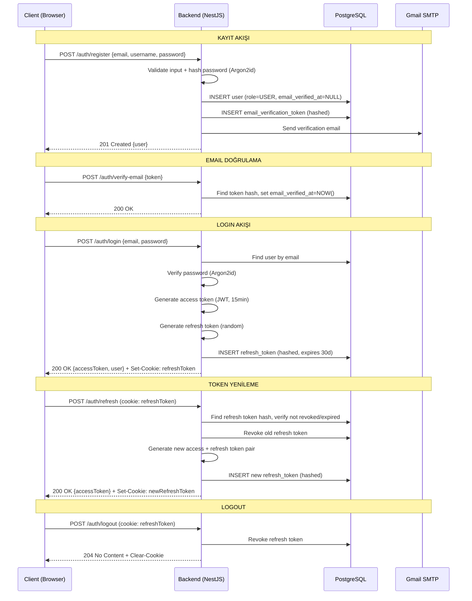
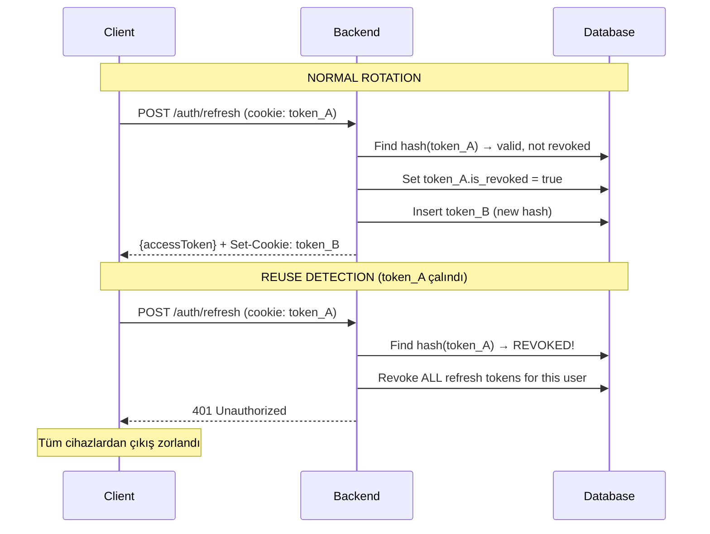

# DnD Companion Platform — Security Implementation

> **Doküman amacı:** Kimlik doğrulama, oturum yönetimi, yetkilendirme, transport güvenliği, input validation, rate limiting, dosya yükleme güvenliği, secrets yönetimi, veri sınıflandırma, audit log ve bağımlılık güvenliği konularını uçtan uca tanımlar. Kodlama agent'ı bu dokümanı okuyarak güvenlik katmanını eksiksiz ve tutarlı şekilde implemente eder.

---

## 1. Güvenlik Seviyesi ve Kapsam

Hedef güvenlik seviyesi **OWASP ASVS Level 1** (temel düzey). Proje ücretsiz, açık bir hobi/topluluk projesidir; ticari veri veya ödeme bilgisi işlenmez. Bununla birlikte kullanıcı hesapları ve şifreleri bulunduğundan aşağıdaki güvenlik kontrolleri eksiksiz uygulanır:

**Kapsanan kontroller:** Şifre hashleme, JWT tabanlı oturum yönetimi, refresh token rotation, yetkilendirme (RBAC + sahiplik), HTTPS zorunluluğu, HTTP güvenlik başlıkları, CORS, CSRF koruması, input validation, rate limiting, dosya yükleme güvenliği, secrets yönetimi, PII koruması, audit log, dependency scanning.

**Bilinçli olarak MVP dışı bırakılan kontroller:** MFA (çok faktörlü kimlik doğrulama), KVKK/GDPR tam uyum, virüs tarama, WAF, penetrasyon testi, sızdırılmış şifre kontrolü (HaveIBeenPwned), chain-hash tamper-evidence, tam kalıcı hesap silme (right to erasure).

---

## 2. Kimlik Doğrulama Akışı (Auth Flow)

### 2.1 Kayıt (Register)

İstemci `POST /auth/register` endpoint'ine `email`, `username`, `password` gönderir. Backend şu adımları sırayla uygular:

1. Input validation — email formatı, username uzunluğu/karakterleri, şifre minimum 8 karakter (karmaşıklık kuralı yok — NIST SP 800-63B ile uyumlu, uzunluk önceliklidir).
2. Uniqueness kontrolü — `email` ve `username` veritabanında mevcut mu (409 Conflict).
3. Şifre hashleme — **Argon2id** algoritması ile hash üretilir. Minimum parametreler: `memory=19MB, iterations=2, parallelism=1` (OWASP önerisi). `argon2` npm paketi kullanılır.
4. Kullanıcı kaydı oluşturulur: `role = USER`, `is_active = true`, `email_verified_at = NULL`.
5. Email doğrulama token'ı üretilir (cryptographically random, 64 karakter hex), hash'lenerek DB'de saklanır, doğrulama linki email ile gönderilir.
6. Response: `201 Created` + kullanıcı bilgisi (password_hash **hiçbir zaman** response'ta dönmez).

Email gönderim hatası kayıt işlemini engellemez — hata loglanır, kullanıcıya başarılı kayıt mesajı döner. Kullanıcı doğrulama email'ini profil sayfasından tekrar isteyebilir.

### 2.2 Email Doğrulama

İstemci `POST /auth/verify-email` endpoint'ine `token` gönderir. Backend token'ı hash'leyerek DB'de eşleştirir; geçerliyse `email_verified_at = NOW()` olarak günceller. Token tek kullanımlık — doğrulama sonrası silinir. Token'ın ömrü **24 saat**; süresi dolmuşsa kullanıcı yeni doğrulama email'i ister.

### 2.3 Login

İstemci `POST /auth/login` endpoint'ine `email`, `password` gönderir. Backend:

1. Email ile kullanıcı aranır. Bulunamazsa **genel hata mesajı** döner: `"Invalid email or password"` — hangi alanın hatalı olduğu (email mevcut değil vs şifre yanlış) belirtilmez (account enumeration önleme).
2. `is_active = false` kontrolü — deaktive kullanıcı giriş yapamaz, aynı genel hata mesajı döner.
3. Şifre doğrulaması — Argon2id verify. Başarısızsa aynı genel hata mesajı.
4. Başarılıysa JWT access token + refresh token üretilir (bkz. Bölüm 3).
5. Response: `200 OK` + `{ accessToken, user }`. Refresh token `Set-Cookie` header'ı ile gönderilir.

### 2.4 Şifre Sıfırlama

1. `POST /auth/password-reset-request` — email alır, kullanıcı mevcutsa sıfırlama token'ı üretir (cryptographically random, 64 karakter hex), hash'leyerek DB'de saklar, sıfırlama linki email ile gönderir. Kullanıcı mevcut olmasa bile **aynı başarı mesajı** döner (account enumeration önleme). Token ömrü **1 saat**.
2. `POST /auth/password-reset-confirm` — `token` ve `newPassword` alır. Token doğrulanır, yeni şifre Argon2id ile hash'lenir, güncellenir. Token tek kullanımlık — sıfırlama sonrası silinir. Kullanıcının **tüm mevcut refresh token'ları iptal edilir** (tüm cihazlardan çıkış).

### 2.5 Logout

`POST /auth/logout` — İstemcideki access token memory'den silinir. Backend'de, cookie'deki refresh token hash'i bulunur ve `is_revoked = true` olarak işaretlenir. Response: `204 No Content` + refresh cookie temizlenir (`Set-Cookie` ile `maxAge=0`).

### 2.6 Auth Flow — Sequence Diagram



---

## 3. Token Mimarisi (JWT)

### 3.1 Access Token

| Özellik | Değer |
|---|---|
| Ömür | 15 dakika |
| Algoritma | HS256 (tek backend servisi — mikroservis ihtiyacı doğarsa RS256'ya geçiş yeni bir karar olarak eklenir) |
| İmzalama anahtarı | `JWT_SECRET` env var (minimum 32 karakter) |
| İstemci tarafı saklama | **JavaScript memory** (değişken/state). localStorage veya sessionStorage **kullanılmaz** — XSS ile token çalınmasını önlemek için |
| Gönderim | `Authorization: Bearer <token>` header |

**Payload yapısı:**

```json
{
  "sub": "user-uuid",
  "role": "USER",
  "emailVerified": true,
  "iat": 1700000000,
  "exp": 1700000900
}
```

`password_hash`, `email` veya diğer PII alanları token payload'ına **dahil edilmez**.

### 3.2 Refresh Token

| Özellik | Değer |
|---|---|
| Ömür | 30 gün |
| Format | Cryptographically random string (64 karakter hex), token'ın **hash'i** DB'de saklanır |
| İstemci tarafı saklama | `httpOnly`, `Secure`, `SameSite=Strict` cookie |
| Kullanım | Sadece `POST /auth/refresh` endpoint'inde |

**DB şeması (`refresh_tokens` tablosu):**

| Alan | Tip | Açıklama |
|---|---|---|
| `id` | UUID (PK) | |
| `user_id` | UUID (FK → users) | Token sahibi |
| `token_hash` | string | Refresh token'ın SHA-256 hash'i |
| `expires_at` | timestamp | 30 gün sonra |
| `is_revoked` | boolean, default false | İptal edildi mi |
| `created_at` | timestamp | |

### 3.3 Refresh Token Rotation ve Reuse Detection

Her refresh işleminde:

1. Mevcut refresh token'ın hash'i DB'de aranır.
2. Token geçerli (revoked değil, süresi dolmamış) ise → eski token `is_revoked = true` yapılır.
3. Yeni access token + yeni refresh token üretilir, yeni refresh token hash'lenerek DB'ye kaydedilir.
4. Yeni refresh token cookie olarak set edilir.

**Reuse detection:** Daha önce `is_revoked = true` yapılmış bir refresh token tekrar kullanılmaya çalışılırsa, bu olası bir token çalınma senaryosuna işaret eder. Bu durumda **o kullanıcıya ait tüm refresh token'lar iptal edilir** (tüm cihazlardan çıkış zorlanır). İstemciye `401 Unauthorized` döner.



### 3.4 Token Temizleme

Süresi dolmuş ve iptal edilmiş refresh token kayıtları birikmeyi önlemek için bir **scheduled job** (NestJS `@Cron`) günlük olarak temizlik yapar: `expires_at < NOW()` veya `is_revoked = true AND created_at < NOW() - 7 days` olan kayıtları siler.

---

## 4. Email Doğrulama Enforcement

Kullanıcılar üç erişim seviyesinde değerlendirilir:

| Seviye | Koşul | Yapabilecekleri |
|---|---|---|
| Misafir (anonim) | Giriş yapmamış | SRD referans verisini ve published homebrew galerisini görüntüleyebilir. Diğer tüm sayfalar login gerektirir |
| Kayıtlı ama doğrulanmamış | `email_verified_at = NULL` | Misafir ile **aynı** seviye — sadece public içerik okuma. Karakter oluşturma, campaign'e katılma, koleksiyona ekleme dahil tüm yazma eylemleri engellenir |
| Doğrulanmış | `email_verified_at != NULL` | Tüm yazma işlemleri serbest (rol ve sahiplik kuralları dahilinde) |

### Guard Implementasyonu

Backend'de iki guard katmanlı olarak uygulanır:

1. **`JwtAuthGuard`** — Token'dan kullanıcıyı çıkarır. Token yoksa veya geçersizse `401 Unauthorized`. Public endpoint'ler (`@Public()` decorator) bu guard'ı atlar.
2. **`EmailVerifiedGuard`** — `user.emailVerifiedAt` kontrol eder. NULL ise `403 Forbidden` + `{ error: "EMAIL_NOT_VERIFIED", message: "Please verify your email to perform this action" }`. Read-only endpoint'ler (`@SkipEmailVerification()` decorator) bu guard'ı atlar.

```typescript
// common/guards/email-verified.guard.ts
@Injectable()
export class EmailVerifiedGuard implements CanActivate {
  canActivate(context: ExecutionContext): boolean {
    const isSkipped = this.reflector.getAllAndOverride<boolean>(
      SKIP_EMAIL_VERIFICATION_KEY,
      [context.getHandler(), context.getClass()],
    );
    if (isSkipped) return true;

    const request = context.switchToHttp().getRequest();
    const user = request.user;
    if (!user.emailVerifiedAt) {
      throw new ForbiddenException({
        error: 'EMAIL_NOT_VERIFIED',
        message: 'Please verify your email to perform this action',
      });
    }
    return true;
  }
}
```

Frontend'de doğrulanmamış kullanıcılara sarı uyarı banner'ı gösterilir; yazma butonları disabled + tooltip ile "Verify your email first" mesajı verilir. Bu sadece UX — güvenlik sınırı backend'dedir.

---

## 5. Yetkilendirme Modeli

### 5.1 Genel Yapı

Sistem hibrit bir yetkilendirme modeli kullanır:

1. **Sistem rolü katmanı (RBAC):** `ADMIN` rolü tüm sahiplik kontrollerini bypass eder.
2. **Sahiplik/ilişki katmanı (ReBAC-lite):** `USER` rolündeki kullanıcılar için her kaynak tipi kendi sahiplik ve ilişki kurallarına göre erişim alır.

Yetki çözümlemesi **runtime, cache'siz** yapılır. Her istek için ilgili kaynağın sahiplik ve/veya campaign ilişkisi DB'den indeksli sorgu ile alınır. Cache invalidation riski (üyelikten çıkarılan kullanıcının stale cache ile erişime devam etmesi) bu ölçekte kabul edilen DB yükünden daha maliyetlidir.

### 5.2 Guard / Enforcement Mekanizması

Yetki kontrolleri backend'de merkezi bir **authorization guard katmanında** uygulanır. Controller/route handler'lar policy fonksiyonlarını çağırır:

```typescript
// common/policies/campaign.policy.ts
export class CampaignPolicy {
  static canRead(user: AuthUser, campaign: Campaign, members: string[]): boolean {
    if (user.role === Role.ADMIN) return true;
    if (campaign.ownerId === user.id) return true;
    return members.includes(user.id);
  }

  static canUpdate(user: AuthUser, campaign: Campaign): boolean {
    if (user.role === Role.ADMIN) return true;
    return campaign.ownerId === user.id;
  }

  static canDelete(user: AuthUser, campaign: Campaign): boolean {
    if (user.role === Role.ADMIN) return true;
    return campaign.ownerId === user.id;
  }
}
```

Her policy fonksiyonunun **ilk adımı** `user.role === ADMIN` kontrolüdür — ADMIN ise sahiplik/üyelik kontrolü yapılmadan `true` döner.

Frontend yetki kontrolleri (buton gizleme, disabled state) sadece UX amaçlıdır. Güvenlik sınırı her zaman backend'dedir.

### 5.3 Tam Yetki Matrisi

#### Campaign

| Eylem | USER koşulu | ADMIN |
|---|---|---|
| Create | Doğrulanmış kullanıcı (herkes) | ✅ |
| Read (liste + detay) | `campaign.owner_id == user.id` VEYA `campaign_members` tablosunda kayıt | ✅ (tümünü görür) |
| Update | `campaign.owner_id == user.id` (sadece DM) | ✅ |
| Delete | `campaign.owner_id == user.id` (sadece DM) | ✅ |
| Invite link yönetimi | `campaign.owner_id == user.id` | ✅ |
| Üye çıkarma | `campaign.owner_id == user.id` | ✅ |

Campaign **tamamen üyelik bazlı private** bir kaynaktır. Davetli olmayan kullanıcılar campaign'i listede göremez, doğrudan URL ile de erişemez (403).

#### Character

| Eylem | USER koşulu | ADMIN |
|---|---|---|
| Create | Doğrulanmış kullanıcı (herkes) | ✅ |
| Read | `visibility = PUBLIC` → herkes (misafir dahil) görür. `visibility = PRIVATE` → sadece sahip. Campaign'e atanmış karakter → campaign DM'i ve üyeleri `visibility`'den bağımsız görür | ✅ (tümünü görür) |
| Update | `character.owner_id == user.id` (sahip) VEYA karakter campaign'e atanmışsa `campaign.owner_id == user.id` (DM) | ✅ |
| Delete | `character.owner_id == user.id` (sahip) VEYA karakter campaign'e atanmışsa `campaign.owner_id == user.id` (DM) | ✅ |
| Visibility toggle | `character.owner_id == user.id` (sadece sahip) | ✅ |
| Campaign atama/çıkarma | `character.owner_id == user.id` + kullanıcı hedef campaign'in üyesi | ✅ |

Karakter-campaign ilişkisi 1:1 ve opsiyoneldir. Bir karakter aynı anda en fazla bir campaign'e atanabilir.

#### Homebrew

| Eylem | USER koşulu | ADMIN |
|---|---|---|
| Create | Doğrulanmış kullanıcı (herkes) | ✅ |
| Read (galeri) | `status = PUBLISHED` → herkes (misafir dahil). `status = DRAFT` → sadece sahip | ✅ (tümünü görür, DRAFT dahil) |
| Update | `homebrew.owner_id == user.id` (sadece sahip) | ✅ |
| Delete | `homebrew.owner_id == user.id` (sadece sahip) | ✅ |
| Publish / Unpublish | `homebrew.owner_id == user.id` (sadece sahip) | ✅ |

Unpublish edilen homebrew galeriden kalkar ancak daha önce koleksiyonuna eklemiş kullanıcıların referansı korunur (UI'da "unpublished by author" rozeti).

#### User

| Eylem | USER koşulu | ADMIN |
|---|---|---|
| Read (kendi profili) | `user.id == requester.id` — tam bilgi (email dahil) | ✅ (tüm kullanıcılar, tam bilgi) |
| Read (başka kullanıcı) | Sadece `username` + `avatar_url` döner; `email` görünmez | ✅ (tam bilgi) |
| Update (profil) | `user.id == requester.id` | ✅ |
| Deactivate | `user.id == requester.id` (self-service) | ✅ (herhangi bir kullanıcıyı) |
| Reactivate | — (sadece admin) | ✅ |
| Rol değiştirme | — (sadece admin) | ✅ (son admin rolünü düşüremez) |

### 5.4 Deaktive Kullanıcı İçerik Gizleme

`is_active = false` olan kullanıcıların sahip olduğu içerikler (campaign, character, homebrew) **diğer normal kullanıcılardan gizlenir**. Bu, her listeleme ve detay sorgusunda ek bir koşul olarak uygulanır:

```typescript
// Listeleme sorgularında ek WHERE koşulu (USER rolü için)
where: {
  owner: { isActive: true }
}
```

ADMIN bu koşulu bypass eder — Admin Panel'den deaktive kullanıcıların içeriklerini görmeye devam eder. Kullanıcı reaktive edildiğinde içerikler otomatik olarak tekrar görünür hale gelir.

### 5.5 Son Admin Koruması

Sistemde her zaman en az bir ADMIN bulunması zorunludur. Rol değiştirme endpoint'i (`PATCH /admin/users/:id/role`), hedef kullanıcı son ADMIN ise ve yeni rol USER ise işlemi reddeder:

```typescript
// Admin role change kontrolü
const adminCount = await prisma.user.count({ where: { role: 'ADMIN', isActive: true } });
if (targetUser.role === 'ADMIN' && newRole === 'USER' && adminCount <= 1) {
  throw new BadRequestException('Cannot demote the last admin');
}
```

Bu kural, admin'in kendi rolünü düşürmesi dahil tüm senaryolarda geçerlidir.

---

## 6. WebSocket Güvenliği

DM Screen'deki canlı alanlar (Current HP, Temporary HP, Conditions, Death Saves) WebSocket (Socket.io) ile anlık güncellenir. WebSocket bağlantıları aşağıdaki güvenlik kontrollerinden geçer:

### 6.1 Handshake Authentication

Socket.io bağlantısı kurulurken `auth` objesinde JWT access token gönderilir. Backend gateway'de `handleConnection` sırasında token doğrulanır:

```typescript
// websocket/campaign.gateway.ts
async handleConnection(client: Socket) {
  try {
    const token = client.handshake.auth?.token;
    if (!token) throw new UnauthorizedException();

    const payload = this.jwtService.verify(token);
    const user = await this.usersService.findById(payload.sub);
    if (!user || !user.isActive) throw new UnauthorizedException();

    client.data.userId = user.id;
    client.data.role = user.role;
  } catch {
    client.disconnect(true);
  }
}
```

Token yoksa veya geçersizse bağlantı anında kapatılır.

### 6.2 Room Join Authorization

Bir client `campaign:<campaignId>` room'una katılmak istediğinde, campaign üyelik kontrolü yapılır:

```typescript
@SubscribeMessage('joinCampaignRoom')
async handleJoinRoom(client: Socket, campaignId: string) {
  const userId = client.data.userId;
  const campaign = await this.campaignService.findById(campaignId);

  const isMember = campaign.ownerId === userId ||
    await this.memberService.isMember(campaignId, userId);

  if (!isMember && client.data.role !== 'ADMIN') {
    client.emit('error', { message: 'Not a member of this campaign' });
    return;
  }

  client.join(`campaign:${campaignId}`);
  client.emit('joinedRoom', { campaignId });
}
```

### 6.3 Token Expiry Handling

Access token 15 dakikada expire olur. Client, token yenilenmeden önce WebSocket bağlantısını kapatıp yeni token ile yeniden bağlanır. Alternatif olarak, client `reauthenticate` event'i ile yeni token gönderebilir ve gateway token'ı yeniden doğrular.

---

## 7. Transport ve HTTP Güvenlik Başlıkları

### 7.1 HTTPS Zorunluluğu

Tüm trafik HTTPS üzerinden zorunlu kılınır. HTTP istekleri HTTPS'e yönlendirilir (301 redirect — altyapı/reverse proxy seviyesinde).

### 7.2 Güvenlik Başlıkları

Aşağıdaki başlıklar tüm HTTP yanıtlarına eklenir (NestJS middleware veya Helmet paketi ile):

| Header | Değer | Amacı |
|---|---|---|
| `Strict-Transport-Security` | `max-age=31536000; includeSubDomains` | HSTS — tarayıcıyı sadece HTTPS kullanmaya zorlar |
| `X-Content-Type-Options` | `nosniff` | MIME-type sniffing önleme |
| `X-Frame-Options` | `DENY` | Clickjacking önleme — sayfanın iframe'e yüklenmesini engeller |
| `Referrer-Policy` | `strict-origin-when-cross-origin` | Referrer bilgisini kısıtlar |
| `Content-Security-Policy` | Aşağıda detaylandırılmıştır | XSS ve injection saldırılarını sınırlar |

### 7.3 Content Security Policy (CSP)

Başlangıç CSP politikası:

```
default-src 'self';
img-src 'self' <cdn-domain> data:;
connect-src 'self' <api-domain> wss://<api-domain>;
style-src 'self' 'unsafe-inline';
script-src 'self';
font-src 'self';
frame-ancestors 'none';
```

`<cdn-domain>`: Object storage public URL'i (görseller için). `<api-domain>`: Backend API domain'i. `wss://`: WebSocket bağlantıları için. `'unsafe-inline'` sadece `style-src` için gereklidir (Tailwind CSS inline style üretir); `script-src`'te `'unsafe-inline'` **kullanılmaz**.

Production'da CSP domain'leri env var ile yapılandırılır.

---

## 8. CORS ve CSRF

### 8.1 CORS Yapılandırması

API, sadece frontend'in origin'ine izin verir. Allowlist env var ile yapılandırılır:

```typescript
// main.ts
app.enableCors({
  origin: process.env.FRONTEND_URL, // örn. https://app.dnd-companion.com
  credentials: true, // sadece /auth/refresh için gerekli (cookie taşır)
  methods: ['GET', 'POST', 'PATCH', 'PUT', 'DELETE'],
  allowedHeaders: ['Content-Type', 'Authorization'],
});
```

Development'ta `FRONTEND_URL=http://localhost:5173` (Vite dev server). Wildcard (`*`) origin **hiçbir ortamda kullanılmaz**.

### 8.2 CSRF Koruması

Sadece `/auth/refresh` endpoint'i cookie tabanlıdır (refresh token httpOnly cookie ile gönderilir). Bu cookie `SameSite=Strict` ayarındadır — cross-site istekler cookie'yi taşımaz, bu nedenle CSRF riski pratikte ortadan kalkar.

Diğer tüm endpoint'ler `Authorization: Bearer` header kullanır (cookie'siz). Bearer token tarayıcı tarafından otomatik gönderilmez, bu nedenle ek bir CSRF token mekanizmasına gerek yoktur.

---

## 9. Input Validation ve Injection Önleme

### 9.1 Schema-Based Validation

Tüm API endpoint'leri için NestJS `class-validator` + `class-transformer` ile DTO (Data Transfer Object) validation zorunludur. Doğrulanmamış input controller'a ulaşmaz:

```typescript
// campaigns/dto/create-campaign.dto.ts
export class CreateCampaignDto {
  @IsString()
  @MinLength(1)
  @MaxLength(200)
  name: string;

  @IsString()
  @MaxLength(5000)
  @IsOptional()
  description?: string;
}
```

NestJS global `ValidationPipe` etkinleştirilir:

```typescript
// main.ts
app.useGlobalPipes(new ValidationPipe({
  whitelist: true,      // DTO'da tanımlı olmayan alanları siler
  forbidNonWhitelisted: true, // Tanımsız alan gelirse 400 hata
  transform: true,      // Otomatik tip dönüşümü
}));
```

### 9.2 SQL Injection Önleme

Tüm veritabanı erişimi Prisma Client üzerinden yapılır. **Raw SQL ve string concatenation kesinlikle yasaktır.** Bu kural agent'ın kesinlikle uyması gereken bir yasaktır — Prisma'nın parametrik sorguları SQL injection'ı yapısal olarak engeller.

### 9.3 XSS Önleme

React, JSX içindeki değerleri varsayılan olarak escape eder. `dangerouslySetInnerHTML` **kullanılmaz** — homebrew açıklamaları ve campaign notları dahil tüm kullanıcı içeriği düz metin olarak render edilir. Markdown render ihtiyacı doğarsa sanitize kütüphanesi (DOMPurify) zorunludur.

---

## 10. Rate Limiting

### 10.1 Auth Endpoint'leri

Brute-force koruması için aşağıdaki endpoint'ler IP başına sınırlandırılır:

| Endpoint | Limit | Pencere |
|---|---|---|
| `POST /auth/login` | 5 istek | 15 dakika |
| `POST /auth/register` | 5 istek | 15 dakika |
| `POST /auth/password-reset-request` | 5 istek | 15 dakika |

Sınır aşıldığında `429 Too Many Requests` döner:

```json
{
  "statusCode": 429,
  "error": "TOO_MANY_REQUESTS",
  "message": "Too many attempts. Please try again later.",
  "retryAfter": 900
}
```

### 10.2 Implementasyon

Redis tabanlı sliding-window counter kullanılır. NestJS `@nestjs/throttler` modülü Redis store ile yapılandırılır:

```typescript
// app.module.ts
ThrottlerModule.forRoot({
  throttlers: [
    { name: 'auth', ttl: 900000, limit: 5 }, // 15 min, 5 requests
  ],
  storage: new ThrottlerStorageRedisService(redisClient),
}),
```

Auth endpoint'leri `@Throttle({ auth: { limit: 5, ttl: 900000 } })` decorator ile işaretlenir. Genel API rate limiting reverse proxy / CDN seviyesinde ayrıca uygulanır (deployment platformuna bağlı).

---

## 11. Dosya Yükleme Güvenliği

### 11.1 Kabul Edilen Format ve Boyut

| Kural | Değer |
|---|---|
| Kabul edilen MIME tipleri | `image/png`, `image/jpeg`, `image/webp` |
| Maksimum dosya boyutu | 5 MB |
| SVG | **Reddedilir** (script injection riski) |

### 11.2 Doğrulama Katmanları

1. **Presign isteğinde (backend):** İstemci `POST /uploads/presign` ile `contentType` ve `fileSize` bildirir. Backend MIME tipi allowlist'e dahil mi ve boyut 5MB altında mı kontrol eder. Geçersizse presigned URL üretilmez.
2. **İstemci tarafında (upload öncesi):** Tarayıcıda dosya seçildikten sonra `file.type` kontrol edilir, boyut doğrulanır, görsel önizleme gösterilir. İstemci tarafı doğrulama UX amaçlıdır, güvenlik sınırı değildir.
3. **Magic-byte doğrulaması:** Yüklenen dosyanın ilk birkaç byte'ı (magic bytes) okunarak gerçek formatı doğrulanır. Uzantı veya MIME header'a güvenilmez:

| Format | Magic Bytes |
|---|---|
| PNG | `89 50 4E 47` |
| JPEG | `FF D8 FF` |
| WebP | `52 49 46 46 ... 57 45 42 50` |

Magic-byte kontrolü presign aşamasında yapılamaz (dosya henüz yüklenmemiştir); bu kontrol object storage'a yükleme sonrası bir background job veya upload-complete webhook ile uygulanır. Kontrol başarısız olursa dosya silinir ve ilgili `*_url` alanı temizlenir.

### 11.3 Upload Akışı

Presigned URL deseni kullanılır — büyük dosyalar app sunucusu üzerinden proxy edilmez:

1. İstemci `POST /uploads/presign` ile dosya bilgisini gönderir (auth zorunlu).
2. Backend S3-uyumlu storage'dan presigned PUT URL üretir (geçerlilik: 10 dakika).
3. İstemci dosyayı doğrudan storage'a PUT ile yükler.
4. İstemci dönen public URL'i ilgili varlığın `*_url` alanına PATCH ile kaydeder.

Bucket/erişim politikası **public-read** — görseller hassas veri değildir. Signed URL ile okuma karmaşıklığına gerek yoktur.

---

## 12. Secrets Yönetimi

### 12.1 Saklama Kuralları

Tüm secret'lar **environment variable** olarak tutulur. Kesinlikle uyulması gereken kurallar:

- `.env` dosyası repo'da **commit edilmez** (`.gitignore`'a eklidir).
- `.env.example` dosyası tüm secret key'leri (değersiz) listeler — yeni geliştirici kurulumunu kolaylaştırır.
- Production secret'ları deployment platformunun secret store'unda tutulur.
- Secret'lar log'a **yazılmaz** — Pino logger'da `redact` listesine eklenir.

### 12.2 Secret Listesi

| Env Var | Açıklama | Zorunlu |
|---|---|---|
| `DATABASE_URL` | PostgreSQL bağlantı string'i | ✅ |
| `REDIS_URL` | Redis bağlantı string'i | ✅ |
| `JWT_SECRET` | Access token imzalama anahtarı (min 32 karakter) | ✅ |
| `SMTP_USER` | Gmail SMTP kullanıcı adı | ✅ |
| `SMTP_PASS` | Gmail App Password | ✅ |
| `S3_ACCESS_KEY` | Object storage erişim anahtarı | ✅ |
| `S3_SECRET_KEY` | Object storage gizli anahtarı | ✅ |
| `S3_ENDPOINT` | Object storage endpoint URL | ✅ |
| `S3_BUCKET` | Object storage bucket adı | ✅ |
| `SENTRY_DSN` | Sentry error tracking DSN | opsiyonel |
| `SEED_ADMIN_EMAIL` | İlk admin hesap email'i (seed script) | opsiyonel |
| `SEED_ADMIN_PASSWORD` | İlk admin hesap şifresi (seed script) | opsiyonel |

Uygulama başlangıcında tüm zorunlu env var'lar Zod şeması ile doğrulanır. Eksik veya geçersiz değer varsa uygulama **başlamaz** (fail-fast).

---

## 13. Veri Sınıflandırma ve PII Koruması

### 13.1 Sınıflandırma

| Veri | Sınıf | Koruma |
|---|---|---|
| `email` | PII / Hassas | API yanıtlarında sadece hesap sahibi ve ADMIN görür. Diğer kullanıcılara `username` + `avatar_url` döner |
| `password_hash` | Hassas | **Hiçbir zaman** API yanıtında dönmez, hiçbir zaman loglanmaz |
| Campaign / Character / Homebrew içerikleri | Oyun verisi | Yetkilendirme kuralları (Bölüm 5) geçerli |
| `email_verified_at`, `created_at` vb. | Teknik metadata | Normal erişim kuralları |

### 13.2 Response Filtreleme

Tüm user-related endpoint'lerde response DTO'su kullanılır. Hangi alanların dönüleceği isteyen kullanıcının kimliğine göre belirlenir:

```typescript
// users/dto/user-response.dto.ts

// Kendi profili veya ADMIN isteği
interface FullUserResponse {
  id: string;
  email: string;        // PII — sadece self veya ADMIN
  username: string;
  avatarUrl: string | null;
  role: Role;
  emailVerifiedAt: string | null;
  isActive: boolean;
  createdAt: string;
}

// Başka bir kullanıcının public bilgisi
interface PublicUserResponse {
  id: string;
  username: string;
  avatarUrl: string | null;
}
```

`password_hash` alanı **hiçbir** response DTO'sunda yer almaz. Bu, agent'ın kesinlikle uyması gereken bir yasaktır.

---

## 14. Kullanıcı Deaktivasyon ve Hesap Silme

### 14.1 Deaktivasyon (Soft Delete)

`users.is_active` (boolean, default `true`). İki yoldan tetiklenir:

1. **Admin tarafından:** Admin Panel > Kullanıcı Yönetimi ekranından. Herhangi bir kullanıcıyı deaktive edebilir (son admin hariç).
2. **Self-service:** Kullanıcı profil/ayarlar sayfasından kendi hesabını deaktive eder. Onay diyalogu gösterilir.

Deaktivasyon sonucu:
- `is_active = false` olur.
- Kullanıcı giriş yapamaz (login endpoint kontrolü).
- İçerikleri (campaign, character, homebrew) DB'de kalır ancak diğer normal kullanıcılardan gizlenir.
- ADMIN, içerikleri Admin Panel'den görmeye devam eder.
- İşlem geri alınabilir — admin `is_active = true` ile reaktive eder, içerikler otomatik olarak görünür hale gelir.

### 14.2 Kalıcı Silme

Tam kalıcı hesap silme (hard delete, "right to erasure") MVP'de yoktur. Talep gelirse admin manuel olarak değerlendirir. Bu, hobi projesi bağlamıyla uyumlu bir bilinçli MVP sınırıdır.

---

## 15. Audit Log

### 15.1 Kapsam

MVP'de **sadece admin eylemleri** loglanır:

| Eylem | Açıklama |
|---|---|
| `ROLE_CHANGED` | Bir kullanıcının rolü USER ↔ ADMIN olarak değiştirildi |
| `USER_DEACTIVATED` | Bir kullanıcı deaktive edildi |
| `USER_REACTIVATED` | Bir kullanıcı reaktive edildi |
| `CONTENT_EDITED` | Admin, sahibi olmadığı bir campaign/character/homebrew kaydını düzenledi |
| `CONTENT_DELETED` | Admin, sahibi olmadığı bir campaign/character/homebrew kaydını sildi |

Normal kullanıcıların kendi içerikleri üzerindeki işlemleri (campaign düzenleme, karakter oluşturma vb.) loglanmaz.

### 15.2 Veri Modeli

`audit_logs` tablosu:

| Alan | Tip | Açıklama |
|---|---|---|
| `id` | UUID (PK) | |
| `actor_id` | UUID (FK → users) | İşlemi yapan ADMIN |
| `action` | enum | `ROLE_CHANGED`, `USER_DEACTIVATED`, `USER_REACTIVATED`, `CONTENT_EDITED`, `CONTENT_DELETED` |
| `target_type` | enum | `USER`, `CAMPAIGN`, `CHARACTER`, `HOMEBREW` |
| `target_id` | UUID | Etkilenen kaydın ID'si |
| `metadata` | JSONB | Değişiklik detayları |
| `created_at` | timestamp | |

### 15.3 Metadata Örnekleri

```json
// ROLE_CHANGED
{ "oldRole": "USER", "newRole": "ADMIN" }

// CONTENT_EDITED
{ "targetType": "CAMPAIGN", "targetName": "Dragon's Lair", "changedFields": ["name", "description"] }

// CONTENT_DELETED
{ "targetType": "CHARACTER", "targetName": "Elara the Ranger", "ownerId": "owner-uuid" }

// USER_DEACTIVATED
{ "targetEmail": "user@example.com", "targetUsername": "player42" }
```

### 15.4 Yazma Kuralları

- `audit_logs` tablosuna uygulama katmanında **sadece INSERT** yapılır.
- **UPDATE ve DELETE yasaktır** — append-only davranışı.
- Chain-hash tamper-evidence mekanizması MVP'de uygulanmaz (ASVS L1 için gerekli değil).
- Kayıtlar süresiz saklanır (hacim düşük — sadece admin eylemleri).

### 15.5 Implementasyon

Admin eylemleri gerçekleştiren her service method, işlem sonrası `AuditLogService.log()` çağırır:

```typescript
// admin/audit-log.service.ts
@Injectable()
export class AuditLogService {
  constructor(private prisma: PrismaService) {}

  async log(params: {
    actorId: string;
    action: AuditAction;
    targetType: AuditTargetType;
    targetId: string;
    metadata?: Record<string, unknown>;
  }) {
    await this.prisma.auditLog.create({ data: params });
  }
}
```

MVP'de Admin Panel'de audit log görüntüleme ekranı yoktur. Veriler DB'de tutulur, gerektiğinde doğrudan sorgu ile incelenebilir.

---

## 16. Bağımlılık Güvenliği

### 16.1 CI Pipeline Entegrasyonu

GitHub Actions CI pipeline'ında otomatik bağımlılık güvenlik taraması çalışır:

```yaml
# .github/workflows/ci.yml (security scan adımı)
- name: Security audit
  run: pnpm audit --audit-level=critical
```

**Critical** seviye güvenlik zafiyetleri build'i kırar — PR merge edilemez. High ve altı seviyeler uyarı olarak raporlanır ancak build'i kırmaz.

### 16.2 Dependabot / Renovate

GitHub Dependabot (veya Renovate) etkinleştirilir — güvenlik güncellemeleri için otomatik PR açar. Güvenlik güncellemeleri en geç 1 hafta içinde değerlendirilir.

---

## 17. Güvenlik Kontrol Özet Tablosu

| Kategori | Kontrol | Durum |
|---|---|---|
| Şifre Hashleme | Argon2id (19MB/2iter/1par) | ✅ MVP |
| Şifre Politikası | Min 8 karakter, karmaşıklık yok | ✅ MVP |
| Sızdırılmış Şifre Kontrolü | HaveIBeenPwned | ❌ MVP dışı |
| MFA | TOTP | ❌ MVP dışı |
| JWT Access Token | HS256, 15dk, memory | ✅ MVP |
| Refresh Token | 30 gün, httpOnly cookie, rotation + reuse detection | ✅ MVP |
| Email Doğrulama | Zorunlu (doğrulanmamış = misafir seviyesi) | ✅ MVP |
| Yetkilendirme | RBAC + sahiplik/ilişki, runtime DB-check | ✅ MVP |
| HTTPS | Zorunlu, HSTS | ✅ MVP |
| CSP | Temel politika | ✅ MVP |
| CORS | Allowlist, credentials sadece refresh | ✅ MVP |
| CSRF | SameSite=Strict + Bearer header | ✅ MVP |
| Input Validation | class-validator DTO, whitelist | ✅ MVP |
| SQL Injection | Prisma ORM, raw SQL yasak | ✅ MVP |
| XSS | React auto-escape, dangerouslySetInnerHTML yasak | ✅ MVP |
| Rate Limiting | Auth: 5/15dk (Redis), genel: reverse proxy | ✅ MVP |
| Dosya Upload | PNG/JPEG/WebP only, 5MB, magic-byte | ✅ MVP |
| SVG Engelleme | Reddedilir | ✅ MVP |
| Virüs Tarama | — | ❌ MVP dışı |
| Secrets | Env var, .env commit yasağı | ✅ MVP |
| PII Koruması | email: self+admin, password_hash: hiçbir zaman | ✅ MVP |
| Audit Log | Admin eylemleri, append-only | ✅ MVP |
| Chain-Hash | Tamper-evidence | ❌ MVP dışı |
| Dependency Scan | CI'da npm audit, critical → build kırar | ✅ MVP |
| Kullanıcı Silme | Soft delete (deaktivasyon) | ✅ MVP |
| Kalıcı Silme | Right to erasure | ❌ MVP dışı |
