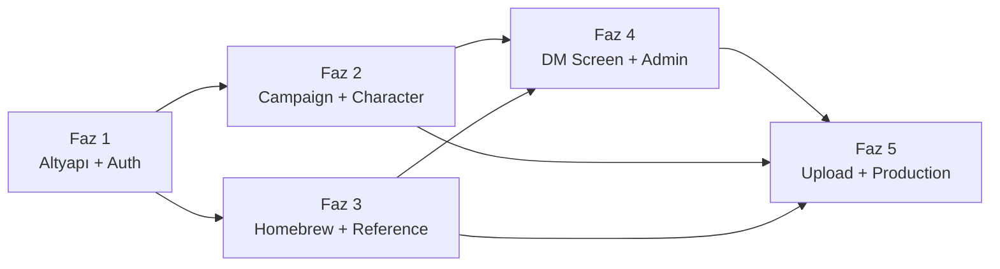
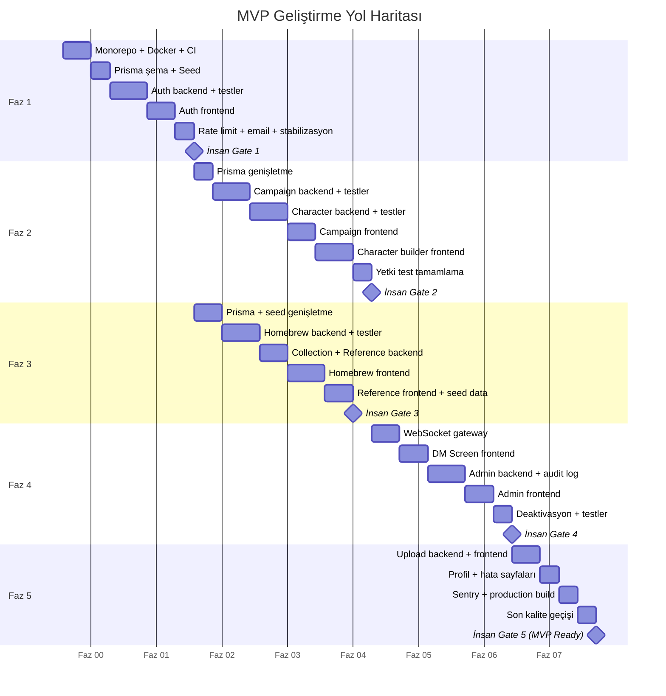

# DnD Companion Platform — Implementation Roadmap

> **Doküman amacı:** MVP'nin faz bazlı geliştirme yol haritasını, her fazın kapsamını, agent oturum planını, insan onay noktalarını, risk kaydını, teknik borç kaydını ve başarı metriklerini tanımlar. Kodlama agent'ı bu dokümanı okuyarak hangi sırayla neyi geliştireceğini, her oturumda hangi dokümanları yükleyeceğini ve nerede durup insan onayı bekleyeceğini bilir.

---

## 1. Vibe Coding Modeli ve Agent Kullanım Prensibi

Bu proje **doküman-öncelikli vibe coding** modeli ile geliştirilir. Kodlama agent'ı (Cursor, Claude Code veya benzeri) tüm mimari kararları, veri modelini, API kontratlarını ve güvenlik kurallarını bu doküman setinden öğrenir; kendi başına mimari karar almaz.

### Temel Prensipler

**Doküman yükle, sonra kodla.** Agent her oturumun başında o oturumun kapsamıyla ilgili dokümanları context olarak yükler. Hangi oturumda hangi dokümanlar yükleneceği Bölüm 8'de (Agent Session Planı) belirtilmiştir.

**Bir oturum = bir PR.** Her agent oturumu tek bir feature branch üzerinde çalışır ve sonunda bir Pull Request üretir. Oturumlar arası bağımlılık PR merge sırası ile yönetilir.

**İnsan gate'leri atlanmaz.** Agent, kullanıcı onayı olmadan `main`'e merge etmez, production'a deploy etmez ve faz geçişi yapmaz. Her fazın sonunda zorunlu insan kontrolü vardır (Bölüm 9).

**Belirsizlikte dur, sorma veya TODO bırak.** Agent, bu doküman setinde karar verilmemiş bir konuyla karşılaşırsa varsayım yaparak ilerlemez. Kullanıcıya sorar veya kodda açık bir `// TODO: [konu] — mimari karar gerekiyor` yorumu bırakır.

### Agent Yasakları (Özet)

Agent şu eylemleri hiçbir koşulda yapmaz:

- Raw SQL veya string concatenation ile DB erişimi (tüm erişim Prisma Client üzerinden)
- Access token'ı localStorage/sessionStorage'da saklama (memory'de tutulur)
- Guard'sız yazma endpoint'i commit etme (her POST/PATCH/PUT/DELETE authorization guard gerektirir)
- `password_hash` alanını herhangi bir DTO/response'a dahil etme
- `email` alanını sahip veya admin dışındaki kullanıcılara döndürme
- SVG dosya yüklemeyi kabul etme (sadece png/jpeg/webp)
- Yetki kuralı içeren endpoint'i integration test olmadan merge etme
- `main` branch'ine doğrudan push yapma

---

## 2. Faz Yapısı — Genel Bakış

MVP geliştirmesi 5 faza ayrılmıştır. Her faz bağımsız çalışabilir bir artış (increment) üretir — bir faz tamamlandığında uygulama o fazın özelliklerini uçtan uca destekler.

| Faz | Başlık | Ana Çıktı | Tahmini Oturum |
|---|---|---|---|
| 1 | Temel Altyapı ve Kimlik Doğrulama | Çalışan auth akışı (register/login/refresh/logout) | 4-6 |
| 2 | Campaign ve Karakter CRUD | DM campaign oluşturur, oyuncu katılır, karakter atar | 6-8 |
| 3 | Homebrew, Koleksiyon ve Referans Verisi | Homebrew galerisi, koleksiyon, 5e referans veri | 5-7 |
| 4 | DM Screen, Real-time ve Admin Panel | Canlı DM Screen, admin içerik yönetimi | 5-7 |
| 5 | Dosya Yükleme, Profil ve Prodüksiyon Hazırlığı | MVP production'a hazır | 4-6 |

**Toplam tahmini oturum:** 24-34 agent oturumu.

### Faz Bağımlılık Grafiği



Faz 2 ve Faz 3 birbirinden bağımsızdır, paralel geliştirilebilir (ikisi de Faz 1'e bağımlıdır). Faz 4, hem Faz 2 hem Faz 3'ün tamamlanmasını gerektirir (DM Screen campaign+karakter verisine, admin panel tüm kaynak tiplerine erişir). Faz 5, tüm önceki fazların tamamlanmasını gerektirir.

---

## 3. Faz 1 — Temel Altyapı ve Kimlik Doğrulama

### Amaç
Monorepo iskeletini kurmak, CI pipeline'ını çalıştırmak, veritabanı şemasının temelini atmak ve uçtan uca kimlik doğrulama akışını tamamlamak.

### Kapsam

#### 3.1 Monorepo Scaffold

- pnpm workspace yapısı: `apps/web`, `apps/api`, `packages/shared`
- TypeScript yapılandırması (root + paket bazlı `tsconfig.json`)
- ESLint + Prettier yapılandırması
- Husky + lint-staged pre-commit hook
- `docker-compose.yml` (PostgreSQL 16 + Redis 7)
- `.env.example` şablonu
- `.gitignore`, `.prettierrc`, `.vscode/settings.json`, `.vscode/extensions.json`
- Root `package.json` script'leri (`dev:api`, `dev:web`, `test`, `lint`, `typecheck`, `build`)

#### 3.2 Backend Temel Yapı

- NestJS projesi (`apps/api`): `main.ts` bootstrap (global prefix `/api`, validation pipe, exception filter)
- `PrismaModule` + `PrismaService` (singleton, connection pooling)
- Global exception filter (`HttpExceptionFilter` — standart hata formatı)
- Global validation pipe (`class-validator` + `class-transformer`)
- Request ID middleware (her isteğe UUID atanması)
- Pino logger yapılandırması (structured JSON, hassas alan maskeleme)
- Health check endpoint (`GET /api/v1/health`)

#### 3.3 Prisma Şema — İlk Migration

Tablolar: `users`, `refresh_tokens`

`users` tablosu: `id` (UUID), `email` (unique), `username` (unique), `password_hash`, `avatar_url` (nullable), `role` (enum USER/ADMIN), `email_verified_at` (nullable), `is_active` (default true), `created_at`, `updated_at`.

`refresh_tokens` tablosu: `id` (UUID), `user_id` (FK → users), `token_hash` (unique), `expires_at`, `created_at`.

Index'ler: `users.email` unique, `users.username` unique, `refresh_tokens.token_hash` unique, `refresh_tokens.user_id`.

#### 3.4 Shared Package

- `packages/shared/src/enums.ts`: `Role` (ADMIN/USER), `CharacterVisibility` (PUBLIC/PRIVATE), `HomebrewStatus` (DRAFT/PUBLISHED), `HomebrewType` (BACKGROUND/FEAT/MAGIC_ITEM/MONSTER/SPELL/SUBCLASS)
- `packages/shared/src/constants.ts`: Action ve Resource enum'ları (yetki sabitleri)
- `packages/shared/src/schemas/auth.ts`: Zod şemaları — register, login, password-reset formları

#### 3.5 Auth Modülü (Backend)

Endpoint'ler:

| Endpoint | Metot | Açıklama |
|---|---|---|
| `/api/v1/auth/register` | POST | Kayıt (email + username + password) |
| `/api/v1/auth/login` | POST | Giriş (email + password → access token + refresh cookie) |
| `/api/v1/auth/refresh` | POST | Refresh token ile yeni access token |
| `/api/v1/auth/logout` | POST | Refresh token iptal |
| `/api/v1/auth/verify-email` | POST | Email doğrulama token'ı ile doğrulama |
| `/api/v1/auth/resend-verification` | POST | Doğrulama emaili tekrar gönder |
| `/api/v1/auth/password-reset/request` | POST | Şifre sıfırlama linki gönder |
| `/api/v1/auth/password-reset/confirm` | POST | Yeni şifre ile sıfırlama |

Bileşenler: `AuthService`, `TokenService` (JWT üretimi/doğrulaması, refresh token yönetimi), `JwtStrategy` (Passport), `JwtAuthGuard`, `@Public()` decorator, `@RequireVerifiedEmail()` decorator. `EmailService` (Gmail SMTP, doğrulama + sıfırlama mailleri).

Güvenlik: Argon2id hash (memory=19MB, iterations=2, parallelism=1), genel hata mesajı ("Invalid email or password"), refresh token rotation + reuse detection, rate limiting (login/register/password-reset: 5 istek/15dk IP başına).

#### 3.6 Frontend Temel Yapı

- React + Vite projesi (`apps/web`)
- React Router yapılandırması (temel route'lar: `/login`, `/register`, `/verify-email/:token`, `/forgot-password`, `/reset-password/:token`, `/` dashboard placeholder)
- Redux Toolkit store + auth slice (`user`, `accessToken`)
- RTK Query base API (base URL, auth header injection, 401 interceptor + refresh retry)
- Auth layout bileşeni (ortalanmış kart)
- Login, Register, Forgot Password, Reset Password, Verify Email sayfaları
- Session expired modal
- Route guard: `ProtectedRoute` (auth gerekli), `PublicOnlyRoute` (login/register — zaten giriş yapmışsa redirect)
- Tailwind CSS + shadcn/ui kurulumu (Button, Input, Form, Card, Toast)

#### 3.7 Seed Script (Temel)

- İlk admin hesabı oluşturma (`SEED_ADMIN_EMAIL`/`SEED_ADMIN_PASSWORD` env var'larından)
- İdempotent çalışma

#### 3.8 CI Pipeline

- GitHub Actions workflow: lint → type-check → test-backend → test-frontend → security (npm audit) → build
- Required status checks ayarlanır
- Branch protection: `main`'e doğrudan push engeli

### Agent iterasyonları (§1.1–§1.6)

Her satır bir agent oturumu (= bir feature branch + bir PR). Detaylı teknik kapsam `#### 3.1`–`#### 3.8` altında; burada **chat başına teslim** özetlenir. Yüklenecek dokümanlar → Bölüm 8 (Faz 1 Oturumları). Uygulama rehberi → `.cursor/rules/50-phase-01-auth-infra.mdc`.

#### §1.1 — Monorepo scaffold + Docker Compose + CI (Oturum 1.1)

- `#### 3.1` monorepo maddeleri (pnpm workspace, TS, ESLint/Prettier, Husky, `.env.example`, root script'ler)
- `docker-compose.yml` — PostgreSQL 16 + Redis 7 (`docs/09` §3)
- `#### 3.8` GitHub Actions: lint → type-check → test → security → build
- Minimal derlenebilir `apps/api` ve `apps/web` shell (boş bootstrap; tam backend core §1.2'de)

#### §1.2 — Backend core + Prisma + shared + seed (Oturum 1.2)

- `#### 3.2` NestJS bootstrap (`/api/v1` prefix), PrismaModule, global filter/pipe, request ID, Pino, `GET /api/v1/health`
- `#### 3.3` Prisma migration: `users`, `refresh_tokens`
- `#### 3.4` `packages/shared` enums, constants, auth Zod şemaları
- `#### 3.7` idempotent admin seed (`SEED_ADMIN_EMAIL` / `SEED_ADMIN_PASSWORD`)

#### §1.3 — Auth backend + integration testler (Oturum 1.3)

- `#### 3.5` Auth modülü: register, login, refresh, logout, verify-email, resend-verification, password-reset request/confirm
- JWT, refresh rotation + reuse detection, Argon2id, `@Public()` / `EmailVerifiedGuard`
- Integration testler (email gönderimi ve rate limit **stub** — tam entegrasyon §1.5)

#### §1.4 — Auth frontend (Oturum 1.4)

- `#### 3.6` React + Vite, Router, Redux auth slice, RTK Query base + reauth
- Ekranlar: `S-LOGIN`, `S-REGISTER`, `S-VERIFY-EMAIL`, `S-PW-RESET-REQ`, `S-PW-RESET-CONF`, `S-SESSION-EXPIRED`
- `ProtectedRoute`, `PublicOnlyRoute`, Tailwind + shadcn/ui (Button, Input, Form, Card, Toast)

#### §1.5 — Rate limiting + EmailService + test tamamlama (Oturum 1.5)

- Redis tabanlı auth rate limit (login/register/password-reset: 5 istek / 15 dk / IP) — `docs/07` §10
- `EmailService` (SMTP): doğrulama + şifre sıfırlama mailleri — `docs/04` §10
- Auth integration test matrisi tamamlama (rate limit, rotation, enumeration)

#### §1.6 — Stabilizasyon (Oturum 1.6, opsiyonel)

- CI kırmızıları, coverage gap, manuel test bulguları
- Faz 1 çıktı kriterleri checklist doğrulaması
- İnsan gate (Bölüm 9) öncesi son düzeltmeler

### Faz 1 Çıktı Kriteri

- [ ] Kullanıcı register olabilir, email doğrulama linki alır
- [ ] Kullanıcı login olabilir, access token alır
- [ ] Access token süresi dolunca refresh ile yenilenir
- [ ] Logout çalışır, refresh token iptal edilir
- [ ] Şifre sıfırlama akışı uçtan uca çalışır
- [ ] Email doğrulanmamış kullanıcı kısıtlı erişime sahiptir (guard aktif)
- [ ] CI pipeline yeşil, tüm testler geçiyor
- [ ] Docker Compose ile lokal ortam 5 dakikada ayağa kalkar
- [ ] Auth endpoint'lerinin integration testleri mevcut

---

## 4. Faz 2 — Campaign ve Karakter CRUD

### Amaç
DM'in campaign oluşturması, oyuncuları davet etmesi, oyuncunun karakter oluşturup campaign'e ataması ve tüm yetki kurallarının çalışması.

### Kapsam

#### 4.1 Prisma Şema Genişletme

Yeni tablolar: `campaigns`, `campaign_members`, `characters`, `dm_notes`.

`campaigns`: `id`, `name`, `description` (nullable), `banner_url` (nullable), `setting` (nullable), `owner_id` (FK → users), `invite_token` (unique, nullable), `created_at`, `updated_at`.

`campaign_members`: `campaign_id` + `user_id` (composite PK), `joined_at`.

`characters`: `id`, `name`, `owner_id` (FK → users), `campaign_id` (FK → campaigns, nullable), `visibility` (enum PUBLIC/PRIVATE, default PRIVATE), `portrait_url` (nullable), `race`, `class_name`, `level` (default 1), `background`, `alignment`, `ability_scores` (JSONB), `hp` (JSONB: max, current, temporary), `armor_class` (int), `speed` (int), `skills` (JSONB), `saving_throws` (JSONB), `equipment` (JSONB), `spells` (JSONB), `features` (JSONB), `proficiencies` (JSONB), `death_saves` (JSONB: successes, failures), `conditions` (JSONB array), `notes` (text, nullable), `created_at`, `updated_at`.

`dm_notes`: `id`, `campaign_id` (FK → campaigns), `title`, `content` (text), `sort_order` (int), `created_at`, `updated_at`.

#### 4.2 Campaign Modülü (Backend)

Endpoint'ler: Campaign CRUD (`POST /api/v1/campaigns`, `GET /api/v1/campaigns`, `GET /api/v1/campaigns/:id`, `PATCH /api/v1/campaigns/:id`, `DELETE /api/v1/campaigns/:id`), üye listesi (`GET /api/v1/campaigns/:id/members`, `DELETE /api/v1/campaigns/:id/members/:userId`), davet linki yönetimi (`POST /api/v1/campaigns/:id/invite/regenerate`, `POST /api/v1/campaigns/:id/invite/disable`, `GET /api/v1/invite/:token`, `POST /api/v1/invite/:token/join`). DM notları → `#### 4.2` alt modül, agent iterasyonu §2.4 (`docs/03` §10).

Yetki kuralları: Campaign CRUD → sadece owner (DM). Campaign read → owner + campaign_members. Üye silme → sadece DM. DM notları → sadece DM. Davet linki yönetimi → sadece DM. Davet ile katılma → doğrulanmış herhangi bir kullanıcı (zaten üye/DM değilse).

#### 4.3 Character Modülü (Backend)

Endpoint'ler: Character CRUD (`POST /api/v1/characters`, `GET /api/v1/characters`, `GET /api/v1/characters/:id`, `PATCH /api/v1/characters/:id`, `DELETE /api/v1/characters/:id`), campaign ataması (`PATCH /api/v1/characters/:id/campaign`), görünürlük (`PATCH /api/v1/characters/:id/visibility`). Canlı alanlar (`PATCH /api/v1/characters/:id/live`) → Faz 4.

Yetki kuralları: Karakter oluşturma → doğrulanmış kullanıcı. Karakter güncelleme/silme → sahibi VEYA karakterin atandığı campaign'in DM'i. Karakter görüntüleme → visibility PUBLIC ise herkes, campaign'e atanmışsa campaign üyeleri, aksi halde sadece sahibi. "My Characters" listesi → sadece kendi karakterleri. Campaign ataması → sadece karakter sahibi, hedef campaign'in üyesi olmalı, karakter başka campaign'e atanmış olmamalı.

#### 4.4 Ownership + Membership Guard/Policy

`common/policies/` altında: `CampaignPolicy` (owner kontrolü), `CharacterPolicy` (owner + DM kontrolü), `CampaignMembershipGuard` (campaign üyelik kontrolü). `can(user, action, resource)` deseni. Admin bypass (user.role === ADMIN ise tüm kontroller geçilir).

#### 4.5 Frontend — Campaign Sayfaları

Campaign listesi (kullanıcının DM olduğu + üye olduğu campaign'ler), campaign oluşturma formu, campaign detay sayfası (üye listesi, DM notları, atanmış karakterler), campaign düzenleme, davet linki yönetimi (kopyala/yenile/devre dışı), davet kabul sayfası.

#### 4.6 Frontend — Character Sayfaları

Karakter listesi ("My Characters"), character builder (çok adımlı form: temel bilgiler → ability scores → sınıf/ırk → beceriler → ekipman → büyüler → özet), karakter detay sayfası (sheet görünümü), karakter düzenleme, campaign ataması UI.

#### 4.7 Yetki Integration Testleri

Yetki matrisindeki her kural için backend integration testleri: sahibi/sahibi-olmayan kullanıcı, campaign DM'i/DM-olmayan üye, ADMIN/USER, deaktive kullanıcı. Bu testler olmadan ilgili endpoint PR'ı merge edilemez.

### Agent iterasyonları (§2.1–§2.8)

Her satır bir agent oturumu (= bir feature branch + bir PR). Detaylı teknik kapsam `#### 4.1`–`#### 4.7` altında; burada **chat başına teslim** özetlenir. Yüklenecek dokümanlar → Bölüm 8 (Faz 2 Oturumları). Uygulama rehberi → `.cursor/rules/51-phase-02-campaign-character.mdc`.

#### §2.1 — Prisma şema genişletme (Oturum 2.1)

- `#### 4.1` migration: `campaigns`, `campaign_members`, `characters`, `dm_notes` (`docs/02` §3.2–3.7)
- `packages/shared` — character JSONB Zod şemaları, campaign DTO Zod (`docs/10` §3.4 kalıbı)
- Seed değişmez (Faz 1 admin seed idempotent kalır)

#### §2.2 — Campaign backend + policy + testler (Oturum 2.2)

- `#### 4.2` Campaign modülü: CRUD, invite regenerate/disable, members list/remove, join via invite (`docs/03` §5–6)
- `#### 4.4` `CampaignPolicy` — `common/policies/campaign.policy.ts` (`@43-add-authorization-policy`)
- Campaign controller integration testleri — owner/member/outsider/ADMIN deny matrisi

#### §2.3 — Character backend + policy + testler (Oturum 2.3)

- `#### 4.3` Character modülü: CRUD, `PATCH …/campaign`, `PATCH …/visibility` (`docs/03` §7)
- `CharacterPolicy` — owner, campaign DM, PUBLIC read, campaign member read
- Character controller integration testleri — visibility + ownership deny matrisi

#### §2.4 — DM Notes backend + policy + testler (Oturum 2.4)

- `campaigns/dm-notes/` alt modülü: CRUD + reorder (`docs/03` §10, `docs/04` dm-notes klasörü)
- `DmNotePolicy` — yalnızca campaign owner (DM)
- DM notes integration testleri — member read deny, DM write allow

#### §2.5 — Campaign frontend (Oturum 2.5)

- `#### 4.5` — `S-CAMPAIGN-LIST`, `S-CAMPAIGN-CREATE`, `S-CAMPAIGN-DETAIL`, `S-CAMPAIGN-EDIT`, `S-INVITE`
- `campaignsApi.ts` RTK Query; route'lar `docs/06` S-* route sütunu (`/my-campaigns`, `/campaigns/new`, …)

#### §2.6 — Character builder frontend (Oturum 2.6)

- `S-CHAR-BUILDER` — çok tablı form, auto-save, POST→PATCH akışı (`docs/06` §7.2)
- Faz 2: race/class/background **serbest metin Input** (reference dropdown → Faz 3); portrait upload yok (Faz 5)
- Campaign atama ve visibility toggle bu iterasyonda **yok** (§2.7)

#### §2.7 — Character list/detail/edit + campaign atama UI (Oturum 2.7)

- `S-CHAR-LIST`, `S-CHAR-DETAIL`, `S-CHAR-EDIT` (`docs/06` §7.1, §7.3, §7.4)
- `charactersApi.ts`; `PATCH /characters/:id/campaign` ve visibility UI
- `/characters/:id/edit` → `/characters/:id/builder` redirect (`docs/06` §7.4)

#### §2.8 — Stabilizasyon (Oturum 2.8, opsiyonel)

- `#### 4.7` yetki test matrisi gap kapatma, CI stabilizasyon
- Faz 2 çıktı kriterleri checklist doğrulaması
- İnsan gate (Bölüm 9) öncesi son düzeltmeler

### Faz 2 Çıktı Kriteri

- [ ] DM campaign oluşturabilir, düzenleyebilir, silebilir
- [ ] DM davet linki oluşturur, oyuncu linkle katılır
- [ ] DM campaign üyelerini görebilir, çıkarabilir
- [ ] DM notları CRUD çalışır, sıralama değiştirilebilir
- [ ] Oyuncu karakter oluşturabilir (builder uçtan uca çalışır)
- [ ] Oyuncu karakteri campaign'e atayabilir/kaldırabilir
- [ ] DM, campaign'e atanmış karakterleri düzenleyebilir
- [ ] Karakter visibility kuralları çalışır (public/private + campaign üyelik)
- [ ] Yetki matrisinin tamamı integration testlerle kapsanmış
- [ ] CI pipeline yeşil

---

## 5. Faz 3 — Homebrew, Koleksiyon ve Referans Verisi

### Amaç
Homebrew içerik oluşturma/yayınlama döngüsünü, herkese açık galeriyi, kullanıcı koleksiyonunu ve resmi 5e referans veri sayfalarını tamamlamak.

### Kapsam

#### 5.1 Prisma Şema Genişletme

Yeni tablolar: `homebrew_items`, `collection_items`.

`homebrew_items`: `id`, `name`, `type` (enum: BACKGROUND/FEAT/MAGIC_ITEM/MONSTER/SPELL/SUBCLASS), `source` (enum: PHB/XGTE/TCOE/DMG/FTOD/VRGR/MPMM/.../HOMEBREW), `owner_id` (FK → users, nullable — resmi içerikte NULL), `status` (enum DRAFT/PUBLISHED, default DRAFT), `published_at` (nullable), `image_url` (nullable), `description` (text), `data` (JSONB — tipe göre farklı şema), `created_at`, `updated_at`.

Unique constraint: `(name, type, source)` — aynı isimde, aynı tipte, aynı kaynaktan birden fazla kayıt olamaz.

`collection_items`: `user_id` + `homebrew_item_id` (composite PK), `added_at`.

#### 5.2 Homebrew Modülü (Backend)

Endpoint'ler (`docs/03_API_CONTRACTS.md` §8 — global prefix `/api/v1`): Homebrew CRUD (`POST /homebrew`, `GET /homebrew` galeri — yalnızca PUBLISHED + aktif owner), `GET /homebrew/my-creations`, `GET /homebrew/:id`, `PATCH /homebrew/:id`, `DELETE /homebrew/:id`, publish/unpublish (`PATCH /homebrew/:id/publish`, `PATCH /homebrew/:id/unpublish`). `type` request body'de; path'te değil.

Yetki: Homebrew oluşturma → doğrulanmış kullanıcı. Güncelleme/silme/publish/unpublish → sadece sahibi (`source = HOMEBREW`). Galeri okuma → herkes (misafir dahil). My Creations → sadece sahibi. Admin tüm işlemleri yapabilir.

JSONB validasyonu: Her homebrew tipi için Zod şeması (`packages/shared/schemas/homebrew/`). `data` alanı oluşturma/güncelleme sırasında service katmanında tipe göre doğrulanır.

#### 5.3 Collection Modülü (Backend)

Endpoint'ler (`docs/03` §9): `GET /collections`, `POST /collections/:homebrewItemId`, `DELETE /collections/:homebrewItemId`. Kullanıcının koleksiyonu unpublish edilmiş öğeler dahil listelenir (`isUnpublished` rozeti).

Yetki: Koleksiyona ekleme/çıkarma → doğrulanmış kullanıcı. Koleksiyon listeleme → sadece sahibi. Yalnızca `PUBLISHED` öğeler eklenebilir.

#### 5.4 Reference (SRD) Modülü (Backend)

Endpoint'ler (`docs/03` §11): `GET /reference/spells`, `/reference/monsters`, `/reference/feats`, `/reference/backgrounds`, `/reference/magic-items`, `/reference/subclasses` (+ her biri için `/:id` detay); `GET /reference/classes`, `GET /reference/races` (sabit shared constants). Tüm referans endpoint'leri 🔓 public (misafir erişimine açık). Sorgu: `homebrew_items` tablosundan `source != HOMEBREW`.

Filtreleme: `?source=PHB`, `?search=fireball`, `?level=3` (spell'ler için) gibi sorgu parametreleri. Cursor-based pagination (`?cursor=xxx&limit=20`).

#### 5.5 Seed Script Genişletme

Tüm resmi 5e kural verisi JSON dosyalarından (`prisma/seed-data/`) yüklenir: spells (~500+), monsters (~300+), classes (13), races (30+), feats (80+), backgrounds (30+), magic items (300+), subclasses (120+). Upsert ile idempotent çalışma.

#### 5.6 Frontend — Homebrew Sayfaları

Homebrew galerisi (herkese açık, arama/filtre/sort), homebrew detay sayfası, homebrew oluşturma/düzenleme formu (tip seçimi → tipe göre dinamik form alanları), "My Creations" sayfası (draft/published rozeti + toggle), "My Collection" sayfası (unpublish rozeti).

#### 5.7 Frontend — Reference Sayfaları

Referans veri listesi (tip seçimi: spells/monsters/classes/..., arama/filtre), referans detay sayfası. Misafir erişimine açık.

### Agent iterasyonları (§3.1–§3.7)

Her satır bir agent oturumu (= bir feature branch + bir PR). Detaylı teknik kapsam `#### 5.1`–`#### 5.7` altında; burada **chat başına teslim** özetlenir. Yüklenecek dokümanlar → Bölüm 8 (Faz 3 Oturumları). Uygulama rehberi → `.cursor/rules/52-phase-03-homebrew-reference.mdc`.

#### §3.1 — Prisma + seed iskeleti (Oturum 3.1)

- `#### 5.1` Prisma migration: `homebrew_items`, `collection_items` (`docs/02` §4)
- `prisma/seed-data/` dizin yapısı + boş/minimal JSON dosyaları; seed script iskeleti (admin seed korunur; resmi veri döngüsü stub)
- Shared enum export doğrulama (`HomebrewType`, `HomebrewStatus`, `Source` — Faz 1'de tanımlı)

#### §3.2 — Homebrew backend + testler (Oturum 3.2)

- `#### 5.2` Homebrew modülü: CRUD, publish/unpublish, `GET /homebrew` galeri (🔓), `GET /homebrew/my-creations`
- `packages/shared/schemas/homebrew/` — 6 tip Zod şeması; service katmanında `safeParse`
- `common/policies/homebrew.policy.ts` + `homebrew.auth.spec.ts` (`docs/08` §5.4)

#### §3.3 — Collection + Reference backend + testler (Oturum 3.3)

- `#### 5.3` Collection modülü: `GET/POST/DELETE /collections`
- `#### 5.4` Reference modülü: tüm `GET /reference/*` endpoint'leri (🔓); classes/races shared constants
- `collection.auth.spec.ts`, `reference` integration testleri (`docs/08` §5.4.1–5.4.2)

#### §3.4 — Homebrew frontend (Oturum 3.4)

- `#### 5.6` `S-HOMEBREW-GALLERY`, `S-HOMEBREW-DETAIL`, `S-HOMEBREW-CREATE`, `S-HOMEBREW-EDIT`, `S-MY-CREATIONS`
- RTK Query `homebrewApi`; dinamik form (RHF + shared Zod); galeri misafir erişimi

#### §3.5 — Collection + Reference frontend (Oturum 3.5)

- `#### 5.6` `S-MY-COLLECTION` (unpublish rozeti)
- `#### 5.7` `S-REF-LIST`, `S-REF-DETAIL`; misafir erişimi; sidebar nav linkleri

#### §3.6 — 5e seed data yükleme (Oturum 3.6)

- `#### 5.5` Tam JSON dosyaları (`spells`, `monsters`, `feats`, `backgrounds`, `magic-items`, `subclasses`)
- Idempotent upsert + Zod validasyon; geçersiz kayıt skip + warn log

#### §3.7 — Stabilizasyon (Oturum 3.7, opsiyonel)

- Arama/filtre/sort index optimizasyonu (`docs/03` pagination/filter)
- Faz 3 bug fix, test gap, Done checklist doğrulama

### Faz 3 Çıktı Kriteri

- [ ] Kullanıcı 6 tipte homebrew oluşturabilir (JSONB validasyonu çalışır)
- [ ] Publish/unpublish state machine çalışır
- [ ] Homebrew galerisi herkese açık (misafir), arama/filtre/sort çalışır
- [ ] Koleksiyona ekleme/çıkarma çalışır, unpublish edilmiş öğeler rozetle görünür
- [ ] Resmi 5e referans verisi listeleme/detay sayfaları çalışır (misafir erişimi)
- [ ] Seed script tüm 5e verisini yükler, idempotent çalışır
- [ ] Homebrew + collection yetki kuralları integration testlerle kapsanmış
- [ ] CI pipeline yeşil

---

## 6. Faz 4 — DM Screen, Real-time ve Admin Panel

### Amaç
DM'in oyun sırasında karakter canlı verilerini gerçek zamanlı görmesi, admin'in tüm içerik ve kullanıcıları yönetebilmesi ve denetim loglarının tutulması.

### Kapsam

#### 6.1 WebSocket Gateway + Live Fields REST

NestJS `@WebSocketGateway` + Socket.io adapter + Redis adapter (horizontal scaling için). Handshake'te JWT access token doğrulaması (`handshake.auth.token`). Campaign odası (room) modeli: `campaign:<id>`. Client `join-campaign` event'i ile room'a katılır; gateway üyelik (owner veya `campaign_members`) doğrular.

**Canlı alan güncellemesi REST üzerinden:** `PATCH /api/v1/characters/:id/live` (sahip veya campaign DM). Service DB'ye yazar, ardından atanmış campaign room'una broadcast eder. Client→server canlı alan event'i yok — tek doğruluk kaynağı `docs/03_API_CONTRACTS.md` Bölüm 14.

Event'ler (`docs/03` §14):

| Event | Yön | Açıklama |
|---|---|---|
| `join-campaign` | Client → Server | Room katılım (üyelik kontrolü) |
| `leave-campaign` | Client → Server | Room'dan ayrılma |
| `character:live-update` | Server → Room | Canlı alan güncellemesi (`PATCH …/live` side effect) |
| `campaign:member-joined` | Server → Room | Yeni üye katıldı |
| `campaign:member-left` | Server → Room | Üye ayrıldı/çıkarıldı |

#### 6.2 DM Screen (Frontend)

Campaign bazlı tam ekran görünüm. İki panel: sol tarafta oyuncu karakter özeti kartları (canlı alanlar: current HP, temp HP, AC, conditions, death saves — WebSocket ile gerçek zamanlı güncelleme), sağ tarafta DM notları listesi (CRUD, sıralama). Masaüstünde yan yana iki sütun, mobilde tab ile geçiş.

#### 6.3 Admin Panel (Backend)

`admin/` modülü. Tüm endpoint'ler `ADMIN` rolü gerektirir.

Kullanıcı yönetimi: `GET /api/v1/admin/users` (listele/ara), `PATCH /api/v1/admin/users/:id/role` (rol değiştir), `POST /api/v1/admin/users/:id/deactivate`, `POST /api/v1/admin/users/:id/reactivate`. Son admin koruması: sistemde tek aktif admin kaldıysa rolü düşürme isteği `422 LAST_ADMIN` ile reddedilir.

Campaign yönetimi: `GET /api/v1/admin/campaigns` (tüm campaign'ler, üyelik kısıtlaması olmadan), `GET /api/v1/admin/campaigns/:id`, `PATCH /api/v1/admin/campaigns/:id`, `DELETE /api/v1/admin/campaigns/:id`.

Character yönetimi: `GET /api/v1/admin/characters` (tüm karakterler, visibility'den bağımsız), `GET /api/v1/admin/characters/:id`, `PATCH /api/v1/admin/characters/:id`, `DELETE /api/v1/admin/characters/:id`.

Homebrew yönetimi: `GET /api/v1/admin/homebrew` (tüm homebrew'ler, status'tan bağımsız), `GET /api/v1/admin/homebrew/:id`, `PATCH /api/v1/admin/homebrew/:id`, `DELETE /api/v1/admin/homebrew/:id`, `PATCH /api/v1/admin/homebrew/:id/status` (publish/unpublish).

İçerik silme davranışı: campaign silinince `campaign_members` satırları silinir, karakterlerin `campaign_id` alanı NULL'a düşer (karakterler silinmez). Karakter/homebrew silme hard delete.

#### 6.4 Audit Log

`audit_logs` tablosu: `id` (UUID), `actor_id` (FK → users), `action` (enum: ROLE_CHANGED, USER_DEACTIVATED, USER_REACTIVATED, CONTENT_EDITED, CONTENT_DELETED), `target_type` (enum: USER, CAMPAIGN, CHARACTER, HOMEBREW), `target_id` (UUID), `metadata` (JSONB), `created_at`.

Sadece admin eylemleri loglanır. `AuditLogService` her admin işleminden sonra çağrılır. Tabloya sadece INSERT yapılır — UPDATE ve DELETE uygulama katmanında yasaktır (append-only).

#### 6.5 Kullanıcı Deaktivasyon Etkileri

Deaktive edilmiş kullanıcı (`is_active = false`): login endpoint'i reddeder, kullanıcının içerikleri (campaign/character/homebrew) diğer normal kullanıcılara gösterilmez (API sorgularına `owner.is_active = true` filtresi eklenir). Admin bu içerikleri Admin Panel'den görmeye devam eder. Reaktivasyon (`is_active = true`) tüm içerikleri otomatik olarak tekrar görünür kılar.

#### 6.6 Frontend — Admin Sayfaları

Admin layout (ayrı sidebar veya navigasyon bölümü). 4 ekran: Kullanıcı listesi (arama, rol değiştirme, deaktive/reaktive), Campaign listesi (arama, görüntüle/düzenle/sil), Character listesi (arama, görüntüle/düzenle/sil), Homebrew listesi (arama, görüntüle/düzenle/sil, publish/unpublish).

### Agent iterasyonları (§4.1–§4.7)

Her satır bir agent oturumu (= bir feature branch + bir PR). Detaylı teknik kapsam `#### 6.1`–`#### 6.6` altında; burada **chat başına teslim** özetlenir. Yüklenecek dokümanlar → Bölüm 8 (Faz 4 Oturumları). Uygulama rehberi → `.cursor/rules/53-phase-04-dm-screen-admin.mdc`.

#### §4.1 — WebSocket gateway + live PATCH (Oturum 4.1)

- `#### 6.1` NestJS `@WebSocketGateway`, Socket.io, Redis adapter, JWT handshake (`docs/03` §14, `docs/04` §9)
- `PATCH /characters/:id/live` — sahip veya campaign DM; DB yaz + `character:live-update` room broadcast (`@47-websocket-live-fields`)
- `join-campaign` / `leave-campaign` üyelik doğrulama; geçersiz token → disconnect
- Gateway unit/smoke; tam WS integration matrisi §4.6'da

#### §4.2 — DM Screen frontend (Oturum 4.2)

- `#### 6.2` `S-DM-SCREEN` — canlı karakter kartları, DM notları CRUD/reorder, responsive tab layout
- `useWebSocket(campaignId)` hook; `character:live-update` → RTK Query cache patch (`docs/05` §8, `docs/06` §6.1)
- Route: `/campaigns/:id/dm-screen` — yalnızca campaign üyeleri/DM

#### §4.3 — Admin backend + audit (Oturum 4.3)

- `#### 6.3–6.4` `admin/` modülü — users + content CRUD (`docs/03` §12)
- `audit_logs` Prisma migration + `AuditLogService` — **yalnızca INSERT** (append-only; UPDATE/DELETE yasak) (`@17-backend-admin-audit`, `docs/07` §15)
- `@Roles(Role.ADMIN)` tüm admin route'larda; admin yazmaları audit zorunlu

#### §4.4 — Admin frontend (Oturum 4.4)

- `#### 6.6` Admin layout + `S-ADMIN-USERS`, `S-ADMIN-CAMPAIGNS`, `S-ADMIN-CHARACTERS`, `S-ADMIN-HOMEBREW`
- `adminApi.ts` RTK Query; onay modalları rol/deaktivasyon/silme için
- Audit log UI **yok** (post-MVP; veri DB'de)

#### §4.5 — Deaktivasyon filtreleri + LAST_ADMIN (Oturum 4.5)

- `#### 6.5` Normal API list/read sorgularına `owner.isActive = true` filtresi; admin endpoint'leri bypass
- Son admin `422 LAST_ADMIN`; deaktive kullanıcı login reddi (mevcut auth)
- Policy/unit testler — tam integration matrisi §4.6'da tamamlanabilir

#### §4.6 — WebSocket + admin integration testleri (Oturum 4.6)

- `websocket.gateway.spec.ts` — JWT handshake, join deny, live broadcast after PATCH
- `admin/*.auth.spec.ts` — `docs/08` §5.5–§5.7 matrisi; audit INSERT doğrulama
- Coverage: `common/policies/`, `common/guards/` %100 korunur

#### §4.7 — Stabilizasyon (Oturum 4.7, opsiyonel)

- WS reconnect UX, flaky test düzeltme, CI gap kapatma
- Faz 4 çıktı kriterleri checklist; insan gate (Bölüm 9) öncesi son düzeltmeler

### Faz 4 Çıktı Kriteri

- [ ] WebSocket bağlantısı çalışır, handshake'te JWT doğrulanır
- [ ] Oyuncu canlı alanları günceller, DM Screen'de gerçek zamanlı yansır
- [ ] DM Screen masaüstü ve mobilde düzgün çalışır
- [ ] Admin kullanıcı listeler/arar, rol değiştirir, deaktive/reaktive eder
- [ ] Son admin koruması çalışır (tek admin rolünü düşüremez)
- [ ] Admin tüm campaign/character/homebrew'leri görür, düzenler, siler
- [ ] İçerik silme cascade kuralları doğru çalışır
- [ ] Deaktive kullanıcının içerikleri normal kullanıcılara gizlenir
- [ ] Admin eylemleri audit_logs'a yazılır
- [ ] Tüm admin endpoint'leri için yetki testleri mevcut
- [ ] CI pipeline yeşil

---

## 7. Faz 5 — Dosya Yükleme, Profil ve Prodüksiyon Hazırlığı

### Amaç
Görsel yükleme altyapısını tamamlamak, profil ve hata sayfalarını eklemek, Sentry entegrasyonunu yapmak ve uygulamayı production'a çıkarmaya hazır hale getirmek.

### Kapsam

#### 7.1 Dosya Yükleme (Backend)

`uploads/` modülü. `POST /api/uploads/presign` — authentication gerektirir, request body: `{ contentType, purpose, fileName }`. `purpose` enum: `avatar`, `portrait`, `banner`, `homebrew-image`. Response: `{ uploadUrl, publicUrl }`.

Validasyon: sadece `image/png`, `image/jpeg`, `image/webp` MIME tipleri kabul edilir. Maksimum dosya boyutu 5 MB. SVG kabul edilmez. Magic-byte doğrulaması presign aşamasında content-type kontrolü, yükleme sonrası opsiyonel olarak S3 event hook ile yapılabilir (MVP'de presign + frontend kontrolü yeterli kabul edilir).

S3-uyumlu object storage'a presigned PUT URL üretilir. Public-read bucket/erişim politikası (görseller hassas veri değildir).

#### 7.2 İstemci Tarafı Görsel İşleme (Frontend)

Upload öncesi tarayıcıda görsel yeniden boyutlandırma:

| Amaç (purpose) | Maksimum Boyut |
|---|---|
| Avatar | 512×512 px |
| Portrait (karakter) | 1600 px genişlik |
| Banner (campaign) | 1600 px genişlik |
| Homebrew görseli | 1600 px genişlik |

Canvas API ile resize, MIME kontrolü, boyut kontrolü (5 MB). Yükleme sırası: presign URL al → dosyayı S3'e PUT → dönen public URL'i ilgili varlığın `*_url` alanına PATCH ile kaydet.

#### 7.3 Profil Sayfası (Frontend)

`/profile` route'u. Kullanıcının kendi bilgilerini görüntüleme/düzenleme: username, avatar (yükleme ile), email (read-only), şifre değiştirme. Hesap deaktivasyon (self-service — `is_active = false`) **Faz 5 İterasyon 5.5**'te tamamlanır; İterasyon 5.2'de `S-PROFILE` DangerZone bölümü yoktur.

Backend: `GET /api/users/me`, `PATCH /api/users/me` (username, avatar_url), `PATCH /api/users/me/password` (eski şifre + yeni şifre), `POST /api/users/me/deactivate` (İterasyon 5.5).

#### 7.4 Hata Sayfaları

404 sayfası (route bulunamadı veya erişim yok), 500 sayfası (beklenmeyen hata). React Router `errorElement` ile entegre.

#### 7.5 Sentry Entegrasyonu

Backend: `@sentry/nestjs` paketi, global exception filter'da Sentry'ye hata gönderimi. Frontend: `@sentry/react` paketi, React error boundary ile entegre. `SENTRY_DSN` env var'ı ile yapılandırılır (development'da boş bırakılır, staging/production'da aktif).

#### 7.6 Production Build

Backend: NestJS build (`pnpm --filter api build` → `dist/`), frontend build çıktısını (`apps/web/dist/`) statik dosya olarak serve eder (`ServeStaticModule`).

Dockerfile (multi-stage build):

```dockerfile
# Stage 1: Build
FROM node:20-alpine AS builder
WORKDIR /app
COPY . .
RUN corepack enable && pnpm install --frozen-lockfile
RUN pnpm --filter web build
RUN pnpm --filter api build

# Stage 2: Production
FROM node:20-alpine
WORKDIR /app
COPY --from=builder /app/apps/api/dist ./dist
COPY --from=builder /app/apps/web/dist ./public
COPY --from=builder /app/node_modules ./node_modules
COPY --from=builder /app/apps/api/prisma ./prisma
COPY --from=builder /app/apps/api/package.json ./package.json
EXPOSE 3000
CMD ["node", "dist/main.js"]
```

#### 7.7 Son Kalite Geçişi

- Tüm testler geçiyor, CI yeşil
- Tüm yetki kuralları integration testlerle kapsanmış
- Seed script hatasız çalışıyor
- Sentry entegre, test hatası yakalanıyor
- Responsive kontrol: ana akışlar mobilde çalışır
- Console'da hata/uyarı yok
- Lighthouse performance/a11y taraması (hedef: 70+ performance, 80+ a11y — kesin eşik değil, bilgilendirme amaçlı)

### Agent iterasyonları (§5.1–§5.6)

Her satır bir agent oturumu (= bir feature branch + bir PR). Detaylı teknik kapsam `#### 7.1`–`#### 7.7` altında; burada **chat başına teslim** özetlenir. Yüklenecek dokümanlar → Bölüm 8 (Faz 5 Oturumları). Uygulama rehberi → `.cursor/rules/54-phase-05-upload-production.mdc`.

#### §5.1 — Upload backend + frontend resize flow (Oturum 5.1)

- `#### 7.1` `uploads/` modülü — `POST /uploads/presign`, MIME allowlist, 5 MB, SVG red (`docs/03` §13, `docs/07` §11)
- `#### 7.2` `resizeImage` + `ImageUpload` / `ImageUploadDropzone`; presign → PUT → `publicUrl` (`docs/05` §11)
- Mevcut formlara entegrasyon: campaign banner, character portrait, homebrew görsel, profil avatar (PATCH ayrı iterasyonda)
- `uploads.auth.spec.ts` — auth zorunlu, geçersiz MIME/SVG deny

#### §5.2 — Profil sayfası (Oturum 5.2)

- `#### 7.3` `GET/PATCH /users/me`, `PATCH /users/me/password` (`docs/03` §4)
- `S-PROFILE` — username, avatar, email readonly, şifre formu; **DangerZone yok** (`docs/06` §11.1)
- `usersApi.ts` RTK Query; profil kaydı → `auth.updateUser()` dispatch
- `users.auth.spec.ts` — me endpoint matrisi (deaktivasyon §5.5'te)

#### §5.3 — Hata sayfaları + Sentry (Oturum 5.3)

- `#### 7.4` `S-404` catch-all, `S-500` error boundary (`docs/06` §11.2–§11.3)
- `#### 7.5` `@sentry/nestjs` + `@sentry/react`; `SENTRY_DSN` boş → dev'de kapalı (`docs/09` §4)
- `GlobalExceptionFilter` — 500 → Sentry; PII scrub (`docs/04` backend Sentry notu)

#### §5.4 — Production Dockerfile + kalite geçişi (Oturum 5.4)

- `#### 7.6` multi-stage `Dockerfile` (`docs/09` §13)
- `#### 7.7` tam CI: lint, typecheck, test, build; `docker build` smoke
- **Platform deploy yok** — `[INF-OPEN-1]` açık; yalnızca container artefakt

#### §5.5 — Self-service deaktivasyon + testler (Oturum 5.5)

- `POST /users/me/deactivate` — `is_active=false`, refresh iptali, logout (`docs/03` §4, `docs/07` deaktivasyon)
- `S-PROFILE` DangerZone + onay modalı (`docs/06` §11.1)
- `users.auth.spec.ts` — deactivate matrisi; login reddi sonrası (`docs/08` §5.5.2)

#### §5.6 — Stabilizasyon + deployment hazırlık (Oturum 5.6, opsiyonel)

- Gap fix, Lighthouse bilgilendirme taraması, deployment checklist (platform-agnostic)
- İnsan faz gate öncesi `docs/10` Faz 5 çıktı kriterleri doğrulama

### Faz 5 Çıktı Kriteri

- [ ] Görsel yükleme uçtan uca çalışır (avatar, portre, banner, homebrew görseli)
- [ ] İstemci tarafı resize çalışır, 5 MB sınırı uygulanır
- [ ] Profil sayfası: bilgi düzenleme, avatar yükleme, şifre değiştirme, hesap deaktivasyon
- [ ] 404 ve 500 sayfaları mevcut
- [ ] Sentry backend + frontend hatalarını yakalar
- [ ] Docker production build çalışır
- [ ] Seed script tüm 5e verisini + admin hesabını yükler
- [ ] Tüm CI check'leri yeşil
- [ ] MVP production'a deploy edilmeye hazır

---

## 8. Agent Session Planı

Her oturum bir feature branch ve bir PR üretir. Oturum başında agent şu dokümanları context olarak yükler:

### Faz 1 Oturumları (4-6 oturum)

Uygulama rehberi: `.cursor/rules/50-phase-01-auth-infra.mdc`. Her oturum `Faz 1 — İterasyon M` + `@50-phase-01-auth-infra` + `@48-git-phase-branch`.

| Oturum | Kapsam | Yüklenecek Dokümanlar |
|---|---|---|
| 1.1 | Monorepo scaffold + Docker Compose + CI pipeline | 09_DEV_WORKFLOW, 04_BACKEND_SPEC (klasör yapısı bölümü) |
| 1.2 | Prisma şema (users + refresh_tokens) + seed (admin) + shared package | 02_DATABASE_SCHEMA, 01_DOMAIN_MODEL |
| 1.3 | Auth modülü backend (register/login/refresh/logout/verify/reset) + testler | 03_API_CONTRACTS (auth bölümü), 07_SECURITY_IMPLEMENTATION, 08_TESTING_STRATEGY |
| 1.4 | Auth frontend (sayfalar + Redux store + RTK Query + route guard) | 05_FRONTEND_SPEC, 06_SCREEN_CATALOG (auth grubu) |
| 1.5 | Rate limiting (Redis) + email service (SMTP) + entegrasyon testi tamamlama | 07_SECURITY_IMPLEMENTATION, 04_BACKEND_SPEC |
| 1.6 | (Gerekirse) Bug fix, test tamamlama, CI stabilizasyonu | İlgili dokümanlar |

### Faz 2 Oturumları (6-8 oturum)

Uygulama rehberi: `.cursor/rules/51-phase-02-campaign-character.mdc`. Her oturum `Faz 2 — İterasyon M` + `@51-phase-02-campaign-character` + `@48-git-phase-branch`.

| Oturum | Kapsam | Yüklenecek Dokümanlar |
|---|---|---|
| 2.1 | Prisma şema genişletme (campaigns, campaign_members, characters, dm_notes) | 02_DATABASE_SCHEMA, 01_DOMAIN_MODEL |
| 2.2 | Campaign backend (CRUD + davet + üyelik + yetki guard'ları) + testler | 03_API_CONTRACTS (campaign bölümü), 07_SECURITY_IMPLEMENTATION |
| 2.3 | Character backend (CRUD + campaign ataması + visibility + yetki) + testler | 03_API_CONTRACTS (character bölümü), 07_SECURITY_IMPLEMENTATION |
| 2.4 | DM Notes backend (CRUD + sıralama) + testler | 03_API_CONTRACTS (dm-notes bölümü) |
| 2.5 | Campaign frontend (liste, oluşturma, detay, düzenleme, davet) | 05_FRONTEND_SPEC, 06_SCREEN_CATALOG (campaign grubu) |
| 2.6 | Character builder frontend (çok adımlı form) | 05_FRONTEND_SPEC, 06_SCREEN_CATALOG (character grubu) |
| 2.7 | Character list/detail/edit frontend + campaign ataması UI | 06_SCREEN_CATALOG (character grubu) |
| 2.8 | (Gerekirse) Yetki test matrisi tamamlama, bug fix | 08_TESTING_STRATEGY |

### Faz 3 Oturumları (5-7 oturum)

Uygulama rehberi: `.cursor/rules/52-phase-03-homebrew-reference.mdc`. Her oturum `Faz 3 — İterasyon M` + `@52-phase-03-homebrew-reference` + `@48-git-phase-branch`.

| Oturum | Kapsam | Yüklenecek Dokümanlar |
|---|---|---|
| 3.1 | Prisma şema (homebrew_items + collection_items) + seed script genişletme | 02_DATABASE_SCHEMA, 01_DOMAIN_MODEL |
| 3.2 | Homebrew backend (CRUD + publish/unpublish + JSONB validasyonu) + testler | 03_API_CONTRACTS (homebrew bölümü), 07_SECURITY_IMPLEMENTATION |
| 3.3 | Collection backend + Reference backend + testler | 03_API_CONTRACTS (collection + reference bölümleri) |
| 3.4 | Homebrew frontend (galeri, detay, oluşturma/düzenleme, My Creations) | 05_FRONTEND_SPEC, 06_SCREEN_CATALOG (homebrew grubu) |
| 3.5 | Collection frontend + Reference frontend | 06_SCREEN_CATALOG (homebrew + reference grupları) |
| 3.6 | Seed data (tüm 5e verisi JSON dosyaları) hazırlama ve yükleme | 01_DOMAIN_MODEL (JSONB şemaları) |
| 3.7 | (Gerekirse) Arama/filtre/sort optimizasyonu, bug fix | 03_API_CONTRACTS (pagination/filter bölümü) |

### Faz 4 Oturumları (5-7 oturum)

Uygulama rehberi: `.cursor/rules/53-phase-04-dm-screen-admin.mdc`. Her oturum `docs/10` §4.M ile birebir hizalıdır.

| Oturum | Kapsam | Yüklenecek Dokümanlar |
|---|---|---|
| 4.1 | WebSocket gateway + `PATCH …/live` + room broadcast | 03_API_CONTRACTS (§7 live + §14 WS), 04_BACKEND_SPEC (§9), `@47-websocket-live-fields` |
| 4.2 | DM Screen frontend (`S-DM-SCREEN`) | 06_SCREEN_CATALOG (§6.1), 05_FRONTEND_SPEC (§8) |
| 4.3 | Admin backend + `audit_logs` append-only | 03_API_CONTRACTS (§12), 02_DATABASE_SCHEMA (§3.8), 07_SECURITY_IMPLEMENTATION (§15), `@17-backend-admin-audit` |
| 4.4 | Admin frontend (4 ekran) | 06_SCREEN_CATALOG (Grup 7), 05_FRONTEND_SPEC (admin route) |
| 4.5 | Deaktive içerik gizleme + LAST_ADMIN + policy testler | 07_SECURITY_IMPLEMENTATION (§14), 01_DOMAIN_MODEL (deaktivasyon), 08_TESTING_STRATEGY |
| 4.6 | WebSocket + admin integration test matrisi | 08_TESTING_STRATEGY (§5.5–§5.7) |
| 4.7 | (Opsiyonel) Bug fix, real-time stabilizasyon | İlgili dokümanlar |

### Faz 5 Oturumları (6 oturum)

Uygulama rehberi: `.cursor/rules/54-phase-05-upload-production.mdc`. Her oturum `Faz 5 — İterasyon M` + `@54-phase-05-upload-production` + `48-git-phase-branch`.

| Oturum | Kapsam | Yüklenecek Dokümanlar |
|---|---|---|
| 5.1 | Upload backend (presigned URL + validasyon) + frontend (resize + upload flow) | 03_API_CONTRACTS (§13), 07_SECURITY_IMPLEMENTATION (§11), 05_FRONTEND_SPEC (§11) |
| 5.2 | Profil sayfası (FE + BE: me, password, avatar; DangerZone hariç) | 06_SCREEN_CATALOG (§11.1), 03_API_CONTRACTS (§4), 05_FRONTEND_SPEC (profile route) |
| 5.3 | Hata sayfaları (404/500) + Sentry entegrasyonu (backend + frontend) | 06_SCREEN_CATALOG (§11.2–§11.3), 04_BACKEND_SPEC (Sentry), 09_DEV_WORKFLOW (§4 SENTRY_DSN) |
| 5.4 | Production Dockerfile + build optimizasyonu + son kalite geçişi | 09_DEV_WORKFLOW (§7, §13), 10_IMPLEMENTATION_ROADMAP (§5.4, §7.6–§7.7) |
| 5.5 | Hesap deaktivasyon (self-service) + testler | 07_SECURITY_IMPLEMENTATION (deaktivasyon), 03_API_CONTRACTS (§4 deactivate), 08_TESTING_STRATEGY (§5.5.2) |
| 5.6 | (Opsiyonel) Son düzeltmeler, deployment hazırlığı | 10_IMPLEMENTATION_ROADMAP (§5.6), 09_DEV_WORKFLOW (deploy notları) |

---

## 9. Human Gate'ler (İnsan Onay Noktaları)

Her fazın sonunda agent durur ve insan onayı bekler. Faz geçişi ancak aşağıdaki kontroller yapıldıktan sonra gerçekleşir.

### Her Faz Sonunda Zorunlu Kontroller

| Kontrol | Nasıl Doğrulanır |
|---|---|
| CI pipeline yeşil | GitHub Actions'ta tüm required check'ler geçiyor |
| Yetki testleri kapsamlı | O faza ait yetki matrisinin tüm kombinasyonları test edilmiş |
| Seed script çalışır | `docker compose down -v` → `up -d` → `migrate dev` → `seed` hatasız |
| UI fonksiyonel | Ana akışlar tarayıcıda manuel test edilmiş (agent demo yapamaz) |
| Kod review | PR'lar gözden geçirilmiş, açık soru yok |
| Açık TODO yok | Kod tabanında çözülmemiş `// TODO: mimari karar gerekiyor` kalıntısı yok |

### Faz Bazlı Ek Kontroller

| Faz | Ek Kontrol |
|---|---|
| 1 | Auth akışı uçtan uca çalışıyor (register → verify → login → refresh → logout → password reset) |
| 2 | Campaign davet akışı çalışıyor, karakter builder tüm adımları tamamlıyor, yetki matrisi tam kapsanmış |
| 3 | Homebrew galerisi misafir olarak erişilebilir, seed data yüklenmiş, arama/filtre çalışıyor |
| 4 | DM Screen real-time güncelleme çalışıyor (iki tarayıcı sekmesi ile test), admin deaktivasyon etkileri doğru |
| 5 | Görsel yükleme çalışıyor, production Docker build başarılı, Sentry hata yakalar |

### PR Merge Onayı

Agent PR oluşturur ama merge etmez. İnsan PR'ı inceler, CI sonuçlarını doğrular ve merge eder. Agent merge sonrası sonraki oturuma geçebilir.

### Production Deploy Onayı

Production'a deploy sadece insan tarafından, manuel onay gate'i ile yapılır. Agent deployment komutu çalıştırmaz.

---

## 10. Risk Kaydı

| # | Risk | Olasılık | Etki | Azaltma Stratejisi |
|---|---|---|---|---|
| R1 | **WebSocket ölçek sorunu** — Çok sayıda eşzamanlı DM Screen bağlantısında performans düşüşü | Düşük (10-20 aktif kullanıcı bağlamında) | Orta | Redis adapter ile horizontal scaling altyapısı baştan kuruluyor. MVP ölçeğinde sorun beklenmez; sorun çıkarsa campaign başına dinleme limiti eklenebilir. |
| R2 | **5e veri lisansı riski** — Resmi D&D içeriklerinin kullanımı lisans ihlali teşkil edebilir | Orta | Yüksek | Lisans sorumluluğu deployment sahibine bırakılmış, kod tabanında atıf mekanizması hazır. Proje özel kullanım (10-20 kişi) amaçlı, herkese açık dağıtım planlanmıyor. |
| R3 | **Migration hataları** — Hatalı migration production verisini bozabilir | Düşük | Yüksek | Her migration PR ile review edilir, staging ortamında önce test edilir. Managed Postgres PITR (7 gün) ile kurtarma mümkün. |
| R4 | **Agent halüsinasyonu** — Kodlama agent'ı dokümanda olmayan özellik ekleyebilir veya yetki kuralını yanlış uygulayabilir | Orta | Orta | Yetki testleri zorunlu (testsiz merge engellenir). İnsan PR review'ı her merge öncesi yapılır. Agent yasakları açıkça tanımlanmış. |
| R5 | **Scope creep** — Geliştirme sırasında yeni özellik talepleri MVP'yi geciktirebilir | Orta | Orta | MVP kapsamı bu dokümanda net tanımlı. Yeni özellik talepleri "post-MVP teknik borç" olarak kaydedilir, mevcut faz kesintiye uğratılmaz. |
| R6 | **JSONB şema tutarsızlığı** — Homebrew `data` alanında validasyon açığı nedeniyle bozuk veri birikebilir | Düşük | Orta | Zod şemaları ile frontend ve backend'de çift validasyon. Seed data da aynı şemadan geçirilir. |
| R7 | **Gmail SMTP limitleri** — Günlük email gönderim limiti aşılabilir | Çok Düşük (10-20 kullanıcı) | Düşük | Bu ölçekte limit sorunu beklenmez. Sorun çıkarsa Resend/SendGrid free tier'a geçiş basit (SMTP konfigürasyon değişikliği). |
| R8 | **Refresh token reuse saldırısı** — Çalınan refresh token ile yetkisiz erişim | Düşük | Yüksek | Rotation + reuse detection mekanizması uygulanıyor. Reuse tespit edildiğinde tüm aktif token'lar iptal edilir. |

---

## 11. Teknik Borç Kaydı

Aşağıdaki konular bilinçli olarak MVP kapsamı dışında bırakılmıştır. Her öğe için "ne zaman ele alınmalı" notu verilmiştir.

| # | Konu | MVP'deki Durum | Ne Zaman Ele Alınmalı |
|---|---|---|---|
| TB1 | **MFA (Multi-Factor Authentication)** | Yok | Kullanıcı tabanı büyürse veya hassas veri eklenirse |
| TB2 | **KVKK/GDPR tam uyum** | Temel güvenlik iyi pratikleri uygulanıyor, tam uyum yok | Proje herkese açık hale gelirse veya AB/TR kullanıcılarına açılırsa |
| TB3 | **E2E testler (Playwright)** | Yok, unit + integration testlerle kapsanıyor | Test matrisi genişletilmek istendiğinde, özellikle karmaşık UI akışları (character builder) için |
| TB4 | **Virüs/malware tarama (yüklenen dosyalar)** | Yok, MIME/boyut/magic-byte kontrolü ile sınırlı | Proje herkese açık hale gelirse |
| TB5 | **Chain-hash tamper-evidence (audit log)** | Yok, append-only INSERT kısıtlaması yeterli kabul edilmiş | Denetim gereksinimi artarsa (regülasyon, kurumsal kullanım) |
| TB6 | **HaveIBeenPwned sızdırılmış şifre kontrolü** | Yok | Kullanıcı tabanı büyürse, ek güvenlik katmanı olarak |
| TB7 | **Tam hesap silme (hard delete / right to erasure)** | Sadece soft delete (deaktivasyon) | KVKK/GDPR uyum gereksinimi doğarsa |
| TB8 | **Image CDN transform pipeline** | İstemci tarafı resize | Trafik artarsa ve farklı boyut varyantları gerekirse (thumbnail, preview) |
| TB9 | **Audit log Admin Panel ekranı** | Veri DB'de mevcut, UI yok | Admin ekibi büyürse veya denetim kolaylığı istenirse |
| TB10 | **Log aggregation / retention** | stdout'a yazılıyor, toplama stratejisi yok | Deployment platformu seçildikten sonra, platform'un sunduğu araçlarla (CloudWatch, Papertrail vb.) |
| TB11 | **API versioning** | Yok (tek versiyon) | Breaking change gerektiğinde (public API olarak sunulursa) |
| TB12 | **Çoklu dil (i18n)** | Sadece İngilizce | Farklı dil toplulukları hedeflenirse |
| TB13 | **Native mobil uygulama** | Responsive web, native yok | Mobil kullanım yoğunlaşırsa (PWA ara adım olabilir) |
| TB14 | **In-app bildirim sistemi** | Yok, transactional email yeterli kabul edilmiş | Campaign aktivitesi yoğunlaşırsa (yeni üye, yeni homebrew, oturum daveti) |
| TB15 | **Deployment platformu konfigürasyonu** | Docker image hazır, platform seçilmemiş | MVP test süreci tamamlandıktan sonra, production öncesi |

---

## 12. Başarı Metrikleri

MVP'nin "bitti" sayılması için aşağıdaki kontrol listesinin tamamının geçmesi gerekir:

### Fonksiyonel Gereksinimler

| # | Gereksinim | Doğrulama |
|---|---|---|
| F1 | Kullanıcı kayıt, email doğrulama, giriş, çıkış, şifre sıfırlama çalışır | Manuel test |
| F2 | Email doğrulanmamış kullanıcı kısıtlı erişime sahiptir | Integration test + manuel test |
| F3 | DM campaign oluşturur, düzenler, siler | Manuel test |
| F4 | DM davet linki oluşturur, oyuncu linkle katılır | Manuel test |
| F5 | DM campaign üyelerini yönetir, DM notları CRUD çalışır | Manuel test |
| F6 | Oyuncu karakter oluşturur (builder tüm adımları), düzenler, siler | Manuel test |
| F7 | Karakter campaign'e atanır/kaldırılır (1:1 kısıtlama çalışır) | Integration test |
| F8 | Karakter visibility kuralları çalışır (public/private + campaign üyelik) | Integration test |
| F9 | DM, campaign'e atanmış karakterleri düzenleyebilir | Integration test |
| F10 | Homebrew 6 tipte oluşturma/düzenleme/silme çalışır | Manuel test |
| F11 | Homebrew publish/unpublish state machine çalışır | Integration test |
| F12 | Homebrew galerisi misafir erişimine açık, arama/filtre/sort çalışır | Manuel test |
| F13 | Koleksiyona ekleme/çıkarma çalışır, unpublish rozeti görünür | Manuel test |
| F14 | Resmi 5e referans verisi listeleme/detay çalışır | Manuel test |
| F15 | DM Screen canlı alanları gerçek zamanlı günceller | Manuel test (iki sekme) |
| F16 | Admin kullanıcı yönetimi (liste, rol değiştir, deaktive/reaktive) çalışır | Manuel test |
| F17 | Admin içerik yönetimi (campaign/character/homebrew CRUD) çalışır | Manuel test |
| F18 | Son admin koruması çalışır | Integration test |
| F19 | Deaktive kullanıcının içerikleri gizlenir | Integration test |
| F20 | Audit log admin eylemleri kaydeder | Integration test |
| F21 | Görsel yükleme çalışır (avatar, portre, banner, homebrew görseli) | Manuel test |
| F22 | Profil düzenleme, şifre değiştirme, hesap deaktivasyon çalışır | Manuel test |

### Teknik Gereksinimler

| # | Gereksinim | Doğrulama |
|---|---|---|
| T1 | CI pipeline tüm check'lerden geçiyor (lint, type-check, test, security, build) | GitHub Actions dashboard |
| T2 | Backend test coverage: yetki matrisinin tamamı kapsanmış | Jest coverage raporu |
| T3 | `pnpm audit` critical seviye zafiyet yok | CI security job |
| T4 | Docker production build başarılı ve çalışır | Docker build + container test |
| T5 | Seed script idempotent çalışır (temiz DB + tekrar çalıştırma hatasız) | Manuel doğrulama |
| T6 | API'da `password_hash` hiçbir response'ta dönmüyor | Integration test |
| T7 | `email` alanı sadece sahip ve admin'e dönüyor | Integration test |
| T8 | Rate limiting çalışır (login/register/password-reset) | Integration test |
| T9 | Refresh token rotation + reuse detection çalışır | Integration test |
| T10 | WebSocket handshake'te JWT doğrulaması çalışır, yetkisiz bağlantı reddedilir | Integration test |

### Operasyonel Gereksinimler

| # | Gereksinim | Doğrulama |
|---|---|---|
| O1 | Managed Postgres günlük snapshot + 7 gün PITR aktif | Deployment platform dashboard |
| O2 | Sentry entegre, test hatası yakalanıyor | Sentry dashboard |
| O3 | Production secret'lar platform secret store'da, repo'da açık metin yok | Repo taraması |
| O4 | HTTPS zorunlu, HTTP → HTTPS redirect çalışır | Browser test |
| O5 | Security header'lar (HSTS, X-Content-Type-Options, X-Frame-Options, CSP) mevcut | Browser DevTools / curl |
| O6 | CORS sadece frontend origin'ine izin veriyor | curl test |

---

## Faz Zaman Çizelgesi (Göreli)



> Not: Gantt chart'taki tarihler ve süreler **görelidir**, gerçek takvimi temsil etmez. Gerçek süre agent oturum hızına ve insan review süresine bağlıdır. Faz 2 ve Faz 3 paralel çalışabilir (Gantt'ta sıralı gösterilmiştir ama bağımlılık grafiğine göre paralel geliştirme mümkündür).
